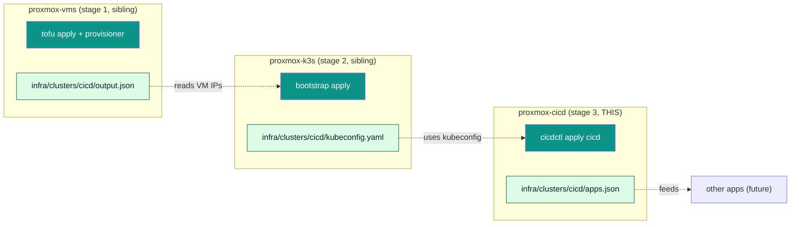

# proxmox-cicd

> Stage 3 of the proxmox provisioning pipeline. Deploys an
> extensible catalog of operator-facing applications (gitea,
> gitea-runner, vaultwarden-k8s-sync, cloudflared) on top
> of a k3s cluster provisioned by the sibling `proxmox-k3s`
> repo.



## Quick start

```bash
# 1. Stage 1: clone the VMs (one-time).
cd ../proxmox-vms && make apply CLUSTER=cicd

# 2. Stage 2: install k3s + helm charts (one-time).
cd ../proxmox-k3s && make apply CLUSTER=cicd

# 3. Stage 3: deploy the app catalog (idempotent).
cd ../proxmox-cicd
make plan     CLUSTER=cicd            # see what would change
make apply    CLUSTER=cicd            # install
make status   CLUSTER=cicd            # live state
make render   CLUSTER=cicd            # show rendered values YAML (read-only)
make validate CLUSTER=cicd            # parse catalog + values, no kubectl/helm
```

## What gets installed

| App | Chart | Namespace | Persistence | Ingress |
|---|---|---|---|---|
| `vaultwarden-k8s-sync` | `oci://ghcr.io/antoniolago/charts/vaultwarden-kubernetes-secrets:2.0.0` | `vaultwarden-kubernetes-secrets` | none (polling service) | none |
| `gitea` | `oci://docker.gitea.com/charts/gitea:12.0.0` | `gitea` | `proxmox-lvm-thin` (5 Gi) | `gitea.example.net` |
| `gitea-runner` | local `infra/charts/gitea-runner:0.2.0` | `gitea-runner` | `proxmox-lvm-thin`: 1×1Gi (`/data`, `.runner` file) + 1×20Gi (`/var/lib/docker`, image cache) per replica | none |
| `cloudflared` | vendored `infra/helm-charts/cloudflare-tunnel-remote-0.1.2.tgz` (remote-managed) | `cloudflared` | none | `cloudflared.example.net` |

The shipped catalog is the version contract: every app this
version of proxmox-cicd knows how to install is listed in
[`provisioner/lib/catalog/shipped.yaml`](provisioner/lib/catalog/shipped.yaml).
The per-cluster `infra/clusters/<name>/catalog.yaml`
becomes a thin enablement + values-override layer on top.
Adding a 5th app is the SOLID extension recipe:
[`docs/runbooks/add-an-app.md`](docs/runbooks/add-an-app.md).

## Documentation

- [docs/architecture.md](docs/architecture.md) — subsystem boundaries + SOLID seams (BaseApp / Container / planner).
- [docs/plans/2026-07-15-sequence-abstraction-plan.md](docs/plans/2026-07-15-sequence-abstraction-plan.md) — the abstraction plan that took the codebase from AppSpec Protocol → BaseApp ABC + groups + shipped catalog + render layer.
- [docs/plans/2026-07-15-openbao-application-plan.md](docs/plans/2026-07-15-openbao-application-plan.md) — forward-looking plan for migrating the Vaultwarden-side secret sync to OpenBao.
- [docs/idempotency.md](docs/idempotency.md) — what `make apply` does on a steady-state cluster.
- [docs/cloudflare-tunnel.md](docs/cloudflare-tunnel.md) — the canonical Cloudflare Tunnel doc: end-to-end secret flow (mint → Vaultwarden → VKS → chart → pod) plus rotation runbook.
- [docs/vaultwarden-sync.md](docs/vaultwarden-sync.md) — how VKS consumes Vaultwarden items as k8s Secrets.
- [docs/vaultwarden-notes.md](docs/vaultwarden-notes.md) — the `VaultwardenClient` library used by the orchestrator.
- [docs/cloudflared-helm-post-renderer.md](docs/cloudflared-helm-post-renderer.md) — focused design reference for the helm ↔ VKS race fix for chart-managed Secrets (the post-renderer overlay).
- [docs/runbooks/add-an-app.md](docs/runbooks/add-an-app.md) — adding a 5th app to the catalog.
- [docs/runbooks/destroy-and-recreate.md](docs/runbooks/destroy-and-recreate.md) — fresh-cluster recipe.
- [docs/runbooks/rotate-gitea-tokens.md](docs/runbooks/rotate-gitea-tokens.md) — rotating the Gitea admin password via Vaultwarden.
- [docs/runbooks/setup-vaultwarden-sync.md](docs/runbooks/setup-vaultwarden-sync.md) — one-time VKS setup + Vaultwarden account creation.

## Source documentation

The catalog implements what the upstream docs recommend:

- Gitea on Kubernetes: <https://docs.gitea.com/installation/install-on-kubernetes>
- Gitea Runner: <https://docs.gitea.com/runner/1.0.8/>
- Vaultwarden Kubernetes Secrets: <https://github.com/antoniolago/vaultwarden-kubernetes-secrets>
- cloudflared: <https://github.com/cloudflare/cloudflared>

## Repository conventions

Mirrors the sibling `proxmox-vms` and `proxmox-k3s` repos:

- `provisioner/` — Python orchestrator (stdlib only, ruff + mypy --strict).
- `provisioner/lib/apps/base.py` — the `BaseApp` ABC every app inherits.
- `provisioner/lib/groups/` — group-aware orchestration: the `cicd-stack` group is the DAG rooted at VKS, applied in topological order.
- `provisioner/lib/catalog/shipped.yaml` — version contract: every app this version of `proxmox-cicd` knows how to install.
- `provisioner/lib/render_values.py` — single source of truth for "what gets sent to helm" (`render_for_app(...)`).
- `infra/clusters/<name>/` — one cluster root per cluster.
- `infra/clusters/<name>/catalog.yaml` — operator-edited; which apps are enabled (with values overrides).
- `infra/clusters/<name>/apps.json` — generated; the orchestrator's handoff (gitignored).
- `values/<app>.yaml` — helm values overrides (one file per app; the planned file-move to `infra/clusters/<name>/values/` is deferred).
- `versions.yaml` + `versions.lock.yaml` — pinned versions + provenance.
- `docs/` — design + runbooks.
- `logs/` — generated; structured audit log (gitignored).

## Exit codes

| Code | Meaning |
|---|---|
| 0 | success |
| 2 | prerequisite failure (kubectl/helm missing, kubeconfig missing) |
| 3 | catalog parse failed |
| 4 | plan failed |
| 5 | apply failed |
| 6 | destroy failed |
| 7 | status failed |
| 8 | validate failed |
| 9 | render failed (e.g. an app has no shipped defaults AND no per-cluster overlay) |
| 8 | validate failed |