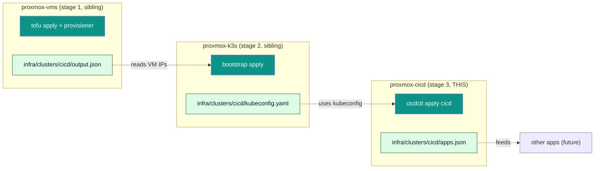

# proxmox-cicd

> Stage 3 of the proxmox provisioning pipeline. Deploys an
> extensible catalog of operator-facing applications (gitea,
> gitea-runner, bitwarden-sm-operator) on top of a k3s
> cluster provisioned by the sibling `proxmox-k3s` repo.



## Quick start

```bash
# 1. Stage 1: clone the VMs (one-time).
cd ../proxmox-vms && make apply CLUSTER=cicd

# 2. Stage 2: install k3s + helm charts (one-time).
cd ../proxmox-k3s && make apply CLUSTER=cicd

# 3. Stage 3: deploy the app catalog (idempotent).
cd ../proxmox-cicd
make plan   CLUSTER=cicd              # see what would change
make apply  CLUSTER=cicd              # install
make status CLUSTER=cicd              # live state
```

## What gets installed

| App | Chart | Namespace | Persistence | Ingress |
|---|---|---|---|---|
| `gitea` | `oci://docker.gitea.com/charts/gitea:12.0.0` | `gitea` | `proxmox-lvm-thin` (5 Gi) | `gitea.example.net` |
| `gitea-runner` | local `infra/charts/gitea-runner:0.1.0` | `gitea-runner` | `EmptyDir` (ephemeral) | none |
| `bitwarden-sm-operator` | `bitwarden/sm-operator:0.4.0` (`--devel`) | `sm-operator-system` | none | none |

The catalog is operator-extensible: see
[docs/architecture.md](docs/architecture.md) for the SOLID
extension recipe.

## Documentation

- [docs/PLAN.md](docs/PLAN.md) — the design plan.
- [docs/architecture.md](docs/architecture.md) — subsystem boundaries.
- [docs/idempotency.md](docs/idempotency.md) — what `make apply` does on a steady-state cluster.
- [docs/vaultwarden-sync.md](docs/vaultwarden-sync.md) — how VKS consumes Vaultwarden items as k8s Secrets.
- [docs/vaultwarden-notes.md](docs/vaultwarden-notes.md) — the `vaultwarden-notes` CLI + `VaultwardenClient` library used by the orchestrator.
- [docs/vaultwarden-seed-note.md](docs/vaultwarden-seed-note.md) — legacy `scripts/vaultwarden-seed-note.py` script (kept for backwards compat).
- [docs/cloudflared-helm-post-renderer.md](docs/cloudflared-helm-post-renderer.md) — helm ↔ VKS race fix for chart-managed Secrets.
- [docs/runbooks/add-an-app.md](docs/runbooks/add-an-app.md) — adding a 4th app to the catalog.
- [docs/runbooks/destroy-and-recreate.md](docs/runbooks/destroy-and-recreate.md) — fresh-cluster recipe.
- [docs/runbooks/rotate-gitea-tokens.md](docs/runbooks/rotate-gitea-tokens.md) — rotating the Gitea admin password via Bitwarden.
- [docs/runbooks/setup-vaultwarden-sync.md](docs/runbooks/setup-vaultwarden-sync.md) — one-time VKS setup + Vaultwarden account creation.

## Source documentation

The catalog implements what the upstream docs recommend:

- Gitea on Kubernetes: <https://docs.gitea.com/installation/install-on-kubernetes>
- Gitea Runner: <https://docs.gitea.com/runner/1.0.8/>
- Bitwarden SM Operator: <https://bitwarden.com/help/secrets-manager-kubernetes-operator/>

## Repository conventions

Mirrors the sibling `proxmox-vms` and `proxmox-k3s` repos:

- `provisioner/` — Python orchestrator (stdlib only, ruff + mypy --strict).
- `infra/clusters/<name>/` — one cluster root per cluster.
- `infra/clusters/<name>/catalog.yaml` — operator-edited; which apps are enabled.
- `infra/clusters/<name>/apps.json` — generated; the orchestrator's handoff (gitignored).
- `values/<app>.yaml` — helm values overrides (one file per app).
- `versions.yaml` + `versions.lock.yaml` — pinned versions + provenance.
- `docs/` — design + runbooks.
- `logs/` — generated; structured audit log (gitignored).

## Exit codes

| Code | Meaning |
|---|---|
| 0 | success |
| 2 | prerequisite failure (kubectl/helm missing, kubeconfig missing) |
| 3 | catalog parse failed |
| 4 | plan failed |
| 5 | apply failed |
| 6 | destroy failed |
| 7 | status failed |
| 8 | validate failed |