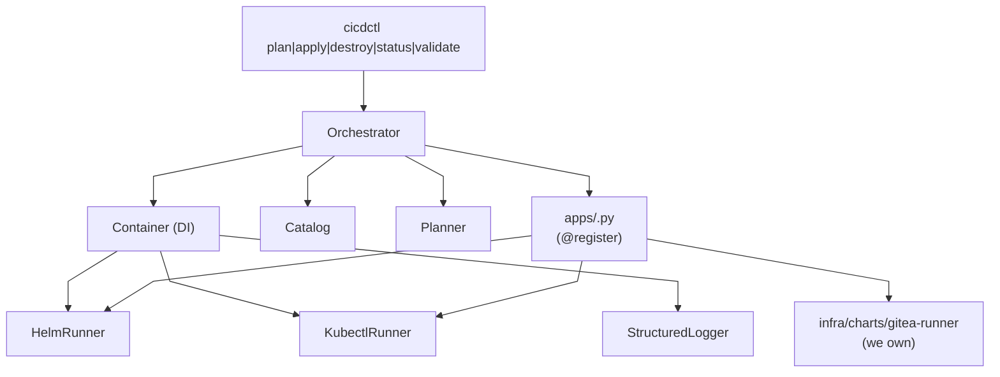

# Architecture

> Status: **Initial implementation (2026-07-10)**. The
> proxmox-cicd provisioner is a SOLID, extensible catalog
> of helm-installed apps on top of a k3s cluster.

## 1. What this repo is

`proxmox-cicd` is stage 3 of a three-stage provisioning
pipeline. It assumes:

- Stage 1 (`proxmox-vms`) produced `infra/clusters/<name>/output.json`
  with the live VM IPs.
- Stage 2 (`proxmox-k3s`) produced `infra/clusters/<name>/kubeconfig.yaml`
  with the k3s apiserver reachable + cilium + proxmox-csi-plugin
  + envoy-gateway controllers all Ready.

This repo deploys an **app catalog** — a set of
operator-facing apps — on top of that cluster. It does NOT
rebuild the cluster or touch any infrastructure pods. It
just:

1. Reads the kubeconfig from the sibling proxmox-k3s repo.
2. Renders Helm values for each enabled app.
3. `helm upgrade --install`s each app, in dependency order.
4. Wires each app's external route through the existing
   Envoy Gateway (GatewayClass=envoy, managed by stage 2).
5. Pins data persistence on the existing `proxmox-lvm-thin`
   StorageClass (managed by stage 2's `proxmox-csi-plugin`).

## 2. The SOLID design



### S — Single Responsibility

Every `apps/<name>.py` file owns exactly one app: its
values, its required-namespace, its probes, its BitwardenSecret
dependencies. The orchestrator owns nothing app-specific —
it loops over the AppSpec registry and calls
`.plan()` / `.apply()` / `.destroy()` / `.status()`.

The same principle extends to two cross-cutting packages:

- `provisioner/lib/vaultwarden/` — the Bitwarden / Vaultwarden
  wire-protocol implementation. The `crypto.py` /
  `http.py` / `client.py` / `note.py` / `kubeconfig.py`
  modules split the Bitwarden protocol at its natural
  seams (symmetric primitives, HTTP helpers with the right
  `User-Agent` + `Bitwarden-Client-Version` headers,
  high-level cipher CRUD, note-payload builders, kubeconfig
  resolution). Consumers: the `vaultwarden-notes` CLI in
  `provisioner/lib/cli/vaultwarden_notes.py`, the
  `cloudflared` app's in-process `_seed_vaultwarden_note()`,
  and the unit tests under `provisioner/tests/`.
  See [`docs/vaultwarden-notes.md`](vaultwarden-notes.md).
- `provisioner/lib/helm_post_renderers/` — small Python
  scripts that `helm upgrade --install --post-renderer`
  forks as child processes. The orchestrator wires one in
  via `extra_args=("--post-renderer", …)`; the script reads
  the rendered YAML on stdin, strips helm-emitted labels /
  annotations from one targeted document, and writes the
  modified stream to stdout. Used to break the
  chart-managed-Secret ↔ VKS-managed-Secret field-manager
  race for `cloudflare-tunnel-remote`. See
  [`docs/cloudflared-helm-post-renderer.md`](cloudflared-helm-post-renderer.md)
  for the post-renderer design; the end-to-end
  Cloudflare Tunnel story (mint → Vaultwarden → VKS →
  chart → pod, plus rotation) lives in
  [`docs/cloudflare-tunnel.md`](cloudflare-tunnel.md).

### O — Open/Closed

Adding `harbor` or `argocd` is a one-file change:

1. Create `provisioner/lib/apps/harbor.py`.
2. Define `class HarborApp` with `@register`.
3. Add `from .lib.apps import harbor as _harbor` to `cli.py`.
4. Add `harbor: { enabled: true }` to `catalog.yaml`.

The orchestrator, the planner, the helm_runner, the
kubectl_runner, and all existing apps stay the same.

This is **pinned by `test_orchestrator_does_not_import_app_
specific_symbols`**, which greps the orchestrator source
for app-specific imports and asserts there are none.

### L — Liskov Substitution

Every `AppSpec` subclass honors the same 4-method contract:

```python
def plan(self, ctx: Container, catalog: dict) -> AppPlanResult
def apply(self, ctx: Container, catalog: dict) -> AppApplyResult
def destroy(self, ctx: Container, catalog: dict) -> None
def status(self, ctx: Container, catalog: dict) -> AppStatus
```

The orchestrator can swap any registered app for any other
(e.g. for a `--dry-run` pass or a test fixture).

### I — Interface Segregation

`AppSpec` only exposes the 4 methods the orchestrator needs.
The actual implementation is free to define private helpers
(`_render_values()`, `_probes()`, `_bw_secret_cr()`).

### D — Dependency Inversion

Apps take a `Container`, not concrete runners. The
`Container` is the only place in the codebase that knows
about `HelmRunner` and `KubectlRunner`. Tests pass
`Container.for_tests()` and substitute MagicMocks for
both runners.

## 3. The app registry

```python
# provisioner/lib/apps/__init__.py
_REGISTRY: dict[str, type[AppSpec]] = {}

def register(cls: type[AppSpec]) -> type[AppSpec]:
    """Decorator: register cls in the global app registry."""
    _REGISTRY[cls.name] = cls
    return cls

def all_apps() -> tuple[type[AppSpec], ...]:
    return tuple(_REGISTRY.values())
```

Apps self-register at import time:

```python
# provisioner/lib/apps/gitea.py
@register
class GiteaApp:
    name = "gitea"
    def plan(self, ctx, catalog): ...
    # ...
```

`cli.py` force-imports every known app to trigger the
registration; the orchestrator pulls them back via
`all_apps()`.

The registry is reset between tests via
`reset_registry()` (called from the autouse fixture in
`tests/conftest.py`).

## 4. The catalog schema

`infra/clusters/<name>/catalog.yaml`:

```yaml
cluster_name: cicd                # must match the CLI argument
ingress:
  base_domain: example.net          # every app's hostname is
                                  # <app>.base_domain
bitwarden:                       # optional
  organization_id: ""
  runner_secret_id: ""
apps:
  gitea:
    enabled: true
  gitea-runner:
    enabled: true
  bitwarden-sm-operator:
    enabled: true
```

The orchestrator parses this with a narrow YAML-subset
parser (`provisioner/lib/catalog.py`); no `pyyaml` dep.

Validation:
- `cluster_name` must match the CLI argument.
- `ingress.base_domain` must be a valid DNS name.
- At least one app must be `enabled: true`.
- Every enabled app name must exist in the registry.

## 5. The handoff: apps.json

After a successful apply, the orchestrator writes
`infra/clusters/<name>/apps.json`:

```json
{
  "version": "1",
  "cluster_name": "cicd",
  "applied_at": "2026-07-10T13:42:01.234Z",
  "apps": [
    {
      "name": "gitea",
      "namespace": "gitea",
      "release": "gitea",
      "chart_version": "12.0.0",
      "image_version": "1.26.x",
      "ingress_host": "gitea.example.net"
    },
    ...
  ]
}
```

Mode is 0600 (the file may include hostname metadata).

## 6. Persistence + ingress

Every PVC points at the `proxmox-lvm-thin` StorageClass that
stage 2's `proxmox-csi-plugin` provisioned. No hostPaths,
no EmptyDir-for-stateful-data.

Every external route is a `Gateway` + `HTTPRoute` anchored
on the `GatewayClass=envoy` that stage 2's `envoy-gateway`
controller manages. The chart's own `ingress:` block is
disabled (it assumes Ingress-NGINX-shaped annotations).