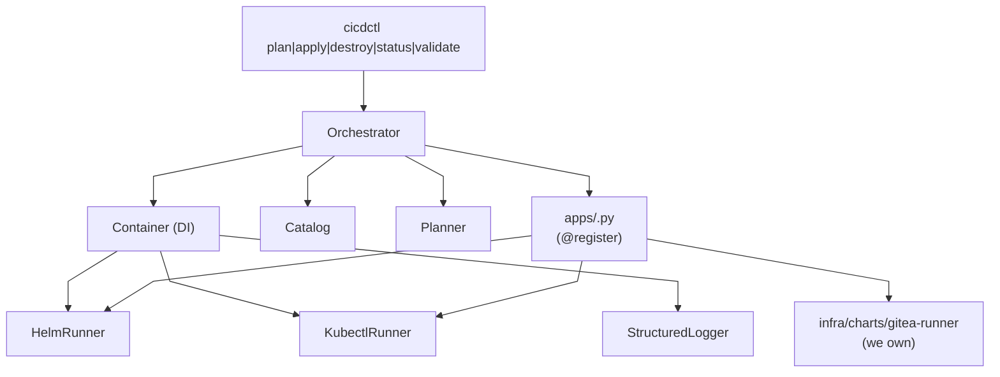

# Architecture

> Status: **Mature (2026-07-16)**. The codebase has
> completed the 16-work-package
> [GroupSpec abstraction plan](plans/2026-07-15-sequence-abstraction-plan.md):
> WP0–WP15 all landed, 317 tests passing, ruff + mypy --strict
> clean. The SOLID seams documented below are enforced
> by the four static guards (`tests/test_apps_no_inline_*.py`).
> A forward-looking OpenBao migration plan lives at
> [`docs/plans/2026-07-15-openbao-application-plan.md`](plans/2026-07-15-openbao-application-plan.md).

## 1. What this repo is

`proxmox-cicd` is stage 3 of a three-stage provisioning
pipeline. It assumes:

- Stage 1 (`proxmox-vms`) produced `infra/clusters/<name>/output.json`
  with the live VM IPs.
- Stage 2 (`proxmox-k3s`) produced `infra/clusters/<name>/kubeconfig.yaml`
  with the k3s apiserver reachable + cilium + proxmox-csi-plugin
  + envoy-gateway controllers all Ready.

This repo deploys an **app catalog** — a set of
operator-facing apps — on top of that cluster. It does NOT
rebuild the cluster or touch any infrastructure pods. It
just:

1. Reads the kubeconfig from the sibling proxmox-k3s repo.
2. Renders Helm values for each enabled app.
3. `helm upgrade --install`s each app, in dependency order.
4. Wires each app's external route through the existing
   Envoy Gateway (GatewayClass=envoy, managed by stage 2).
5. Pins data persistence on the existing `proxmox-lvm-thin`
   StorageClass (managed by stage 2's `proxmox-csi-plugin`).

## 2. The SOLID design



### S — Single Responsibility

Every `apps/<name>.py` file owns exactly one app: its
values, its required-namespace, its probes, its VKS
dependencies. The orchestrator owns nothing app-specific —
it loops over the `BaseApp` registry and calls the
4-method contract:
`.plan()` / `.apply()` / `.destroy()` / `.status()`.

The same principle extends to four cross-cutting packages:

- `provisioner/lib/vaultwarden/` — the Vaultwarden
  wire-protocol implementation. The `crypto.py` /
  `http.py` / `client.py` / `note.py` modules split the
  Vaultwarden protocol at its natural seams (symmetric
  primitives, HTTP helpers with the right `User-Agent` +
  `Bitwarden-Client-Version` headers, high-level cipher
  CRUD, note-payload builders). Consumers: the
  `BaseApp._vaultwarden_client(...)` /
  `BaseApp._seed_vaultwarden_note(...)` helpers (WP12;
  single canonical site), and the unit tests under
  `provisioner/tests/`. See
  [`docs/vaultwarden-notes.md`](vaultwarden-notes.md).
- `provisioner/lib/helm_post_renderers/` — small Python
  scripts that `helm upgrade --install --post-renderer`
  forks as child processes. The orchestrator wires one in
  via `extra_args=("--post-renderer", …)`; the script reads
  the rendered YAML on stdin, strips helm-emitted labels /
  annotations from one targeted document, and writes the
  modified stream to stdout. Used to break the
  chart-managed-Secret ↔ VKS-managed-Secret field-manager
  race for `cloudflare-tunnel-remote`. See
  [`docs/cloudflared-helm-post-renderer.md`](cloudflared-helm-post-renderer.md)
  for the post-renderer design; the end-to-end
  Cloudflare Tunnel story (mint → Vaultwarden → VKS →
  chart → pod, plus rotation) lives in
  [`docs/cloudflare-tunnel.md`](cloudflare-tunnel.md).
- `provisioner/lib/groups/` (WP2) — group-aware
  orchestration: the `BaseGroup` ABC + `DefaultGroup` +
  `CicdStackGroup` define the apply/destroy topology for
  one cluster. The DAG is rooted at `vaultwarden-k8s-sync`
  (every other app reads Vaultwarden-managed Secrets at
  apply time) and fans out to `gitea`, `gitea-runner`,
  `cloudflared`. See
  `provisioner/lib/groups/cicd_stack.py`.
- `provisioner/lib/render_values.py` (WP10) — single source
  of truth for "what does the orchestrator send to helm":
  `render_for_app(...)` deep-merges shipped defaults +
  per-cluster overlay + writes to
  `.proxmox-cicd/rendered/<cluster>/<app>.yaml`. Apps
  reach for the helper via `BaseApp._render_for_apply(...)`;
  `cicdctl render cicd` is the operator-facing entry
  point (read-only — no kubectl/helm).

### O — Open/Closed

Adding `harbor` or `argocd` is a four-step change (post-WP1):

1. Create `provisioner/lib/apps/harbor.py` with a
   `BaseApp` subclass that declares `name` / `namespace`
   / `release` / `chart` / `chart_version` /
   `image_version` as `ClassVar[str]`s (WP13) and
   implements the 4-method contract.
2. Add the new app to
   `provisioner/lib/catalog/shipped.yaml` (the version
   contract — see §3 below).
3. Add `from .lib.apps import harbor as _harbor` to
   `cli.py` to force `@register` at CLI startup.
4. Add `harbor: { enabled: true }` (and any values
   overrides) to `infra/clusters/<name>/catalog.yaml`.

The orchestrator, the planner, the helm_runner, the
kubectl_runner, and all existing apps stay the same.

This is **pinned by three tests**:
- `test_orchestrator_does_not_import_app_specific_symbols`
  greps the orchestrator source for app-specific imports.
- `test_apps_have_no_inline_<...>` (WP9, WP10, WP12, WP15)
  scan `apps/*.py` for inline patterns that drift away
  from the canonical helpers.

### L — Liskov Substitution

Every `BaseApp` subclass honors the same 4-method contract:

```python
def plan(self, ctx: Container, catalog: dict) -> AppPlanResult
def apply(self, ctx: Container, catalog: dict) -> AppApplyResult
def destroy(self, ctx: Container, catalog: dict) -> None
def status(self, ctx: Container, catalog: dict) -> AppStatus
```

The orchestrator can swap any registered app for any other
(e.g. for a `--dry-run` pass or a test fixture). The
canonical helpers on `BaseApp` (see §3 below) keep
the seam consistent across apps.

### I — Interface Segregation

`BaseApp` exposes:

- The 4 abstract methods the orchestrator needs.
- A small library of canonical helpers (WP6 / WP9 / WP11 /
  WP12 / WP10) that apps reach for rather than re-implementing:
  `_kubectl(ctx)` (WP6), `_values_file(ctx)` /
  `_rendered_values_file(ctx)` /
  `_render_for_apply(...)` (WP9 / WP10),
  `_secret_ref(name, key)` /
  `_hostname(...)` /
  `_labels(...)` /
  `_annotations(...)` (WP9),
  `_parse_dotenv(text)` /
  `_load_dotenv(repo_root)` /
  `_require_env(env, key)` (WP11),
  `_read_dotenv_creds(repo_root, catalog)` /
  `_vaultwarden_client(ctx, catalog)` /
  `_seed_vaultwarden_note(...)` (WP12),
  `_render_template(name, **vars)` (WP5).

Apps subclass behaviour without rewriting the seam.

### D — Dependency Inversion

Apps take a `Container`, not concrete runners. The
`Container` is the only place in the codebase that knows
about `HelmRunner` and `KubectlRunner`. Tests pass
`Container.for_tests()` and substitute MagicMocks for
both runners.

## 3. The app registry + shipped catalog

```python
# provisioner/lib/apps/__init__.py
_REGISTRY: dict[str, type[BaseApp]] = {}

def register(cls: type[BaseApp]) -> type[BaseApp]:
    """Decorator: register cls in the global app registry.

    WP0 invariants enforced here:

      1. `cls` must subclass `BaseApp` (no more ad-hoc
         dataclass-with-no-base-shape apps).
      2. `cls` must NOT be `@dataclass`-decorated (apps are
         behaviour with stable identity, not data).
      3. `cls.name` must be a non-empty string.
    """
    if not issubclass(cls, BaseApp):
        raise TypeError(...)
    _REGISTRY[cls.name] = cls
    return cls

def all_apps() -> tuple[type[BaseApp], ...]:
    return tuple(_REGISTRY.values())
```

Apps self-register at import time:

```python
# provisioner/lib/apps/gitea.py
@register
class GiteaApp(BaseApp):
    name = "gitea"
    namespace: ClassVar[str] = "gitea"
    release: ClassVar[str] = "gitea"
    chart: ClassVar[str] = "oci://docker.gitea.com/charts/gitea"
    chart_version: ClassVar[str] = "12.0.0"
    image_version: ClassVar[str] = "1.26.x"

    def plan(self, ctx, catalog): ...
    def apply(self, ctx, catalog): ...
    def destroy(self, ctx, catalog): ...
    def status(self, ctx, catalog): ...
```

`cli.py` force-imports every known app to trigger the
registration; the orchestrator pulls them back via
`all_apps()`. The registry is reset between tests via
`reset_registry()` (called from the autouse fixture in
`tests/conftest.py`).

### The shipped catalog (WP1)

The shipped catalog is the **version contract**: every
app this version of `proxmox-cicd` knows how to install.
Lives at `provisioner/lib/catalog/shipped.yaml`.

```yaml
version: "0.3.0"
apps:
  vaultwarden-k8s-sync:
    namespace: "vaultwarden-kubernetes-secrets"
    release: "vaultwarden-kubernetes-secrets"
    chart: "oci://ghcr.io/antoniolago/charts/vaultwarden-kubernetes-secrets"
    chart_version: "2.0.0"
    image_version: "2.0.0"
  gitea:
    namespace: "gitea"
    release: "gitea"
    chart: "oci://docker.gitea.com/charts/gitea"
    chart_version: "12.0.0"
    image_version: "1.26.x"
  # ... gitea-runner, cloudflared
```

A per-cluster catalog is built by merging the shipped
catalog with the cluster's `infra/clusters/<name>/catalog.yaml`:

- The shipped catalog lists every app the orchestrator
  can install. Editing it is a code change.
- The per-cluster catalog becomes a thin enablement +
  values-override layer on top:
  - `apps:<name>.enabled: <bool>` flips the merged
    catalog's `enabled` flag.
  - `apps:<name>.values:` is deep-merged on top of the
    shipped defaults.
- A cluster reference to an app not in the shipped
  catalog raises `CatalogError` listing the unknown
  name(s).

The merge rule is `Catalog.from_shipped_and_cluster(...)`
(see [`provisioner/lib/catalog.py`](provisioner/lib/catalog.py)).

## 4. The per-cluster catalog schema

`infra/clusters/<name>/catalog.yaml`:

```yaml
cluster_name: cicd                # must match the CLI argument
ingress:
  base_domain: example.net          # every app's hostname is
                                  # <app>.base_domain
vaultwarden:                     # optional; consumed by
                                 # BaseApp._read_dotenv_creds
                                 # (catalog > .env > canonical)
  server_url: "https://bitwarden.example"
  email: "ops@example"
  skip_admin_seed: false
  skip_runner_seed: false
apps:
  vaultwarden-k8s-sync:
    enabled: true
  gitea:
    enabled: true
  gitea-runner:
    enabled: true
  cloudflared:
    enabled: true
    # per-cluster values overlay (deep-merged on top of
    # the shipped `default_values:` block).
    values:
      replicaCount: 1
```

The orchestrator parses this with a narrow YAML-subset
parser (`provisioner/lib/catalog.py`); no `pyyaml` dep.

Validation:
- `cluster_name` must match the CLI argument.
- `ingress.base_domain` must be a valid DNS name.
- At least one app must be `enabled: true`.
- Every enabled app name must exist in the shipped catalog
  (WP1 / WP14: unknown app → `CatalogError`).

## 5. Groups (WP2 / WP3 / WP4)

A *group* is a named DAG of apps that the orchestrator
applies / destroys together. Two built-in groups:

- `default` — every enabled app in catalog order. The
  fallback when no `--group` flag is passed.
- `cicd-stack` — the full DAG: VKS → gitea → gitea-runner →
  cloudflared, with VKS as the root (every other app reads
  Vaultwarden-managed Secrets at apply time).

Group-aware orchestration surfaces as:

- `cicdctl apply cicd --group cicd-stack` (or `cicdctl
  destroy cicd --group cicd-stack`) runs the apps in
  topological order.
- `cicdctl apply cicd --group cicd-stack --app gitea`
  intersects the group's topological order with the
  filter, preserving the topology.
- The audit log records `apply.group_resolved` with the
  group name + nodes for every apply call.

See `provisioner/lib/groups/` for the `BaseGroup` ABC,
`DefaultGroup`, `CicdStackGroup`, and
`resolve_apply_order(...)` topological sorter.

## 6. The handoff: apps.json

After a successful apply, the orchestrator writes
`infra/clusters/<name>/apps.json`:

```json
{
  "version": "1",
  "cluster_name": "cicd",
  "applied_at": "2026-07-10T13:42:01.234Z",
  "apps": [
    {
      "name": "gitea",
      "namespace": "gitea",
      "release": "gitea",
      "chart_version": "12.0.0",
      "image_version": "1.26.x",
      "ingress_host": "gitea.example.net"
    },
    ...
  ]
}
```

Mode is 0600 (the file may include hostname metadata).

## 7. The render layer (WP10)

The render layer is the single source of truth for "what
would `apply` send to helm". It lives at
`provisioner/lib/render_values.py` and exposes:

- `render_for_app(app_name, cluster_name, repo_root, shipped_defaults, cluster_overlay)` —
  deep-merges the shipped defaults + per-cluster overlay
  and writes the result to
  `.proxmox-cicd/rendered/<cluster>/<app>.yaml`.
- `render_path(repo_root, cluster_name, app_name)` — pure
  path computation, no I/O.

Apps reach for the helper via
`BaseApp._render_for_apply(ctx, cluster_name, catalog)`,
which:

1. Reads shipped defaults from
   `provisioner/lib/catalog/shipped.yaml`.
2. Reads the per-cluster values overlay from
   `catalog.apps[name].values`.
3. Calls `render_for_app(...)` (deep-merge + write).

The CLI surface is `cicdctl render cicd [--app NAME]`.
Exits 0 on success, 3 on catalog parse failure, 9 on
render failure (e.g. an app has no shipped defaults AND
no per-cluster overlay; the helper raises
`NoShippedDefaultsError`).

The static guard
`tests/test_no_alt_render_layer.py` (parametrized over
`yaml.safe_dump` / `yaml.dump` / `yaml.safe_load`) fails
the build if a future contributor introduces an
alternative render path in `apps/*.py`.

The file-move from `values/<app>.yaml` to
`infra/clusters/<name>/values/<app>.yaml` is **deferred**
to a follow-up WP15-item; the runtime is unchanged
(WP10 ships the helper + CLI; the operator's existing
`values/<app>.yaml` files continue to be the runtime
source).

## 8. Persistence + ingress

Every PVC points at the `proxmox-lvm-thin` StorageClass that
stage 2's `proxmox-csi-plugin` provisioned. No hostPaths,
no EmptyDir-for-stateful-data.

Every external route is a `Gateway` + `HTTPRoute` anchored
on the `GatewayClass=envoy` that stage 2's `envoy-gateway`
controller manages. The chart's own `ingress:` block is
disabled (it assumes Ingress-NGINX-shaped annotations).