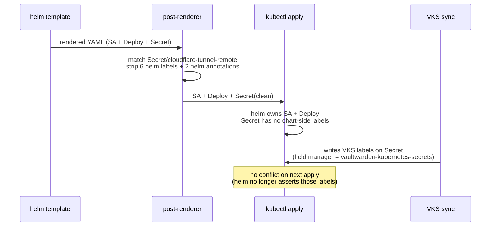

# Helm ↔ VKS race fix: the post-renderer overlay

> **Scope.** This doc is the design reference for the
> `--post-renderer` overlay that breaks the helm ↔ VKS
> field-manager race on the
> `Secret/cloudflare-tunnel-remote` resource. It is
> focused on the post-renderer design (symptom, fix,
> label/annotation contract, tests).
>
> For the **end-to-end Cloudflare Tunnel story** —
> how the tunnel is minted, where its token lives in
> Vaultwarden, how the chart consumes it, and how to
> rotate the token — see
> [cloudflare-tunnel.md](./cloudflare-tunnel.md).
> That doc is the canonical source; this one is a
> focused drill-down on the post-renderer.

The `cloudflared` app installs the upstream
[`cloudflare-tunnel-remote` chart][chart], which renders a
single Secret (`cloudflare-tunnel-remote`) carrying the
tunnel token. The orchestrator also seeds that same Secret's
value into Vaultwarden as a Secure Note so
[VaultwardenK8sSync (VKS)][vks] can recreate it after a
destroy + apply.

Two controllers writing labels on the same Secret is a
kubectl field-manager race. This document explains the race
and the post-renderer overlay that fixes it.

[chart]: https://github.com/cloudflare/helm-charts/releases/tag/cloudflare-tunnel-remote-0.1.2
[vks]: ./vaultwarden-sync.md
[cf-tunnel]: ./cloudflare-tunnel.md

## Symptom

The first `cicdctl apply cicd` succeeds. The second one (after
VKS has had a chance to sync at least once) fails with:

```
Error: UPGRADE FAILED: failed to create resource: Secret
"cloudflare-tunnel-remote" is invalid:
metadata.labels.app.kubernetes.io/managed-by: Invalid value:
"Helm": must be 'kustomize.toolkit.fluxcd.io' or 'Helm' or
'kubectl-client side-apply' or 'before-first-apply'
```

Or, on more recent kubectl versions:

```
Error from server (Conflict):
conflict with "unknown" using v1:
.metadata.labels.app.kubernetes.io/managed-by
```

Either way: kubectl server-side apply refuses to assert
`managed-by: Helm` because the field is already owned by VKS
(field manager `vaultwarden-kubernetes-secrets`).

## Why it happens

The chart's `templates/_helpers.tpl::labels` emits these
labels on every resource, including the Secret:

```yaml
helm.sh/chart: cloudflare-tunnel-remote-0.1.2
app.kubernetes.io/name: cloudflare-tunnel-remote
app.kubernetes.io/instance: cloudflare-tunnel-remote
app.kubernetes.io/version: "2024.8.3"
app.kubernetes.io/managed-by: Helm
```

VKS, when it picks up the Secure Note on the next ~5-min sync
cycle, writes the **same five `app.kubernetes.io/*` keys**
plus its own fingerprint annotation, with different values:

```yaml
labels:
  app.kubernetes.io/managed-by: vaultwarden-kubernetes-secrets
  app.kubernetes.io/created-by:  vaultwarden-k8s-sync
  app.kubernetes.io/instance:    cloudflare-tunnel-remote
  app.kubernetes.io/name:        cloudflare-tunnel-remote
  app.kubernetes.io/version:     latest
annotations:
  vaultwarden-kubernetes-secrets/content-hash: ...
  vaultwarden-kubernetes-secrets/managed-keys: ["tunnelToken"]
```

The two label sets are nearly identical except for
`managed-by` (`Helm` vs `vaultwarden-kubernetes-secrets`).
The chart's value wins on the first `helm upgrade`; VKS's
value wins on the next VKS sync; **the next `helm upgrade`
fails** because kubectl refuses to overwrite a field owned by
another field manager.

## Why `--take-ownership` doesn't fix it

`helm upgrade --install --take-ownership` tells helm to
**adopt** an existing resource by adding `meta.helm.sh/release-name`
to its annotations. It does NOT silently overwrite labels
that another tool set. So:

- helm tries to set `managed-by: Helm` on the Secret.
- kubectl sees the field is owned by VKS, not helm.
- The apply is rejected.

`--take-ownership` is for the case where helm's previous
release created a Secret and someone hand-edited it. It is
not a bridge between two active controllers.

## The fix: helm doesn't own the Secret

The post-renderer overlay in
[`provisioner/lib/helm_post_renderers/strip_helm_secret_labels.py`][pr]
rewrites the rendered chart manifest so the chart's Secret
comes out with `labels: {}` and `annotations: {}` (modulo
any non-helm keys VKS may have written). Helm still owns the
Deployment and ServiceAccount — those pass through untouched.

[pr]: ../provisioner/lib/helm_post_renderers/strip_helm_secret_labels.py



Helm's contract becomes:

> "Create or update this Secret's `stringData.tunnelToken`.
> Don't assert any labels or annotations."

VKS handles everything else. The two controllers no longer
overlap.

## How the post-renderer works

The post-renderer is a 130-line Python 3 script (chmod +x,
`#!/usr/bin/env python3` shebang). Helm invokes it as a
child process:

```
$ helm upgrade --install cloudflare-tunnel-remote … \
    --post-renderer provisioner/lib/helm_post_renderers/strip_helm_secret_labels.py
```

Helm pipes the rendered YAML on stdin; the script reads it
with `yaml.safe_load_all`, walks each document, and rewrites
the matching Secret's labels/annotations:

```python
HELM_LABEL_KEYS = {
    "helm.sh/chart",
    "app.kubernetes.io/name",
    "app.kubernetes.io/instance",
    "app.kubernetes.io/version",
    "app.kubernetes.io/managed-by",
    "app.kubernetes.io/created-by",
}
HELM_ANNOTATION_KEYS = {
    "meta.helm.sh/release-name",
    "meta.helm.sh/release-namespace",
}
```

The matching document has those keys removed. Everything
else (other documents, other label keys) is byte-identical
on the wire. Output uses `yaml.safe_dump_all(explicit_start=True)`
so the `---` separators are preserved, which both helm and
kubectl parse transparently.

### Smoke-testing the post-renderer

```sh
$ helm template cloudflare-tunnel-remote infra/helm-charts/cloudflare-tunnel-remote-0.1.2.tgz \
    --version 0.1.2 -n cloudflared \
    --set cloudflare.tunnel_token=fake \
    --set image.tag=2024.8.3 --set replicaCount=1 \
  | ./provisioner/lib/helm_post_renderers/strip_helm_secret_labels.py | grep -A1 'kind: Secret$'
kind: Secret
metadata:
  name: cloudflare-tunnel-remote
  labels: {}
stringData:
  tunnelToken: fake
```

The Secret comes out with `labels: {}`. The Deployment
next in the stream still has its helm-emitted labels
(proving only the targeted document is mutated).

## What gets stripped vs preserved

| Resource | helm labels after post-render | helm annotations after post-render |
| --- | --- | --- |
| `ServiceAccount/cloudflare-tunnel-remote` | preserved (helm owns it) | preserved |
| `Deployment/cloudflare-tunnel-remote` | preserved (helm owns it) | preserved |
| `Secret/cloudflare-tunnel-remote` | **stripped to `{}`** | **stripped to `{}`** |

VKS's keys (e.g. `vaultwarden-kubernetes-secrets/content-hash`)
are not in `HELM_LABEL_KEYS` or `HELM_ANNOTATION_KEYS`, so
they pass through if the chart ever added them. Today the
chart doesn't emit them; the constant lists will grow only
when helm's chart starts writing new fields that conflict
with VKS's.

## When to use it (and when not)

Use the post-renderer when:

- An upstream chart creates a Secret whose labels VKS also
  writes (managed-by conflict).
- You can't fork the chart without losing upstream updates.
- The orchestrator owns both the chart install and the VKS
  seed for the same resource.

Don't use the post-renderer when:

- The Secret is fully owned by helm (no VKS involvement).
- A different operator owns the chart (the post-renderer
  would silently strip labels that operator relies on).
- The fix is upstream (file an issue, wait for a release).

## Reverting

Delete the `--post-renderer` flag from
`provisioner/lib/apps/cloudflared.py`. Helm resumes full
ownership of the Secret, and the race returns. There's no
post-renderer-side state to roll back.

## Tests

`provisioner/tests/test_helm_post_renderer.py` (18 tests):

- `strip_helm_labels` unit tests:
  - targets `Secret` by `(kind, name)` match
  - leaves `Deployment` / `ServiceAccount` alone
  - leaves `Secret`s with a different `name` alone
  - removes every key in `HELM_LABEL_KEYS`
  - removes every key in `HELM_ANNOTATION_KEYS`
  - keeps non-helm label keys (`app.kubernetes.io/part-of`)
  - handles missing / non-dict inputs gracefully
- `render` integration tests over multi-doc streams:
  - Deployment + ServiceAccount pass through byte-identical
  - Secret's `stringData.tunnelToken` is preserved
  - empty documents are dropped silently
- `main` CLI tests via `monkeypatch`:
  - reads stdin, writes stdout
  - accepts `--target-kind` / `--target-name` overrides
- File-mode test: the script is chmod +x (helm forks it
  directly).
- Subprocess smoke test: `subprocess.run([str(SCRIPT_PATH)],
  input=CHART_OUTPUT, …)` and assert the Secret's labels
  are empty.
- Wiring test: the orchestrator's `extra_args` contains
  `--post-renderer` (not `--take-ownership`).

The 18 new tests bring the suite to **139 tests passing**;
ruff + mypy --strict clean across 27 source files.

## See also

- [`docs/cloudflare-tunnel.md`](./cloudflare-tunnel.md) —
  the canonical Cloudflare Tunnel doc. Covers how the
  tunnel is minted, where the token lives in
  Vaultwarden, the full secret flow, and rotation
  procedures (routine + hard).
- [`docs/vaultwarden-notes.md`](./vaultwarden-notes.md) —
  how the orchestrator seeds the VKS note (the other half
  of the loop).
- [`docs/vaultwarden-sync.md`](./vaultwarden-sync.md) —
  how VKS consumes the note and writes the Secret.
- [`provisioner/lib/helm_post_renderers/strip_helm_secret_labels.py`](../provisioner/lib/helm_post_renderers/strip_helm_secret_labels.py) —
  the post-renderer source (well-commented module docstring).
- [`provisioner/tests/test_helm_post_renderer.py`](../provisioner/tests/test_helm_post_renderer.py) —
  the 18 tests that pin the contract.