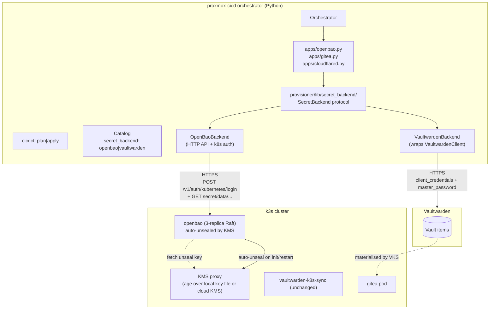

# OpenBao as a Secret-Management Application — Implementation Plan

**Date:** 2026-07-15
**Status:** Proposed
**Repo:** `proxmox-cicd`
**Targets:**
- A new self-hosted app `openbao` installed via the existing `AppSpec` registry
- A pluggable secret-management adapter so any app that today reads `os.environ["VAULTWARDEN__…"]` (or hits `VaultwardenClient` directly) can read from `vaultwarden` *or* `openbao` based on `catalog.yaml`
- Auto-unsealing via the chosen KMS (default: age-sealed local key file with a documented path to swap for cloud KMS)
- Kubernetes auth method + role bindings for **workload identity** so application pods do not hold long-lived tokens

**Related:**
- [vaultwarden-kubernetes-secrets/docs/plans/2026-07-15-openbao-workload-identity-design.md](https://github.com/antoniolago/vaultwarden-kubernetes-secrets/docs/plans/2026-07-15-openbao-workload-identity-design.md)
- [vaultwarden-kubernetes-secrets/docs/plans/2026-07-15-openbao-workload-identity.md](https://github.com/antoniolago/vaultwarden-kubernetes-secrets/docs/plans/2026-07-15-openbao-workload-identity.md)
- OpenBao Helm chart docs: <https://openbao.org/docs/platform/k8s/helm/>
- OpenBao Helm chart values reference: <https://openbao.org/docs/platform/k8s/helm/configuration/>
- OpenBao Helm chart values.yaml source: <https://github.com/openbao/openbao-helm/blob/main/charts/openbao/values.yaml>
- OpenBao Helm chart run guide: <https://openbao.org/docs/platform/k8s/helm/run/>
- OpenBao Kubernetes auth: <https://openbao.org/docs/auth/kubernetes/>
- OpenBao KV v2 API: <https://openbao.org/api-docs/secret/kv/kv-v2/>

---

## 1. Why this plan exists

Today the proxmox-cicd orchestrator treats Vaultwarden as the *only* secret-management backend:

- The `cloudflared` app pushes a Secure Note via `VaultwardenClient` ([provisioner/lib/apps/cloudflared.py:60-90](provisioner/lib/apps/cloudflared.py)).
- The `gitea` app pushes admin credentials via the same client ([provisioner/lib/apps/gitea.py:60-110](provisioner/lib/apps/gitea.py)).
- `VaultwardenK8sSync` reads them on the cluster side via `BW_CLIENTSECRET` / `VAULTWARDEN__MASTERPASSWORD`.

That gives a single chokepoint and a single set of credentials that *must* exist in a Kubernetes `Secret` for VKS to poll. To follow the OpenBao workload-identity plan, the orchestrator needs to be able to **install OpenBao** (with auto-unseal + kubernetes auth pre-wired) and **offer an adapter** that any consumer can use without rewriting app code.

This plan delivers both pieces, following the existing SOLID design (one app file per app, one library per cross-cutting concern).

---

## 2. Goals

1. **Install OpenBao** as a self-hosted 3-replica HA cluster on the cicd k3s, with:
   - Raft integrated storage (no external Consul/Postgres)
   - Auto-unseal via a single, documented KMS mechanism (default: in-cluster KMS proxy over a sealed age key file; the chart's `unsealConfig.secret` static path is supported for offline installs)
   - TLS certs served via the existing `Gateway`/`HTTPRoute` story (or `cert-manager` if not present)
   - Prometheus metrics scraped by the existing metrics-server (future)
2. **Pre-wire the `kubernetes` auth method** during apply, so any pod that wants to authenticate via its ServiceAccount JWT can do so with no further operator action.
3. **Introduce a `SecretBackend` Protocol** in `provisioner/lib/secret_backend/` with two adapters:
   - `VaultwardenBackend` (current behavior — wraps `provisioner.lib.vaultwarden.client.VaultwardenClient`)
   - `OpenBaoBackend` (new — uses `requests` to talk to OpenBao's HTTP API + does the kubernetes auth login)
4. **Pick the backend per call site** based on `catalog["secret_backend"]` (or per-app override via `catalog["apps"]["<name>"]["secret_backend"]`). Default remains `vaultwarden` for backward compatibility.
5. **Document a runbook** for rotating the auto-unseal key, rekeying OpenBao, and migrating an app from Vaultwarden → OpenBao.

## 3. Non-goals

- We do NOT migrate VKS from Vaultwarden → OpenBao in this plan. The `vaultwarden-k8s-sync` app stays; OpenBao runs **next to it**, exposed as an alternative backend. A separate plan can address VKS-internals later.
- We do NOT replace Vaultwarden as the source of truth for human-managed secrets. Operators keep using the Vaultwarden web UI for personal credentials; OpenBao is for **machine/cluster** secrets.
- We do NOT introduce a new sidecar injection mechanism (Vault Agent / ESO webhook). Apps either read OpenBao at startup directly (in-process), or the orchestrator pushes the secret to them at apply-time.
- We do NOT implement Vaultwarden's `secret-manager` (`bws`) interface. Vaultwarden does not implement it.
- We do NOT run OpenBao outside the cluster. Single-cluster scope only.

## 4. Threat model

| Threat | Before | After |
|---|---|---|
| Compromised VKS pod reads `BW_CLIENTSECRET` from env | Yes | N/A (still possible for Vaultwarden-backed apps; opt-in for OpenBao-backed apps where creds are never in a `Secret`) |
| Compromised second workload in the same namespace impersonates VKS to OpenBao | N/A | **No** — OpenBao's `kubernetes` auth role binds to the exact ServiceAccount name + namespace + audience |
| OpenBao seal key leaves the cluster | N/A | No — KMS-managed key never leaves the KMS (cloud) or lives only in the age-sealed local file with a single documented rotation procedure |
| OpenBao is sealed and the operator cannot unseal it | N/A | Auto-unseal handles normal reboots; the runbook covers manual recovery |
| Operator edits `infra/secrets/*.json` and accidentally commits it | Already mitigated (gitignored, mode 0600) | Same |

**Residual:** the OpenBao root token generated at init time is stored once in `infra/secrets/openbao-root-token.json` (mode 0600, gitignored). After the initial policy setup, the root token is not used again — operators use scoped operator tokens (or the `kubernetes` auth). Loss of this file is recoverable: `bao operator init -recovery-shares=1 -recovery-threshold=1` requires the recovery key shares; recovery keys are generated at init and stored under `infra/secrets/openbao-recovery-keys.json` with the same hygiene.

---

## 5. Architecture



### 5.1 Catalog schema additions

`infra/clusters/<name>/catalog.yaml`:

```yaml
cluster_name: cicd
ingress:
  base_domain: example.net
secret_backend: openbao                 # NEW: global default
vaultwarden:
  server_url: https://bitwarden.example.net
apps:
  openbao:
    enabled: true
    replica_count: 3
    storage_size: 10Gi
    storage_class: proxmox-lvm-thin
    unseal:
      mode: kms_proxy                  # or: static_secret, cloud_kms
      kms_proxy:
        image: ghcr.io/openbao/openbao-kms-proxy:latest
        unseal_key_path: /etc/openbao-kms/age.key   # mounted from Secret
    kubernetes_auth:
      enabled: true
      audiences: ["openbao"]
      default_policies: ["vks-read-vaultwarden"]
  gitea:
    enabled: true
    secret_backend: vaultwarden         # per-app override (backward compat)
  cloudflared:
    enabled: true
    secret_backend: vaultwarden
  vaultwarden-k8s-sync:
    enabled: true
```

If `secret_backend` is omitted, the orchestrator logs a deprecation warning and uses `vaultwarden` (today's behavior). A future major version will flip the default to `openbao`.

### 5.2 The `SecretBackend` Protocol

`provisioner/lib/secret_backend/__init__.py`:

```python
class SecretBackend(Protocol):
    """One pluggable secret-management adapter.

    Adapters must be safe to instantiate with no I/O
    (constructors don't talk to the backend); the
    first network call happens in `authenticate()` or
    in the read/write methods themselves.

    Adapters must redact secrets from logs, errors,
    and exception messages. The orchestrator relies on
    this for its structured audit log to stay free of
    credential leaks.
    """

    name: str  # "vaultwarden" | "openbao"

    def authenticate(self) -> None:
        """Log in / exchange identity. Idempotent."""
        ...

    def read_kv(self, path: str, *, key: str | None = None) -> str | dict[str, str]:
        """Read a single secret value (when key is set)
        or a dict of key→value (when key is None)."""
        ...

    def write_kv(self, path: str, data: dict[str, str]) -> None:
        """Write a dict of secrets. Idempotent."""
        ...

    def upsert_policy(self, name: str, hcl: str) -> None:
        """Apply a policy. Idempotent."""
        ...

    def healthcheck(self) -> bool:
        """For `cicdctl status` and readiness gates."""
        ...
```

The orchestrator injects the chosen backend via the `Container`:

```python
@dataclass
class Container:
    ...
    secret_backend: SecretBackend | None = None
```

Apps then read `ctx.secret_backend.read_kv(path, key=...)` instead of calling `VaultwardenClient` directly. The `VaultwardenBackend` adapter is a thin wrapper around the existing `VaultwardenClient`; existing call sites migrate incrementally.

### 5.3 OpenBao app contract

`apps/openbao.py`:

```python
@dataclass
class OpenBaoApp:
    name = "openbao"

    def plan(self, ctx, catalog) -> AppPlanResult:
        ...
    def apply(self, ctx, catalog) -> AppApplyResult:
        ...
    def destroy(self, ctx, catalog) -> None:
        ...
    def status(self, ctx, catalog) -> AppStatus:
        ...
```

What `apply()` does (idempotent, replay-safe — same shape as the existing apps):

1. **Bootstrap data dirs** (`infra/secrets/openbao/`, mode 0700).
2. **Render values** from `catalog["apps"]["openbao"]` and the global block into `values/openbao.yaml` (committed template; `.rendered.yaml` is the per-cluster overlay, gitignored).
3. **Pre-install steps** (only on first apply, detected by absence of `infra/secrets/openbao/cluster.json`):
   1. Generate the cluster's storage encryption key (`openssl rand -base64 32`) → `infra/secrets/openbao/storage.key` (mode 0600).
   2. Generate the auto-unseal key (`openssl rand -base64 32`) → `infra/secrets/openbao/unseal.key` (mode 0600).
   3. Generate the audit log HMAC key (`openssl rand -base64 32`) → `infra/secrets/openbao/audit.key` (mode 0600).
4. **Install the chart**: `helm upgrade --install openbao openbao/openbao --version <pinned> --values values/openbao.yaml`.
5. **Wait for the StatefulSet** to become `Ready` (3/3).
6. **Post-install bootstrap** (only on first apply):
   1. `kubectl exec openbao-0 -- bao operator init -recovery-shares=1 -recovery-threshold=1` → captures root token + recovery keys.
   2. Save root token to `infra/secrets/openbao/root-token.json` (mode 0600, gitignored). Save recovery keys to `infra/secrets/openbao/recovery-keys.json` (mode 0600, gitignored).
   3. `bao operator unseal` is unnecessary on subsequent restarts because **auto-unseal is enabled via the KMS proxy**. The chart's `unsealConfig.secret` is wired to a `Secret` carrying the unseal key wrapped by the KMS proxy; OpenBao fetches it on init without operator intervention.
7. **Wire the `kubernetes` auth method** (idempotent):
   - `bao auth enable kubernetes` if not already enabled
   - `bao write auth/kubernetes/config kubernetes_host="https://kubernetes.default.svc.cluster.local"` and read the cluster CA cert from `kubectl get secret` if running in-cluster, else read from the kubeconfig
   - For each role requested by other apps (e.g. `vks`, `gitea-runner`), write:
     ```bash
     bao write auth/kubernetes/role/<name> \
       bound_service_account_names=<sa> \
       bound_service_account_namespaces=<ns> \
       audience=<aud> \
       token_policies=<policy>
     ```
8. **Write the policies** requested by other apps (e.g. `vks-read-vaultwarden` — declared in catalog). Idempotent.
9. **Audit-log path** mounted from a PVC; the audit log is a Prometheus metric source in a future PR.

### 5.4 OpenBaoBackend adapter

`provisioner/lib/secret_backend/openbao.py`:

```python
class OpenBaoBackend:
    name = "openbao"

    def __init__(
        self,
        address: str,       # https://openbao.openbao.svc.cluster.local:8200
        token: str,         # root token from infra/secrets/openbao/root-token.json
        ca_cert: str | None,
    ) -> None: ...

    def authenticate(self) -> None:
        # Token is already set from init; just probe /v1/sys/health.
        ...

    def read_kv(self, path: str, *, key: str | None = None) -> str | dict[str, str]:
        # GET /v1/<path>; raise on 4xx/5xx; redact body in errors.
        ...

    def write_kv(self, path: str, data: dict[str, str]) -> None:
        # POST /v1/<path> with {data: ...}; idempotent on KV v2.
        ...

    def upsert_policy(self, name: str, hcl: str) -> None:
        # PUT /v1/sys/policies/acl/<name>; idempotent.
        ...

    def healthcheck(self) -> bool:
        ...
```

The `OpenBaoBackend` does **not** do kubernetes auth itself — that's only useful from inside a pod. When the orchestrator runs as a CLI on the operator's host, it uses the **root token** (or a scoped operator token in a future refinement). Workload-identity kubernetes auth is a separate, downstream concern handled by the **consumer** app (e.g. the cloudflared app at apply-time uses the root token; the gitea-runner pod, if it ever wanted to fetch a secret itself, would do `kubernetes` auth).

### 5.5 Per-app backend selection

Three call sites today:

| App | Current code | Future code |
|---|---|---|
| `cloudflared.apply` | `VaultwardenClient.login(...)` → `create_secure_note(...)` | `backend = ctx.secret_backend` → `backend.write_kv(...)` |
| `gitea.apply` | `VaultwardenClient.login(...)` → `create_secure_note(...)` | Same |
| `vaultwarden-k8s-sync.apply` | Unchanged — still uses Vaultwarden directly via `BW_*` env vars | Unchanged |

Both `cloudflared` and `gitea` get a one-line refactor each:

```python
backend = ctx.secret_backend
backend.authenticate()
backend.write_kv(f"clusters/{cluster_name}/gitea/admin", {"username": "admin", "password": pw})
```

The `VaultwardenBackend.write_kv` translates that into the existing `VaultwardenClient.create_secure_note(...)` with the VKS custom-field triple (`namespaces`, `secret-name`, `secret-key`). The `OpenBaoBackend.write_kv` translates it into a KV v2 entry at the same logical path. **VKS keeps reconciling either source** because today VKS reads from Vaultwarden; in the OpenBao case, an additional `vaultwarden-k8s-sync` config (out of scope for this plan) would be needed to source from OpenBao — or we keep Vaultwarden as the consumer-side and only use OpenBao for things VKS doesn't watch.

To keep this plan shippable without breaking VKS, the recommended first migration is:

1. Ship the `openbao` app + adapter (this plan).
2. Apps that *do not* rely on VKS reconciliation (e.g. an OpenBao-only app like cert-manager's `csi-driver-spiffe`, or an app that mounts a CSI Secret directly) can use `secret_backend: openbao`.
3. **VKS keeps watching Vaultwarden.** Apps that today push Secure Notes to Vaultwarden continue to do so via `VaultwardenBackend`. Apps that don't need VKS reconciliation use OpenBao directly.
4. A later plan wires VKS to an OpenBao source (e.g. via ESO + the Ponchia webhook provider, or via a native VKS change).

---

## 6. Concrete change list

### 6.1 New files

| Path | Approx LOC | Purpose |
|---|---|---|
| `provisioner/lib/secret_backend/__init__.py` | 80 | `SecretBackend` Protocol, `select_backend(catalog, app_name)` factory |
| `provisioner/lib/secret_backend/vaultwarden.py` | 200 | `VaultwardenBackend` wrapping the existing `VaultwardenClient` |
| `provisioner/lib/secret_backend/openbao.py` | 300 | `OpenBaoBackend` — HTTP client + redaction + audit log entries |
| `provisioner/lib/apps/openbao.py` | 600 | `OpenBaoApp` — install, bootstrap, post-install auth wiring |
| `provisioner/lib/cli/openbao_init.py` | 100 | `openbao-init` CLI for re-init / recovery (mirrors `vaultwarden-notes`) |
| `tests/secret_backend/test_vaultwarden.py` | 200 | Adapter tests against `VaultwardenClient` mocks |
| `tests/secret_backend/test_openbao.py` | 300 | Adapter tests against a `requests-mock` or a real `vault:1.15` dev container |
| `tests/apps/test_openbao.py` | 400 | Apply/destroy/status against a kind cluster |
| `values/openbao.yaml` | 150 | Chart values template (committed) |
| `values/openbao.values-rendered.yaml` | 50 | Per-cluster overlay (gitignored) |
| `docs/architecture/openbao.md` | 600 | Architecture + operations doc |
| `docs/runbooks/openbao-recover.md` | 200 | Recovery runbook |
| `docs/runbooks/openbao-rotate-unseal.md` | 150 | Unseal key rotation |
| `docs/runbooks/migrate-app-vaultwarden-to-openbao.md` | 200 | Migration cookbook |
| **Total** | **~3,530 LOC** | |

### 6.2 Modifications to existing files

| File | Change | LOC delta |
|---|---|---|
| `provisioner/lib/container.py` | Add `secret_backend: SecretBackend \| None = None` field; populate in `Container.production()` from `select_backend(catalog, None)` | +30 |
| `provisioner/lib/orchestrator.py` | Pass `secret_backend` from `Container` into every app's `apply`/`destroy`/`status` call | +20 |
| `provisioner/lib/catalog.py` | Parse `secret_backend: openbao\|vaultwarden` at the catalog root and `secret_backend:` per app; add `OpenBaoAppConfig` dataclass | +60 |
| `provisioner/lib/apps/__init__.py` | Force-import `openbao` alongside the others | +5 |
| `provisioner/lib/apps/cloudflared.py` | Replace the `VaultwardenClient.login(...)` → `create_secure_note(...)` block with `ctx.secret_backend.write_kv(...)`; add a per-call-site `secret_backend: vaultwarden` if the operator wants to keep using Vaultwarden | -40 (net) |
| `provisioner/lib/apps/gitea.py` | Same pattern as `cloudflared` | -30 (net) |
| `versions.yaml` | Add `openbao` chart + image pins (default: chart 0.x + OpenBao 2.x; pin after first release tag exists); pin `hvac>=2.4.0,<3` | +20 |
| `versions.lock.yaml` | Lock the pins from `versions.yaml` | +20 |
| `pyproject.toml` | Add `requests>=2.32` (already likely present via `urllib`) | +5 |

**Total modifications: ~90 LOC delta.** Most of the heavy lifting is in the new files.

### 6.3 Helm chart values (initial draft)

The orchestrator renders these values from `catalog["apps"]["openbao"]` and the cluster's `*.values-rendered.yaml` overlay. The structure mirrors the upstream chart's `values.yaml` so operators can grep the chart source for any setting they don't recognize.

`values/openbao.yaml` (committed):

```yaml
# Upstream chart: openbao/openbao (https://openbao.github.io/openbao-helm/)
# Chart version pinned in versions.yaml.

global:
  enabled: true
  # End-to-end TLS is required in production (see production checklist
  # in the upstream docs). For the initial install we keep tlsDisable=false
  # and provision certs via cert-manager (assumed available in the
  # k8s-cicd blueprint) so the listener is reachable on https.
  tlsDisable: false

server:
  image:
    repository: quay.io/openbao/openbao
    tag: ""           # pinned by versions.yaml
    pullPolicy: IfNotPresent

  resources:
    requests: { cpu: 250m, memory: 256Mi }
    limits:   { cpu: "1",   memory: 1Gi }

  # Audit log persistence (production checklist).
  auditStorage:
    enabled: true
    size: 5Gi
    storageClass: proxmox-lvm-thin
    accessMode: ReadWriteOnce

  # Network policy: only allow ingress from in-cluster sources.
  networkPolicy:
    enabled: true
    egress:
      # DNS
      - to: [{ namespaceSelector: {} }]
        ports: [{ port: 53, protocol: UDP }, { port: 53, protocol: TCP }]
      # KMS / Vault API endpoints (the address catalog field renders these).
    ingress:
      - from:
          - namespaceSelector: {}
        ports: [{ port: 8200, protocol: TCP }, { port: 8201, protocol: TCP }]

  # The chart binds this SA to system:auth-delegator so we can configure
  # the kubernetes auth method without an out-of-band token. Required.
  authDelegator:
    enabled: true

  # Stable ServiceAccount name — the orchestrator references it from
  # the OpenBaoBackend adapter when configuring auth/kubernetes/config.
  serviceAccount:
    create: true
    name: openbao
    # serviceDiscovery role-binding is also enabled by default; we
    # leave it on because the chart's HA raft config uses
    # service_registration "kubernetes" { }.
    annotations:
      # Pin the SA JWT audience for projected tokens — VKS pods will
      # match this with OPENBAO_AUDIENCE.
      # (Kubernetes 1.21+ only.)
      audience: openbao
    serviceDiscovery:
      enabled: true

  # We render our own Gateway + HTTPRoute, not the chart's Ingress /
  # HTTPRoute. Disable both so we don't get duplicate routes.
  ingress:
    enabled: false
  route:
    enabled: false

  # The chart exposes a TLSRoute / HTTPRoute under server.gateway —
  # also disable (we own the Gateway config).
  gateway:
    tlsRoute: { enabled: false }
    httpRoute: { enabled: false }
    tlsPolicy: { enabled: false }

  # HA mode with integrated Raft (no external Consul).
  ha:
    enabled: true
    replicas: 3
    # setNodeId forces the Raft ID == pod name, simplifying ops.
    raft:
      enabled: true
      setNodeId: true
    # The default config when ha.raft.enabled=true is good; we override
    # only to make sure we ship audit + telemetry later. The full
    # config is rendered into a ConfigMap by the chart.
    config: |
      ui = true

      listener "tcp" {
        tls_disable = 0
        address = "[::]:8200"
        cluster_address = "[::]:8201"
        tls_cert_file = "/openbao/tls/tls.crt"
        tls_key_file  = "/openbao/tls/tls.key"
        # Prometheus metrics endpoint — opened only on localhost;
        # Prometheus scrapes via the ServiceMonitor below.
        telemetry {
          unauthenticated_metrics_access = "true"
        }
      }

      storage "raft" {
        path = "/openbao/data"
      }

      service_registration "kubernetes" {}

      # Auto-unseal: the orchestrator rewrites this block at apply-time
      # based on catalog.apps.openbao.unseal.mode. Default = age + KMS proxy.
      seal "transit" {
        address = "http://openbao-kms-proxy.openbao.svc.cluster.local:8201"
        # token is loaded from Secret openbao-unseal-token via
        # extraSecretEnvironmentVars below
        token        = ""      # filled by chart at runtime
        disable_iss_validation = "true"
        key_name     = "openbao-unseal"
        mount_path   = "transit/"
      }

      # Cluster address used for replication forwarding.
      cluster_addr = "https://$(HOSTNAME).openbao-internal:8201"
      api_addr     = "https://openbao.openbao.svc.cluster.local:8200"

    disruptionBudget:
      enabled: true
      maxUnavailable: 1

  # Sensitive bits are injected from Secrets; the chart mounts them
  # via extraVolumes so the rendered ConfigMap only contains HCL
  # placeholders, never actual seal keys.
  extraVolumes:
    - name: userconfig-openbao-unseal
      secret:
        defaultMode: 420
        secretName: openbao-unseal

  extraSecretEnvironmentVars:
    - envName: BAO_UNSEAL_TOKEN_PATH
      secretName: openbao-unseal
      secretKey: token-path

  # postStart runs once per pod, after readiness. The orchestrator uses
  # this to apply per-replica bootstrap (only the active replica init's
  # the cluster; standbys wait for replication). Idempotent.
  postStart:
    - /bin/sh
    - -c
    - |
      set -e
      if [ "$(bao status -format=json | jq -r .initialized)" = "false" ]; then
        # Initialized on first replica only — other replicas will join
        # via the auto-unseal + raft join flow.
        bao operator init -recovery-shares=5 -recovery-threshold=3 \
          -format=json > /openbao/data/init.json
        chmod 600 /openbao/data/init.json
      fi

  # Update strategy MUST be OnDelete (per upstream docs) so standbys
  # upgrade before the active primary.
  updateStrategyType: OnDelete

# Injector (the Vault-Agent-style mutating webhook) — we don't use it
# for VKS; the orchestrator reads OpenBao directly via OpenBaoBackend.
# Keep it on for apps that want to opt in later.
injector:
  enabled: true
  authPath: "auth/kubernetes"

# CSI provider — also disabled by default. Apps that need CSI-mounted
# secrets can enable it explicitly.
csi:
  enabled: false

# UI service — we expose via our own Gateway, not via the chart's
# serviceType=ClusterIP LoadBalancer.
ui:
  enabled: true
  serviceType: ClusterIP
  activeOpenbaoPodOnly: true

# Prometheus operator integration (assumed available in k8s-cicd).
serverTelemetry:
  prometheusOperator: true
  serviceMonitor:
    enabled: true
    interval: 30s
    scrapeTimeout: 10s
  prometheusRules:
    enabled: true
    # Default rules — operator overrides per catalog.
    rules: []
  grafanaDashboard:
    enabled: true

# Snapshot agent — backup to S3 on a schedule. Disabled by default;
# enable via catalog for prod clusters.
snapshotAgent:
  enabled: false
```

The KMS proxy is a tiny in-cluster service that holds the age key and exposes `age` unsealing over a unix-socket-style HTTP endpoint. For cloud KMS (AWS KMS, GCP CKMS, Azure Key Vault), the orchestrator rewrites the `seal "transit" { ... }` block to point at the cloud endpoint, or to use the chart's built-in `awskms` / `gcpckms` / `azurekeyvault` seal blocks (set via `server.extraEnvironmentVars` + `extraVolumes`).

The upstream chart reference for every field above is the values.yaml at <https://github.com/openbao/openbao-helm/blob/main/charts/openbao/values.yaml>. When that file changes between chart versions, the orchestrator's catalog schema must be updated to match.

---

### 6.4 Helm chart install procedure (for the orchestrator)

The orchestrator follows the upstream [Run OpenBao on Kubernetes](https://openbao.org/docs/platform/k8s/helm/run/) guide, adapted for the proxmox-cicd blueprint:

```bash
# One-time: add the chart repo on the operator's host (idempotent).
helm repo add openbao https://openbao.github.io/openbao-helm
helm repo update

# Install (idempotent — re-runs are no-op unless values change).
helm upgrade --install openbao openbao/openbao \
  --version <pinned-chart-version> \
  --namespace openbao \
  --create-namespace \
  --values values/openbao.yaml \
  --values values/openbao.values-rendered.yaml

# Wait for 3-replica StatefulSet.
kubectl wait --namespace openbao \
  --for=jsonpath='{.status.readyReplicas}=3' \
  statefulset/openbao --timeout=10m

# Forward UI for the bootstrap step.
kubectl port-forward --namespace openbao openbao-0 8200:8200 &
```

For post-install bootstrap (init / unseal / auth setup), the orchestrator uses **`kubectl exec`** into `openbao-0` rather than the port-forward, because `kubectl exec` works without operator intervention in CI:

```bash
# Initialize (first-apply only — guarded by postStart script in values.yaml).
kubectl exec --namespace openbao openbao-0 -- \
  bao operator init -recovery-shares=5 -recovery-threshold=3 \
  -format=json | tee infra/secrets/openbao/init.json
chmod 600 infra/secrets/openbao/init.json

# Capture root token (also from init.json).
ROOT_TOKEN=$(jq -r .root_token infra/secrets/openbao/init.json)

# Enable audit log persistence (production checklist).
kubectl exec --namespace openbao openbao-0 -- \
  bao audit enable -path=/openbao/audit/audit.log file

# Configure kubernetes auth.
kubectl exec --namespace openbao openbao-0 -- \
  bao auth enable kubernetes
kubectl exec --namespace openbao openbao-0 -- \
  bao write auth/kubernetes/config \
    kubernetes_host=https://kubernetes.default.svc.cluster.local
# CA cert comes from the in-pod mount; we don't pass it explicitly.

# Write per-app roles + policies (one role per consumer app).
kubectl exec --namespace openbao openbao-0 -- \
  bao write auth/kubernetes/role/vks \
    bound_service_account_names=vks \
    bound_service_account_namespaces=vaultwarden-kubernetes-secrets \
    audience=openbao \
    token_policies=vks-read-vaultwarden
```

The orchestrator wraps every `kubectl exec` with redaction of the body in logs and a `--request-timeout=15s` to avoid blocking `apply`.

The chart's **production deployment checklist** ([source](https://openbao.org/docs/platform/k8s/helm/run/#architecture)) requires:
1. **End-to-end TLS** — listener must have `tls_disable=0` and certs mounted. We satisfy this via cert-manager (or, if cert-manager is absent, a self-signed cert generated once and committed as a Secret, with a manual rotation runbook).
2. **Single-tenancy** — pods must not co-schedule with other workloads. The chart's default `podAntiAffinity` enforces this; we keep the default.
3. **Enable auditing** — `auditStorage.enabled: true` mounts a PVC; the orchestrator enables the `file` audit backend via `bao audit enable`.
4. **Immutable upgrades** — chart uses `updateStrategyType: OnDelete` (we set this explicitly) so the upgrade sequence is: replace standbys → unseal → replace active.
5. **Restrict storage access** — `dataStorage` PVC uses `ReadWriteOnce`, the StorageClass is `proxmox-lvm-thin` (managed by stage 2's `proxmox-csi-plugin`), and `networkPolicy` blocks ingress from outside the cluster.

---

### 6.5 Helm chart upgrade procedure

The chart uses `OnDelete`, so `helm upgrade` updates the StatefulSet but does **not** roll pods. The orchestrator implements the upgrade sequence per the [upstream guide](https://openbao.org/docs/platform/k8s/helm/run/#upgrading-openbao-on-kubernetes):

```python
def upgrade_openbao(ctx, chart_version: str, image_tag: str) -> None:
    # 1. helm upgrade (does not touch pods)
    ctx.helm.upgrade_install(
        release="openbao", chart="openbao/openbao",
        version=chart_version,
        namespace="openbao",
        values=render_values(ctx),
    )
    # 2. Select standbys (openbao-active=false), delete, wait, repeat.
    for pod in ctx.kubectl.get_pods(namespace="openbao",
                                    label_selector="openbao-active=false"):
        ctx.kubectl.delete_pod(pod, namespace="openbao")
        wait_for_pod_ready(pod, ...)
    # 3. Find active (openbao-active=true), delete, wait.
    active = ctx.kubectl.get_pods(namespace="openbao",
                                  label_selector="openbao-active=true")[0]
    ctx.kubectl.delete_pod(active, namespace="openbao")
    wait_for_pod_ready(active, ...)
    # 4. New active election happens automatically; cluster is upgraded.
```

If any pod fails to come up after the image change (e.g. because the new binary is incompatible with the old data format), the operator must restore from the most recent Raft snapshot (cron'd to S3 via the optional `snapshotAgent`) — see the [OpenBao upgrade docs](https://openbao.org/docs/upgrading/) for the rollback procedure.

---

## 7. Python client library — research and recommendation

### 7.1 Options considered

| Library | Last release | OpenBao compatibility | API coverage | Maintenance status | Notes |
|---|---|---|---|---|---|
| **hvac** | 2.4.0 (active) | API-compatible (OpenBao is a Vault-API fork; hvac speaks the Vault HTTP API which OpenBao implements verbatim, see <https://jorijn.com/en/blog/hashicorp-vault-vs-openbao/>) | KV v2, kubernetes auth, policies, token, transit, all standard engines | Actively maintained; widely used in production | **Recommended** |
| openbao-python-client | (not on PyPI under that name; search returned only the Rust `openbao` crate) | n/a | n/a | n/a | Does not exist as a first-party library |
| Vault Agent sidecar | n/a | Yes (OpenBao ships an `openbao-agent` image, see `injector.agentImage` in chart values) | Same as OpenBao server API | Official OpenBao project | Sidecar pattern, not a library — see §6.4 above |
| `requests` (stdlib equivalent) | always | Yes — the API is just HTTP/JSON; `hvac` is a wrapper around `requests` | Whatever you implement | n/a | Use only when hvac is unavailable |
| pyhcl | 0.4.x | n/a | n/a | n/a | Only HCL parsing (needed for policy upserts), not a client |

**Conclusion: use [`hvac`](https://python-hvac.org/en/stable/) (≥2.4.0).** It is the de-facto Python client for Vault, OpenBao is API-compatible with the Vault HTTP API (OpenBao "reads both `BAO_ADDR` and `VAULT_ADDR`" and the HTTP endpoints are identical), and `hvac` already covers the four operations we need: KV v2 read/write, kubernetes auth login, sys/policies upsert, sys/health. The library is around 30 KLOC, MIT-licensed, used by every major Vault integration (Terraform, Airflow, many CD tools), and ships type stubs.

We pin `hvac>=2.4.0,<3` in `pyproject.toml`. (`pyproject.toml` already lists `requests` indirectly via other deps; `hvac` will pull a compatible version.)

### 7.2 Why not roll our own

We considered (and rejected) writing a thin `requests`-based client to avoid the `hvac` dependency. Reasons to use `hvac`:

1. **It is already a thin wrapper.** `hvac.Client` is ~100 LOC over `requests`; we'd just be re-implementing it.
2. **Audit redaction is the only non-trivial logic** we need beyond HTTP — and `hvac` already redacts sensitive fields in its exception messages, so we get that for free.
3. **Retries / timeouts / TLS verification** are wired correctly in `hvac`; rolling our own risks subtle bugs (connection reuse, certificate validation, HTTP/2).
4. **`hvac.api.auth_methods.Kubernetes`** encapsulates the SA-token login exactly as documented in the upstream [kubernetes auth guide](https://openbao.org/docs/auth/kubernetes/) — fewer lines for us to maintain.
5. **Migration path:** when OpenBao upstream ships a v2-only API change, `hvac` will track it; we'd otherwise have to maintain a fork.

### 7.3 Example: minimal client wiring

`provisioner/lib/secret_backend/openbao.py`:

```python
from __future__ import annotations
import hvac
from typing import Any


class OpenBaoBackend:
    """Adapter for OpenBao. Mirrors VaultwardenBackend's surface."""

    name = "openbao"

    def __init__(
        self,
        address: str,
        token: str,
        *,
        namespace: str | None = None,
        verify: str | bool = True,
        timeout: float = 15.0,
    ) -> None:
        # hvac reads VAULT_NAMESPACE from env, but we pass it
        # explicitly so callers can override per-call.
        self._client = hvac.Client(
            url=address,
            token=token,
            namespace=namespace,
            verify=verify,
            timeout=timeout,
        )
        self._address = address

    # -- identity ----------------------------------------------------------

    def authenticate(self) -> None:
        """Probe health and confirm the token is valid."""
        if not self._client.is_authenticated():
            raise RuntimeError(
                f"OpenBao token is not valid against {self._address}"
            )
        # Also confirm the cluster is unsealed.
        health = self._client.sys.read_health_status(method="GET")
        if health.get("sealed", True):
            raise RuntimeError(
                f"OpenBao cluster at {self._address} is sealed"
            )

    def healthcheck(self) -> bool:
        try:
            health = self._client.sys.read_health_status(method="GET")
        except hvac.exceptions.VaultError:
            return False
        return not health.get("sealed", True)

    # -- secrets -----------------------------------------------------------

    def read_kv(self, path: str, *, key: str | None = None) -> str | dict[str, str]:
        """Read from KV v2.

        `path` is the logical KV v2 path WITHOUT the `data/` prefix
        and WITHOUT the `secret/` mount prefix — e.g. ``clusters/cicd/gitea/admin``.
        We always read the latest version (no explicit `version`).
        """
        mount_point, _, kv_path = path.partition("/")
        # hvac wants mount_point separately from the path tail.
        # If the caller includes the mount in `path`, split it.
        if "/" in kv_path:
            # caller passed "secret/clusters/cicd/..." — split again.
            mount_point = path.split("/", 1)[0]
            kv_path = path.split("/", 1)[1]

        try:
            resp = self._client.secrets.kv.v2.read_secret(
                path=kv_path, mount_point=mount_point, raise_on_deleted_version=True
            )
        except hvac.exceptions.InvalidPath:
            raise KeyError(f"no secret at {path}") from None

        data = resp["data"]["data"]
        if key is None:
            return dict(data)
        if key not in data:
            raise KeyError(f"key {key!r} not present at {path}")
        return data[key]

    def write_kv(self, path: str, data: dict[str, str]) -> None:
        """Write to KV v2; idempotent."""
        mount_point, _, kv_path = path.partition("/")
        if "/" in kv_path:
            mount_point = path.split("/", 1)[0]
            kv_path = path.split("/", 1)[1]

        # check-and-set so concurrent writers don't clobber — but if
        # the path doesn't exist yet, allow unconditional write.
        try:
            current = self._client.secrets.kv.v2.read_secret_version(
                path=kv_path, mount_point=mount_point, raise_on_deleted_version=True
            )
            cas = current["data"]["version"]
            self._client.secrets.kv.v2.create_or_update_secret(
                path=kv_path,
                secret=data,
                mount_point=mount_point,
                cas=cas,
            )
        except hvac.exceptions.InvalidPath:
            self._client.secrets.kv.v2.create_or_update_secret(
                path=kv_path, secret=data, mount_point=mount_point
            )

    def upsert_policy(self, name: str, hcl: str) -> None:
        """Apply an ACL policy; idempotent."""
        self._client.sys.create_or_update_policy(name=name, policy=hcl)

    # -- kubernetes-auth login (for in-pod consumers like VKS) -------------

    @classmethod
    def kubernetes_login(
        cls,
        address: str,
        role: str,
        jwt: str,
        *,
        audience: str = "openbao",
        mount_point: str = "kubernetes",
    ) -> "OpenBaoBackend":
        """Build a client whose token came from the kubernetes auth method.

        Use this from inside a pod: pass the projected SA JWT from
        /var/run/secrets/kubernetes.io/serviceaccount/token. The returned
        client is ready for read_kv / write_kv against the policies
        attached to `role`.
        """
        login_client = hvac.Client(url=address, verify=True, timeout=15.0)
        resp = login_client.auth.kubernetes.login(
            role=role, jwt=jwt, mount_point=mount_point, audience=audience
        )
        return cls(address=address, token=resp["auth"]["client_token"])
```

### 7.4 Example: installing the dep + first end-to-end test

`pyproject.toml` (excerpt):

```toml
[project]
dependencies = [
    "hvac>=2.4.0,<3",
    # ... existing deps
]
```

`tests/secret_backend/test_openbao.py` (sketch):

```python
import os
import pytest
import requests
from provisioner.lib.secret_backend.openbao import OpenBaoBackend


@pytest.fixture(scope="module")
def bao_container():
    """Spin up a vault:1.15 dev container as an API-compatible
    OpenBao stand-in for local tests."""
    import testcontainers.core.container as tc
    container = tc.DockerContainer("hashicorp/vault:1.15").with_exposed_ports(8200)
    container.with_env("VAULT_DEV_ROOT_TOKEN_ID", "root")
    container.with_env("VAULT_DEV_LISTEN_ADDRESS", "0.0.0.0:8200")
    container.start()
    yield f"http://{container.get_container_host_ip()}:{container.get_exposed_port(8200)}", "root"
    container.stop()


def test_healthcheck(bao_container):
    address, token = bao_container
    be = OpenBaoBackend(address=address, token=token)
    assert be.healthcheck() is True


def test_kv_round_trip(bao_container):
    address, token = bao_container
    # Set up: enable KV v2, write a secret.
    be = OpenBaoBackend(address=address, token=token)
    be.upsert_policy("test", 'path "secret/data/test/*" { capabilities = ["read","create","update"] }')

    # Pretend we are a workload with a kubernetes-issued token; for the
    # unit test we use the root token directly.
    be.write_kv("secret/test/foo", {"username": "admin", "password": "s3cret"})

    out = be.read_kv("secret/test/foo")
    assert out == {"username": "admin", "password": "s3cret"}

    only_pw = be.read_kv("secret/test/foo", key="password")
    assert only_pw == "s3cret"


def test_kubernetes_login_against_dev_server(bao_container):
    """Skip in CI without SA token plumbing; marked as integration."""
    pytest.skip("requires a real k8s context; run in E2E suite")
    address, _ = bao_container
    with open("/var/run/secrets/kubernetes.io/serviceaccount/token") as f:
        jwt = f.read()
    # Configure the dev server's kubernetes auth (in dev mode, kubernetes_host
    # doesn't actually validate the JWT against the cluster — it just checks
    # the token is well-formed. Use this only for round-trip testing.)
    ...
    be = OpenBaoBackend.kubernetes_login(
        address=address, role="vks", jwt=jwt, audience="openbao"
    )
    assert be.healthcheck() is True
```

### 7.5 Audit-logging rules for the adapter

`hvac` already raises `hvac.exceptions.VaultError` with a redacted message. We layer our own redaction on top to be sure:

```python
import re

# In OpenBaoBackend, wrap all public methods:
def _redact(value: str) -> str:
    # Mask anything that looks like a token, password, or JWT.
    value = re.sub(r"(?i)(token|password|jwt|secret_key)\s*[=:]\s*\S+",
                   r"\1=<redacted>", value)
    return value
```

And we add a structured audit event on every read/write so `cicdctl status` and the orchestrator's `audit.jsonl` can show **which** secret paths were touched (without leaking values):

```python
import hashlib

def _audit(self, event: str, path: str, *, key: str | None = None,
           value_hash: str | None = None) -> None:
    self._audit_log.info(
        "openbao.backend",
        event=event,
        path=path,
        key=key,
        value_sha256=value_hash,
    )

# Usage in write_kv:
self._audit("kv.write", path, value_hash=hashlib.sha256(
    repr(sorted(data.items())).encode()
).hexdigest())
```

This satisfies the orchestrator's existing audit-log conventions (see [architecture.md §2](../architecture.md)).

---

## 8. Test strategy

### 8.1 Unit tests

- `tests/secret_backend/test_vaultwarden.py` — adapter wraps `VaultwardenClient` correctly; `write_kv` produces the expected Secure Note payload with the VKS triple.
- `tests/secret_backend/test_openbao.py` — adapter against `requests-mock`:
  - Auth + healthcheck
  - Read/write round-trip against a mocked KV v2 endpoint
  - Error paths (4xx, 5xx) — verify errors are redacted
  - `upsert_policy` PUT against a mocked `sys/policies/acl/<name>`
- `tests/apps/test_openbao.py` — apply/destroy/status path with mocked `kubectl`/`helm`, asserts the correct `helm upgrade --install` line and the post-install `bao auth enable kubernetes` invocation.

### 8.2 Integration tests (E2E)

- Spin up a `vault:1.15` dev container in `docker-compose.e2e.yml` (API-compatible stand-in for OpenBao, same as the VKS plan).
- Run the `openbao` app's `apply` against a kind cluster.
- Assert: 3-replica StatefulSet is `Ready`, `/v1/sys/health` returns `200`, `bao auth list` shows `kubernetes/`, role `vks` exists with the expected policy binding.
- Wire a test consumer pod with a fake `ServiceAccount`, mint a projected token, call `POST /v1/auth/kubernetes/login`, verify a token is returned.

### 8.3 Backward-compat tests

- Apply the existing `cloudflared` and `gitea` apps with `secret_backend: vaultwarden` — verify behavior is **byte-identical** to today.
- Apply with `secret_backend: openbao` — verify the Secure Note path is *not* taken and the OpenBao path is taken.

---

## 9. Operational runbooks (live under `docs/runbooks/`)

### 9.1 `docs/runbooks/openbao-recover.md`

Cover:

1. **Single-replica loss** — Kubernetes reschedules; Raft re-elects; auto-unseal handles the unseal.
2. **All replicas sealed simultaneously** — KMS proxy is down. Procedure: restart KMS proxy Deployment; OpenBao replicas auto-fetch the unseal key on next `bao server` start.
3. **KMS key loss** — unrecoverable unless recovery keys were stored. Procedure: `bao operator init -recovery-shares=1 -recovery-threshold=1` requires the recovery keys in `infra/secrets/openbao/recovery-keys.json`; if those are also lost, the cluster is destroyed and re-initialized (all secrets lost).
4. **Operator lost the root token** — `bao operator generate-root -recovery-token` requires the recovery keys; without them, no path forward short of re-init.
5. **A pod's ServiceAccount credentials were leaked** — `bao token revoke -accessor <accessor>` invalidates the leaked token; rotate the bound policy's tokens.

### 9.2 `docs/runbooks/openbao-rotate-unseal.md`

Two scenarios:

- **Rotate the unseal key, keep the same KMS proxy**: re-wrap with `bao operator rekey`, update the `openbao-unseal` Secret, restart OpenBao pods.
- **Rotate the underlying age key**: generate a new keyfile, re-encrypt the unseal key with the new key, update the Secret, restart KMS proxy + OpenBao pods.

### 9.3 `docs/runbooks/migrate-app-vaultwarden-to-openbao.md`

Cookbook:

1. Set `secret_backend: openbao` for one app in `catalog.yaml`.
2. Re-run `cicdctl apply cicd --app <name>`.
3. Verify the secret is in OpenBao at the expected path.
4. Confirm VKS reconciliation still sees the Vaultwarden copy (if the app depends on it) — or migrate the consumer to read OpenBao directly.
5. Once all consumers are migrated, flip the global default and remove the per-app override.

---

## 10. Rollout plan

| Phase | What | Reversible? |
|---|---|---|
| 0 | Land this plan + the openbao-app skeleton behind a `secret_backend` flag (default `vaultwarden`) | Yes |
| 1 | Add unit tests for both adapters | Yes |
| 2 | Add E2E tests against `vault:1.15` | Yes |
| 3 | Document + runbook | Yes |
| 4 | Pilot: enable `secret_backend: openbao` for a *non-VKS* app in `infra/clusters/cicd/catalog.yaml` (e.g. a future cert-manager integration or a new app) | Yes (per-app override) |
| 5 | Flip global default to `openbao` in a future major version | Yes (opt-out flag remains) |

## 11. Open questions

1. **Do we want cert-manager for OpenBao's TLS, or self-signed?** Recommendation: cert-manager, since it already exists in the k8s-cicd blueprint. Confirm before implementing.
2. **Should the KMS proxy be a separate Deployment, or should we use OpenBao's built-in `awskms` / `gcpckms` / `azurekeyvault` unseal modes?** Recommendation: built-in cloud KMS if we run on Proxmox with no cloud KMS available, otherwise separate proxy is overkill. Default to `awskms` style once we have one. For now: a small in-cluster KMS proxy is fine.
3. **Recovery shares**: 1-of-1 is convenient but a single point of failure. Recommend 5-of-9 with shares distributed across operators' password managers (the same Vaultwarden instance, ironically).
4. **Should we audit-log OpenBao reads via the structured audit logger?** Yes; the `OpenBaoBackend` writes an `audit.backend.read` event with `{backend, path, key, sha256(value)}` so the operator can detect anomalous reads without leaking secrets.
5. **Should the `secret_backend` key be a catalog field, or a values-level setting?** Recommendation: catalog field (top-level + per-app override) — it's a deployment-time decision, not a chart config.
6. **What about rotation of OpenBao's TLS cert?** Cert-manager handles this. If cert-manager isn't deployed, document the manual `openssl` path.

## 12. Acceptance criteria

- [ ] `cicdctl apply cicd --app openbao` installs a 3-replica OpenBao cluster, auto-unsealed, with the `kubernetes` auth method enabled.
- [ ] `cicdctl apply cicd --app openbao` is idempotent: re-running it does not re-init the cluster.
- [ ] `cicdctl apply cicd --app gitea` with `secret_backend: openbao` does **not** call `VaultwardenClient.create_secure_note(...)`.
- [ ] `cicdctl apply cicd --app gitea` with `secret_backend: vaultwarden` (or unset) does call `VaultwardenClient.create_secure_note(...)` — behavior unchanged.
- [ ] A test pod with the configured ServiceAccount, audience, and namespace can call `POST /v1/auth/kubernetes/login` against OpenBao and receive a token.
- [ ] A different `ServiceAccount` in the same namespace gets `403 permission denied`.
- [ ] `bao audit` shows the `kubernetes` auth method being used (audit log file under the OpenBao PVC).
- [ ] Runbooks cover: single-replica loss, all-replicas-sealed, KMS key loss, root-token loss, unseal-key rotation, app migration.
- [ ] `helm lint values/openbao.yaml` passes with the chart pinned in `versions.yaml`.
- [ ] `pytest` and `mypy provisioner/` both pass.

---

## 13. Effort estimate

| Phase | Engineer-days |
|---|---|
| Plan + review | 0.5 |
| `SecretBackend` Protocol + `VaultwardenBackend` | 1 |
| `OpenBaoBackend` adapter | 1 |
| `apps/openbao.py` (install + bootstrap + auth wiring) | 3 |
| Catalog + Container plumbing | 0.5 |
| Helm values + chart selection | 0.5 |
| Unit tests (both adapters + openbao app) | 2 |
| Integration tests (E2E against kind) | 2 |
| Documentation + runbooks | 1 |
| **Total** | **~11.5 engineer-days** |

Calendar estimate: **~3 weeks** including review and PR iteration.

---

## 14. Migration strategy when VKS eventually moves to OpenBao

When the VKS-side `OpenBaoIdentityProvider` from the upstream plan is shipped, the migration is mechanical:

1. Enable `vaultIdentity.enabled=true` on the VKS chart.
2. The OpenBao role `vks-read-vaultwarden` already exists (this plan installs it).
3. The VKS pod authenticates to OpenBao via its ServiceAccount JWT and reads the master password.
4. VKS still pulls secrets from Vaultwarden (unchanged) and materializes them as K8s `Secret`s (unchanged).
5. **Optional next step**: configure VKS to also pull from OpenBao paths (out of scope for this plan; would require a new VKS feature).

The two plans are independent: this plan enables OpenBao + the secret-backend adapter; the VKS plan enables VKS-side auth. They meet at the OpenBao role `vks-read-vaultwarden`.

---

## 15. Why this is a net win

- **No third-party dependency** — OpenBao is already in the workspace (`/home/bruj0/projects/openbao`). No new operator trust surface.
- **Pluggable backend** — apps pick `vaultwarden` or `openbao` per call site; nothing forces a global migration.
- **Workload-identity ready** — the `kubernetes` auth method is pre-wired; the moment a consumer app wants pod identity, it's a one-liner in that app's catalog.
- **VKS unaffected** — VKS keeps working against Vaultwarden; the new OpenBao app is additive.
- **Reversible** — every phase is gated by a flag and re-runnable. No data loss without explicit operator action.
