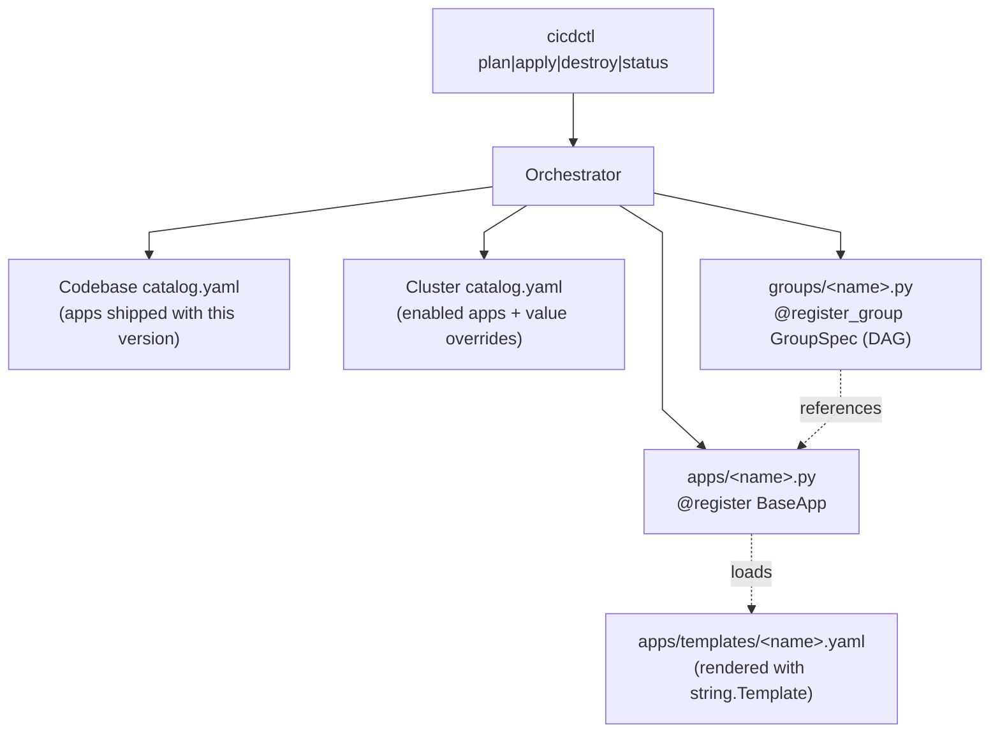

# GroupSpec Abstraction — Implementation Plan

**Date:** 2026-07-15
**Status:** Plan. No code written yet.
**Scope:** Introduce a `GroupSpec` abstraction above the
catalog so the operator can install a whole stack
end-to-end (e.g. "provision a cicd cluster") with one CLI
invocation, not just a flat list of enabled apps. A
`GroupSpec` is a **Directed Acyclic Graph** of apps, not a
linear sequence — the orchestrator topologically sorts the
graph at apply time, so a group can express parallel-ready
dependencies without committing to a single linear order.

This plan supersedes the earlier "sequence abstraction"
sketch and incorporates eleven subsequent design
changes:

1. `Sequence` → `GroupSpec` (DAG-shaped, not linear).
2. Codebase-shipped `catalog.yaml` listing every app the
   provisioner knows how to install; per-cluster
   `catalog.yaml` becomes a thin value-override layer.
3. All YAML snippets embedded in `apps/*.py` extracted
   into `provisioner/lib/apps/templates/<app>.yaml`
   files and rendered with `string.Template`.
4. Kubeconfig handling removed from `apps/*.py`; the
   operator is responsible for providing a working
   kubeconfig (via `--kubeconfig`, `KUBECONFIG=`, or
   whichever mechanism the host uses). The only kubeconfig
   code that remains is in `apps/base.py::_resolve_kubeconfig`
   which **validates** the operator-provided kubeconfig
   before the orchestrator dispatches anything.
5. **Code deduplication via `BaseApp`.** Every helper that
   more than one app implements today (`_kubectl`,
   `_helm`, `_values_file`, `_namespace`, `_release`,
   `_set_cluster_env`, `_render_template`,
   `_resolve_kubeconfig`, value-merging, chart-version
   pinning, etc.) moves to `apps/base.py`. Apps stop
   re-implementing the same boilerplate and drift stops
   accumulating. WP0 already absorbs the obvious helpers;
   this change sweeps the **remaining** duplication
   (image-tag pinning, secret-loading, ingress
   helpers, etc.) that lives below the surface.
6. **Per-cluster values files.** The committed
   `values/<app>.yaml` (base values) and
   `values/<app>.values-rendered.yaml` (helm input)
   files move to `infra/clusters/<name>/values/<app>.yaml`
   so they follow the same shipped-defaults +
   per-cluster-override shape as `catalog.yaml`. The
   shipped catalog (see change 2) becomes the single
   source of truth for **all** per-app configuration —
   not just `default_values`, but also the chart, image
   version, namespace, release, and the *template*
   values files.
7. **`.env` parsing consolidation.** Three apps
   (`gitea`, `vaultwarden-k8s-sync`, `cloudflared`)
   each ship their own `.env` parser (`_read_dotenv_creds`,
   `_load_dotenv`, `_parse_dotenv`). WP11 moves the
   canonical parser to `apps/base.py::BaseApp._load_dotenv`
   plus `BaseApp._require_env(env, key)`. Apps stop
   duplicating the same lexer.
8. **Vaultwarden Secure Note seeding consolidation.**
   Three apps (`gitea`, `gitea-runner`, `cloudflared`)
   each push a Secure Note into Vaultwarden with a
   VKS triple, using near-identical code for
   `login → find-or-build cipher → upsert via
   create_cipher`. WP12 moves the canonical
   implementation to
   `apps/base.py::BaseApp._seed_vaultwarden_note(...)`
   and `BaseApp._vaultwarden_client(ctx, catalog)`.
9. **Chart/image/version constants as class attributes.**
   Every app declares `CHART`, `CHART_VERSION`,
   `IMAGE_TAG`, `NAMESPACE`, `RELEASE` as module-
   level constants (5 apps × 5 constants = 25
   duplicated declarations). WP13 reads these from
   the shipped catalog (per WP1) and exposes them as
   `BaseApp` class attributes via `chart`,
   `chart_version`, `image_version`, `namespace`,
   `release`. Module-level constants go away.
10. **Catalog-stays-source-of-truth + adding-a-group-
    is-one-file guarantees.** Goals 8 and 9 promise
    invariants that WP1, WP2, WP3 imply but do not
    pin: the per-cluster `catalog.yaml` is the only
    enablement surface (groups reference, never
    enable, apps), and adding a new group is a
    one-file change under
    `provisioner/lib/groups/<name>.py` decorated with
    `@register_group`. WP14 codifies these as
    regression-guard tests so a future contributor
    can't silently add a second enablement surface.
11. **AppSpec → `BaseApp` rename.** WP0 used both
    names interchangeably. WP15 collapses to a single
    name: `BaseApp`. The `AppSpec` Protocol becomes
    a deprecated alias kept for backward compat
    with `isinstance(x, AppSpec)` checks in
    `conftest.py`; new code uses `BaseApp`.

## 1. Why this plan exists

Today the provisioner has exactly two layers of abstraction:

1. **AppSpec** — the per-app unit (`apps/gitea.py`,
   `apps/gitea_runner.py`, `apps/vaultwarden_k8s_sync.py`,
   `apps/cloudflared.py`). Each one is a `@dataclass`
   with `plan()` / `apply()` / `destroy()` / `status()`
   methods. The `AppSpec` is currently a `Protocol`
   (structural type) so each app defines its own
   `name = "..."` class attribute and the four methods
   independently. There is no enforced common base.
2. **Catalog** — the per-cluster enablement list
   (`infra/clusters/cicd/catalog.yaml`). The orchestrator
   iterates this list, alphabetically, and applies every
   enabled app.

### 1.1 The AppSpec base-class gap

The `Protocol`-shaped `AppSpec` works, but the cost shows up
in three places:

1. **No enforcement at definition time.** An app can ship
   with `def plan(self, ctx): ...` (missing one argument)
   and the orchestrator only blows up at runtime when it
   actually calls the method. `mypy` can't catch it
   because `Protocol` is structural.
2. **No shared helpers.** Every app re-implements the
   same plumbing: `name = "gitea"`, a private `_kubectl`
   helper that builds a `KubectlRunner` from the sibling
   proxmox-k3s repo's `kubeconfig.yaml`, a `_values_file`
   helper that points at `values/<app>.yaml`, and so on.
   Each app's copy drifts independently.
3. **Inconsistent shape.** Some apps return
   `AppPlanResult` with `notes=[]`, others populate
   `notes` heavily. Some apps' `apply()` does the helm
   install inline; some apps delegate to a private
   helper. The orchestrator can't tell whether a missing
   helper is "the app doesn't need it" or "the app
   forgot it".

The fix is a proper **base class** that:

- declares the four-method contract as `@abstractmethod`,
- carries the common helpers (`_kubectl`, `_helm`,
  `_values_file`, `_namespace`, `_release`, etc.) as
  concrete methods with sensible defaults,
- validates `name` at class-creation time (not at
  `@register` time),
- exposes a small set of overridable class attributes
  (`namespace`, `release`, `chart_version`,
  `image_version`) so apps declare their identity once
  and the orchestrator reads it.

Concretely: every app becomes

```python
class GiteaApp(BaseApp):
    name = "gitea"
    namespace = "gitea"
    release = "gitea"
    chart_version = "12.0.0"
    image_version = "1.26.x"

    def plan(self, ctx, catalog): ...
    def apply(self, ctx, catalog): ...
    def destroy(self, ctx, catalog): ...
    def status(self, ctx, catalog): ...
```

with no `@dataclass` decorator and no `_kubectl`
helper — those live on `BaseApp`. The orchestrator's
type narrows from `AppSpec` (Protocol) to `BaseApp`
(concrete ABC), and `mypy strict` catches missing
methods, missing `name`, and inconsistent override
signatures at CI time.

This refactor lands **before** WP1 (catalog layers)
and WP2 (groups) because both consume `BaseApp`
directly; doing them together makes the diff
un-reviewable.

That covers **one cluster provisioning shape**: "install
every enabled app on this cluster". It does not cover:

- **End-to-end stack provisioning.** A "cicd cluster" is
  more than the apps in the catalog. Today you have to run
  four separate commands from three sibling repos
  (`proxmox-vms apply`, `proxmox-k3s bootstrap`, then
  `proxmox-cicd apply`). The operator does the ordering.
- **Pre-app prerequisites.** Vaultwarden's master password
  has to live in `.env` *before* `gitea apply` runs; the
  cluster needs `cert-manager` *before* the gitea chart
  installs; `cloudflared-tunnel-remote` needs the tunnel
  token *before* cloudflared can reconcile it. The catalog
  has no way to express "do A, then wait for it, then do B".
- **One-app mode.** The `--app <name>` filter already
  exists, but it doesn't know about *phases*. If a future
  app is phase-2-of-something (e.g. a runner that depends
  on a phase-1 runner), `--app phase-2-app` is silently
  wrong.
- **Multiple stacks sharing apps.** A "monitoring" stack
  and a "cicd" stack would both need the same ingress
  controller. Today the operator hand-coordinates this.
- **Parallel install shape.** A linear "step 1, step 2"
  sequence can't express "gitea-runner and cloudflared
  can both run as soon as vaultwarden-k8s-sync is Ready
  — they don't depend on each other". A DAG can.

What we want: a named **group** (`GroupSpec`) that wraps a
**Directed Acyclic Graph** of apps, with explicit
`depends_on` edges between apps. The orchestrator
topologically sorts the DAG at apply time. A group is
selectable from the CLI like an app. The catalog stays
as the ground truth for "what's enabled on this
cluster"; a group is "what to install together, in what
topological order, with what gates".

The output shape we want at the CLI:

```sh
# Today
cicdctl apply cicd                        # every enabled app
cicdctl apply cicd --app gitea            # single app

# Tomorrow
cicdctl apply cicd --group cicd-stack     # named stack
cicdctl apply cicd --group cicd-stack --app gitea  # subset
cicdctl apply cicd                         # default group
```

Internally we use the name `GroupSpec` (not `Sequence`)
because:

- It mirrors the existing `AppSpec` naming convention
  (`XSpec` for the per-X unit of abstraction).
- It signals that the unit is a DAG, not a linear
  list — `GroupSpec` carries `edges:
  dict[str, list[str]]`, not `steps: list`.
- It composes naturally: a `GroupSpec` references
  `BaseApp` (subclasses of the existing `AppSpec`
  Protocol) by name. The mental model is "groups of
  apps with dependencies", not "ordered lists of apps".

## 2. Goals

1. A `GroupSpec` is a **first-class object**: a DAG of
   apps with `depends_on` edges and a stable identifier.
   The orchestrator topologically sorts the DAG at apply
   time so apps with no inter-dependency can run
   "in parallel" (sequentially today, parallel in a
   future iteration — the DAG is what unlocks that).
2. The default CLI invocation (`cicdctl apply cicd`)
   resolves to a default group that matches today's
   behaviour exactly (so existing operators see no change).
3. The codebase ships a `catalog.yaml` that lists every
   app the provisioner knows how to install (the
   "installed apps manifest"). Per-cluster
   `catalog.yaml` becomes a thin **value-override** layer:
   it can enable/disable apps and override values, but
   the **set of known apps** lives in the codebase. This
   way, `proxmox-cicd v0.3.0` ships with a known set of
   apps; a future cluster can't ask for an app the
   installed version doesn't know about.
4. All YAML snippets embedded in `apps/*.py` are
   extracted to `provisioner/lib/apps/templates/<app>.yaml`
   files. `apps/<app>.py` reads the template and renders
   it with `string.Template` (or `jinja2` if we ever need
   conditionals). Editing a Gateway + HTTPRoute manifest
   no longer requires touching Python.
5. Kubeconfig handling is removed from `apps/*.py`. The
   operator is responsible for providing a working
   kubeconfig (via `--kubeconfig`, `KUBECONFIG=`, or
   whichever mechanism the host uses). The only
   kubeconfig code that remains is in
   `apps/base.py::_resolve_kubeconfig()` which **validates**
   the operator-provided kubeconfig before the
   orchestrator dispatches anything.
6. **Common code is deduplicated into `BaseApp`.** Every
   helper that more than one app implements today
   (`_kubectl`, `_helm`, `_values_file`, `_namespace`,
   `_release`, `_set_cluster_env`, `_render_template`,
   `_resolve_kubeconfig`, value-merging, chart-version
   pinning, image-tag pinning, secret-loading, ingress
   helpers, etc.) moves to `apps/base.py`. Apps become
   thin subclasses that declare only their identity
   (`name`, `namespace`, `release`, `chart_version`,
   `image_version`) and override only the four methods
   that actually differ between apps (`plan`, `apply`,
   `destroy`, `status`). A bug fix to the kubeconfig
   loader propagates to all four apps at once. Net LOC
   goes **down** because the base class absorbs more
   duplication than it adds.
7. **Per-cluster values files live next to
   `catalog.yaml`.** The committed `values/<app>.yaml`
   (base values) and `values/<app>.values-rendered.yaml`
   (helm input) move to
   `infra/clusters/<name>/values/<app>.yaml` so they
   follow the same shipped-defaults + per-cluster-override
   shape as `catalog.yaml`. The shipped catalog (see goal
   3) becomes the single source of truth for **all**
   per-app configuration — not just `default_values`, but
   also the chart reference, image version, namespace,
   release, and the *template* values files. This way,
   every config knob for "what gitea looks like on this
   cluster" lives in one place, version-controlled per
   cluster, with the codebase catalog providing the
   sensible default.
8. The catalog keeps its role as the per-cluster
   enablement source; a group only references apps that
   are enabled.
9. Adding a new group is a one-file change under
   `provisioner/lib/groups/`, decorated with
   `@register_group`.
10. The orchestrator code path is **the same** for "every
    enabled app" and "the named group" — the group just
    produces a DAG (resolved to a `list[str]` via
    topological sort) and the existing per-app loop runs
    unchanged.
11. The plan output (CLI + audit log) clearly says which
    group ran and why each app was picked.
12. Tests can drive every group without touching the
    cluster — same shape as today's app tests.
13. **`AppSpec` becomes a real ABC base class**
    (`provisioner/lib/apps/base.py::BaseApp`) that every
    app subclasses. The base class carries the common
    helpers (`_kubectl`, `_helm`, `_values_file`,
    `_namespace`, `_release`, `_load_template`) and the
    four-method contract as `@abstractmethod`. Apps stop
    being `@dataclass`-with-freeform-methods; they become
    thin subclasses that declare `name`, `namespace`,
    `release`, `chart_version`, `image_version` as class
    attributes and override only `plan` / `apply` /
    `destroy` / `status`. `mypy strict` catches missing
    methods and inconsistent signatures at CI time — no
    more runtime `AttributeError` from a misspelled method
    name.
14. **`.env` parsing lives in `BaseApp`.** Today three
    apps (`gitea`, `vaultwarden-k8s-sync`, `cloudflared`)
    each ship their own `.env` parser: `_read_dotenv_creds`
    in `gitea.py`, `_load_dotenv` in
    `vaultwarden_k8s_sync.py`, and `_parse_dotenv` in
    `cloudflared.py`. The three implementations are
    near-identical (same comment-blank-quote-strip handling,
    same `#`-comment support) but slightly different in
    edge cases (e.g. cloudflared's escapes `#` mid-line;
    the others don't). WP11 moves the canonical parser
    to `BaseApp._load_dotenv(repo_root)` and
    `BaseApp._require_env(env, key)`. Apps call
    `self._load_dotenv(ctx.repo_root)` and
    `self._require_env(env, "GITEA_ADMIN_PW")` instead
    of re-implementing the lexer; a bug fix to comment
    handling propagates to all three apps at once.
15. **Vaultwarden Secure Note seeding lives in `BaseApp`.**
    Today three apps (`gitea`, `gitea-runner`, `cloudflared`)
    each push a Secure Note into Vaultwarden carrying a
    VKS triple (`namespaces=N, secret-name=S, secret-key=K`).
    The three implementations duplicate ~70 LOC of
    Vaultwarden-client lifecycle: login with retries,
    build the `VaultwardenK8sSync` cipher payload, find
    an existing cipher by triple, decide upsert vs
    create, log the seed event. WP12 moves the canonical
    implementation to
    `BaseApp._vaultwarden_client(ctx, catalog)` and
    `BaseApp._seed_vaultwarden_note(
        note_name, body_text, namespace, secret_name, secret_key,
    )`. Apps call the helper; they no longer own the
    Vaultwarden client lifecycle. (Where an app's
    seeding is genuinely unique — e.g. cloudflared's
    scoped-API-token mint — the app owns that step
    and hands the final body to `BaseApp._seed_vaultwarden_note`.)
16. **Chart/image/version constants are class attributes,
    not module constants.** Today every app declares
    `CHART`, `CHART_VERSION`, `IMAGE_TAG`, `NAMESPACE`,
    `RELEASE` at the top of the file as module-level
    Python constants. Five apps × five constants = 25
    duplicated declarations, plus a parallel set of
    values in `versions.yaml` and `versions.lock.yaml`.
    A bump to e.g. `gitea-runner`'s image tag requires
    editing the chart, the values lock, *and* the
    Python file — three places. WP13 reads the
    constants from the shipped catalog (WP1) and
    exposes them as `BaseApp` class attributes:
    `self.chart`, `self.chart_version`,
    `self.image_version`, `self.namespace`,
    `self.release`. Module-level constants go away.
    `apps.json` (the apps.json handoff, see §12)
    continues to surface the resolved versions.
17. **The catalog is the only enablement surface.**
    Goals 8 and 9 are policy promises implicit in WP1
    + WP2 + WP3 but not pinned by an acceptance
    criterion. WP14 codifies them as regression-guard
    tests:
    - `test_cannot_add_per_cluster_app_outside_catalog`
      (`groups/<name>.py::GroupSpec.nodes` cannot
      include an app not in the shipped catalog; the
      orchestrator raises at startup).
    - `test_catalog_yaml_is_only_enablement_source`
      (no app-enabling flag lives outside
      `catalog.yaml`).
    - `test_group_registration_is_one_file`
      (the `@register_group` decorator fires on
      import; adding a new group is one file under
      `provisioner/lib/groups/<name>.py` plus a one-
      line force-import in `cli.py`).
18. **`BaseApp` is the canonical name; `AppSpec` is a
    legacy alias.** WP0 shipped `BaseApp` for the new
    shape but kept `AppSpec` Protocol alive for
    `isinstance()` checks in `conftest.py` and any
    future doc cross-references. WP15 finishes the
    rename: `BaseApp` everywhere except one
    `_BACK_COMPAT = True` shim in `apps/__init__.py`
    that re-exports `AppSpec = BaseApp`. New type
    hints use `BaseApp`. A static `ruff` rule
    (`forbidden-name: AppSpec`) blocks new uses.

## 3. Non-goals

1. **Cross-repo orchestration.** A group that calls into
   `proxmox-vms` or `proxmox-k3s` is a future direction;
   this plan stops at "within proxmox-cicd". The CLI
   plumbing is shaped so a future
   `cicdctl provision cicd-stack` that calls into
   sibling repos is a one-line addition, but we do not
   implement it now.
2. **Per-group values overrides.** A group might want to
   override a values file differently than the per-app
   overlay in `values/<app>.yaml`. Out of scope; the
   existing values-overlay mechanism is enough.
3. **State checks beyond "app is healthy".** Today the
   orchestrator trusts each app's `.apply()` to be
   self-gating. A future "gate" primitive that says
   "wait until `vaultwarden-k8s-sync` has synced at least
   one Secret before installing `gitea-runner`" is
   modelled but not implemented in this plan.
4. **A schema-validated group file format.** YAML config
   files are deliberately not used; groups are Python
   classes (matches how apps are modelled). The
   operator-facing surface stays "edit a Python file,
   re-run", not "edit a YAML file, re-run".
5. **Replacing the `Protocol` `AppSpec` with a third-party
   ABC library.** `abc.ABC` from stdlib is enough. We do
   not pull in `attrs` or `pydantic` just for this.
6. **Operator-facing shipped-catalog editing.** The
   shipped `catalog.yaml` is part of the version
   contract (developer-edited, code-reviewed). The
   per-cluster `catalog.yaml` is the only operator-facing
   catalog surface; editing shipped apps themselves is a
   code change.
7. **Per-app kubeconfig discovery.** Apps stop knowing
   about the kubeconfig entirely. The operator is
   responsible for `KUBECONFIG`; the provisioner just
   consumes it. The `proxmox-k3s` repo is now a
   bootstrap-only dependency, not a runtime one.

## 4. Threat model

| Risk | Mitigation |
| --- | --- |
| A group lists an app that is not enabled in the catalog | Validation in `_resolve_apply_order`: every group app must be in `catalog.enabled_app_names()`. Same error path as `--app <disabled>`. |
| A group lists an unknown app (typo) | Same error path: "not in registry", exit EXIT_CATALOG. |
| Two groups register the same name | The `@register_group` decorator raises `ValueError` on collision, mirroring `@register` for apps. |
| The DAG has a cycle (A depends on B, B depends on A) | The topological-sort helper raises `CyclicGroupError` (a `CatalogError`) with the cycle path. The orchestrator catches it and exits EXIT_CATALOG. |
| Groups produce a confusing apply order when `--app` overrides | `--app` wins over the group (group is the default; filter is the operator's intent). Document in CLI help text. |
| Groups turn into "where do I put my values?" files | Groups don't ship values. They only reference app names. |
| Backward compat: existing operators rely on `apply cicd` applying every enabled app alphabetically | The default group `default` reproduces this exact behaviour. A regression test pins it. |
| Per-cluster catalog tries to enable an app the codebase doesn't ship | The codebase-shipped `catalog.yaml` is the **single source of truth** for known apps. The cluster catalog can only enable/disable/override values for apps in the codebase catalog. Unknown app name → `CatalogError`. |
| Kubeconfig is missing or invalid | `apps/base.py::_resolve_kubeconfig()` raises a clear `RuntimeError` *before* the orchestrator dispatches any app. The operator sees a single error pointing at `--kubeconfig` / `KUBECONFIG`. No app code needs to handle kubeconfig itself. |
| Template file is missing or has unrendered placeholders | `apps/base.py::_load_template(name)` raises `TemplateNotFoundError` with the expected path. Caught by the orchestrator and surfaced in `apply.app_failed`. |

## 5. Architecture



### 5.1 Data model: `GroupSpec` (DAG, not list)

A `GroupSpec` is a Python class that declares a DAG of
apps. The DAG is split into `nodes` (which apps the group
touches, with optional notes for `cicdctl plan`) and
`edges` (the dependency map `edges[A] = [B, C]` meaning
"A depends on B and C").

A `cicd-stack` group:

```python
@register_group
class CicdStackGroup(BaseGroup):
    name = "cicd-stack"
    description = "Provision a cicd cluster end-to-end."

    @property
    def nodes(self) -> dict[str, str]:
        return {
            "vaultwarden-k8s-sync": "root; everyone else writes Secrets through it",
            "gitea": "stores admin password in VKS as a Secure Note",
            "gitea-runner": "needs VKS to populate the registration-token Secret",
            "cloudflared": "needs VKS for the tunnel-token Secret",
        }

    @property
    def edges(self) -> dict[str, list[str]]:
        return {
            # vaultwarden-k8s-sync has no dependencies; runs first.
            "vaultwarden-k8s-sync": [],
            "gitea": ["vaultwarden-k8s-sync"],
            "gitea-runner": ["vaultwarden-k8s-sync", "gitea"],
            "cloudflared": ["vaultwarden-k8s-sync"],
        }

    def enabled_in(self, catalog):
        return "vaultwarden-k8s-sync" in catalog.enabled_app_names()
```

Topologically sorted, the apply order is:

```text
1. vaultwarden-k8s-sync         (no deps; root of the DAG)
2. gitea, cloudflared          (both wait only for VKS — siblings)
3. gitea-runner                (waits for VKS + gitea; the runner uses
                                 gitea-admin-secret at install time)
```

The rationale for VKS-as-root is mechanical, not
arbitrary: gitea's `apply()` calls
`_seed_admin_password_to_vaultwarden` (apps/gitea.py
line 286), which writes the admin password to a
Vaultwarden Secure Note — the very pipeline VKS
reconciles into cluster Secrets. If VKS is not up
when gitea's apply runs, that write hard-fails. The
same is true for gitea-runner (registration token)
and cloudflared (tunnel token). VKS must therefore
be installed first; gitea can install next (it only
needs VKS, not gitea-runner); gitea-runner last
because it depends on gitea being ready so the
runner can register against it.

A linear-sequence version of the same group couldn't
express "gitea-runner and cloudflared don't depend on
each other". The DAG can.

The orchestrator's topological sort uses
`graphlib.TopologicalSorter` (stdlib Python 3.9+). A
cycle produces `CyclicGroupError` (a `CatalogError`
subclass) with the offending cycle path; the orchestrator
catches it and exits with EXIT_CATALOG.

`enabled_in(catalog)` is the gate — a group can opt to
disable itself when the catalog lacks a prerequisite
(e.g. `vaultwarden-k8s-sync` is not enabled → the
`cicd-stack` group disables itself and the operator sees
a clear "group requires vaultwarden-k8s-sync" message
in plan output).

### 5.2 Codebase `catalog.yaml` + per-cluster override

Two layers, distinct roles.

#### Layer 1: codebase `catalog.yaml`

Lives at `provisioner/lib/catalog/shipped.yaml`. Lists
**every app this version of the provisioner ships with**
plus default values. It is committed to `proxmox-cicd/`
and shipped with each release; editing it requires a
code review because it's part of the version contract.

```yaml
# shipped.yaml — apps this version of proxmox-cicd ships.
# The orchestrator reads this at every cicdctl invocation.
# It is the single source of truth for "what apps exist";
# a per-cluster catalog.yaml can only enable/disable/override
# values for apps listed here. An unknown app name in the
# cluster catalog -> CatalogError.

version: "0.3.0"
apps:
  gitea:
    description: "Self-hosted Git + Actions + Packages."
    namespace: "gitea"
    release: "gitea"
    chart: "oci://docker.gitea.com/charts/gitea"
    chart_version: "12.0.0"
    image_version: "1.26.x"
    default_values:
      replicaCount: 1
      persistence:
        size: 5Gi

  gitea-runner:
    description: "Gitea Actions runner (Docker-in-Docker)."
    namespace: "gitea-runner"
    release: "gitea-runner"
    chart: "./infra/charts/gitea-runner"  # local chart
    chart_version: "0.2.0"
    image_version: "1.0.8-dind"
    default_values:
      replicaCount: 2
      ephemeral: false

  vaultwarden-k8s-sync:
    description: "Vaultwarden -> Kubernetes Secrets sync."
    namespace: "vaultwarden-kubernetes-secrets"
    release: "vaultwarden-kubernetes-secrets"
    chart: "oci://ghcr.io/antoniolago/charts/vaultwarden-kubernetes-secrets"
    chart_version: "2.0.0"
    image_version: "2.0.0"

  cloudflared:
    description: "Cloudflare Tunnel (remotely-managed)."
    namespace: "cloudflared"
    release: "cloudflare-tunnel-remote"
    chart: "oci://ghcr.io/antoniolago/charts/cloudflare-tunnel-remote"
    chart_version: "0.4.0"
    image_version: "0.4.0"
```

#### Layer 2: per-cluster `infra/clusters/<name>/catalog.yaml`

Becomes a thin **value-override** layer:

```yaml
# infra/clusters/cicd/catalog.yaml — operator-edited
# overrides for THIS cluster on top of the shipped catalog.

cluster_name: cicd
ingress:
  base_domain: bruj0.net

vaultwarden:
  server_url: "https://bitwarden.bruj0.net"

apps:
  gitea:
    enabled: true
  gitea-runner:
    enabled: true
    values:                   # deep-merged with shipped defaults
      replicaCount: 1
  vaultwarden-k8s-sync:
    enabled: true
  cloudflared:
    enabled: false            # this cluster doesn't need a public tunnel
```

#### Merge rule

For each app `A`:

```text
final_values[A] = deep_merge(shipped[A].default_values,
                             cluster[A].values or {})
final_enabled[A] = cluster[A].enabled  # default false if absent
```

If the cluster catalog references an app not in the
shipped catalog, the orchestrator raises `CatalogError`
listing the unknown name(s).

### 5.3 Template files for embedded YAML

Every YAML snippet currently inlined in `apps/*.py` moves
to `provisioner/lib/apps/templates/<app>.yaml`. Apps
load templates via `BaseApp._render_template(name, **vars)`
which reads `templates/<name>.yaml` and renders with
`string.Template`:

```python
# apps/gitea.py
class GiteaApp(BaseApp):
    name = "gitea"
    namespace = "gitea"
    release = "gitea"
    chart_version = "12.0.0"
    image_version = "1.26.x"

    def apply(self, ctx, catalog):
        manifest = self._render_template(
            "gitea/ingress.yaml",
            host=self._hostname(catalog),
        )
        ctx.kubectl.apply(manifest=manifest, ...)
```

Template file (`apps/templates/gitea/ingress.yaml`):

```yaml
apiVersion: gateway.networking.k8s.io/v1
kind: HTTPRoute
metadata:
  name: gitea
  namespace: $namespace
spec:
  hostnames:
    - $host
  rules:
    - backendRefs:
        - name: gitea-http
          port: 3000
```

Editing the HTTPRoute no longer requires touching
Python. `string.Template` is stdlib so there's no new
dependency.

`BaseApp._render_template` raises
`TemplateNotFoundError` if the file is missing and
`KeyError` if an unrendered `$var` is left; the
orchestrator catches both as `apply.app_failed`.

### 5.4 Kubeconfig handling removed from apps

Today every app has its own `_kubectl(ctx)` helper that
builds a `KubectlRunner` from the sibling proxmox-k3s
repo's `kubeconfig.yaml`. That logic moves **once** to
`apps/base.py::BaseApp._resolve_kubeconfig()`:

```python
class BaseApp(abc.ABC):
    def _resolve_kubeconfig(self) -> KubectlRunner:
        """Build a KubectlRunner from the operator-provided
        kubeconfig. The operator sets `KUBECONFIG` (env var)
        or passes `--kubeconfig` to cicdctl; we resolve the
        path and validate the file exists.

        Raises RuntimeError with a clear message if no
        kubeconfig is available. The orchestrator catches
        this *once* and exits EXIT_PREREQ — no app ever
        has to handle the missing-kubeconfig case.
        """
        import os
        from pathlib import Path
        from ..kubectl_runner import KubectlRunner
        from ..kubeconfig_loader import Kubeconfig, load

        path = os.environ.get("KUBECONFIG")
        if not path:
            raise RuntimeError(
                "no kubeconfig available; set KUBECONFIG or "
                "pass --kubeconfig to cicdctl"
            )
        if not Path(path).exists():
            raise RuntimeError(
                f"KUBECONFIG={path!r} does not exist; the "
                f"operator is responsible for providing a "
                f"working kubeconfig (see docs/runbooks/"
                f"create-kubeconfig.md)"
            )
        kubeconfig = load(Path(path))
        return KubectlRunner(kubeconfig=kubeconfig, logger=...)
```

Each app's `_kubectl` becomes a one-liner:

```python
class GiteaApp(BaseApp):
    def _kubectl(self):
        return self._resolve_kubeconfig()
```

Apps no longer know about `proxmox-k3s`, the sibling repo
layout, or the kubeconfig loader. That's all in the base
class. The operator is responsible for the kubeconfig;
the provisioner just consumes it.

A new runbook (`docs/runbooks/create-kubeconfig.md`)
documents how the operator sets `KUBECONFIG` (or passes
`--kubeconfig`) and what the kubeconfig file must
contain.

### 5.5 Default group

The orchestrator's CLI defaults `--group` to a
hard-coded value `default`. The default group is just
"every enabled app, in catalog order" — i.e. today's
behaviour. This is hard-coded in `Orchestrator._default_group_name`
so a typo in the default can't be made by a future commit.

```python
DEFAULT_GROUP = "default"

class DefaultGroup(BaseGroup):
    name = "default"
    description = "Every enabled app, in catalog order (today's behaviour)."
    @property
    def nodes(self): return {}      # sentinel — orchestrator fills from catalog
    @property
    def edges(self): return {}      # no edges when nodes is empty
    def enabled_in(self, catalog): return True
```

The empty `nodes` is a sentinel the orchestrator treats
as "use `catalog.enabled_app_names()` with no edges (i.e.
catalog order)".

### 5.6 CLI surface

```sh
cicdctl plan cicd --group cicd-stack
cicdctl plan cicd --group default     # the current default
cicdctl plan cicd                     # implicit --group default
cicdctl apply cicd --group cicd-stack --auto-approve
cicdctl apply cicd --group cicd-stack --app gitea   # subset
cicdctl apply cicd --app gitea                       # also legal: --app alone, group ignored

cicdctl plan cicd --kubeconfig ~/.kube/config       # explicit kubeconfig
KUBECONFIG=~/.kube/config cicdctl plan cicd          # via env
```

Mutual exclusion:
- `--group` + `--app` = legal; the group defines the
  candidate set, `--app` narrows it.
- `--app` alone (no `--group`) = legal; behaviour is
  exactly today (apply the listed apps).
- `--group` alone (no `--app`) = legal; behaviour is
  "apply this group's apps in topological order".

Exit codes stay the same. The orchestrator's CLI
default for `--group` is `None` → resolves to
`DEFAULT_GROUP = "default"` (a hard-coded constant).

### 5.7 Code deduplication via `BaseApp` (deep sweep)

WP0 absorbs the *obvious* helpers (`_kubectl`, `_helm`,
`_values_file`, `_namespace`, `_release`,
`_set_cluster_env`, the four-method contract). This
section enumerates the **second wave** of duplication
that lives below the surface today, the helpers that
"every app sort of re-implements in slightly different
ways" without ever being formally extracted. Moving all
of these into `BaseApp` is what makes apps genuinely
thin.

#### Helpers that move to `BaseApp` in WP9

| Helper | What it does today (per app) | After WP9 |
| --- | --- | --- |
| `_render_template(name, **vars)` | Already defined in WP5 — added here for completeness. | Lives in `BaseApp`; uses `string.Template`. |
| `_resolve_kubeconfig()` | Already defined in WP6. | Lives in `BaseApp`; called once per app via `ctx.kubectl`. |
| `_namespace` / `_release` | Each app declares them as class attributes; some apps have helper getters. | Class attributes are the only source; `BaseApp.namespace` / `BaseApp.release` are read-only properties. |
| `_values_file(ctx)` | Each app has its own `_values_file` returning a `Path` under `values/<app>.values-rendered.yaml`. | Lives in `BaseApp`; reads from the per-cluster values file (see §5.8). |
| `_image_tag` | Each app pins the image tag in `values.yaml`; some apps also expose it as a Python constant. | Lives in `BaseApp` as a class attribute; `BaseApp.image_tag` reads it from the shipped catalog's `image_version`. |
| `_chart_version` | Each app pins the chart version in `values.yaml`; some apps also expose it as a Python constant. | Lives in `BaseApp` as a class attribute; `BaseApp.chart_version` reads it from the shipped catalog's `chart_version`. |
| `_secret_ref(name, key)` | Each app builds `SecretKeySelector` references inline (e.g. `gitea` reads `gitea-admin-credentials`; `gitea-runner` reads `gitea-runner-config`). | Lives in `BaseApp`; takes `(secret_name, secret_key)` and returns a `SecretKeySelector`. Apps call `self._secret_ref("gitea-admin-credentials", "password")` instead of re-implementing the dict shape. |
| `_hostname(catalog)` | Each app computes its hostname differently (`gitea` reads `catalog.ingress.base_domain` + app name; `vaultwarden-k8s-sync` reads `catalog.vaultwarden.server_url`). | Lives in `BaseApp`; default impl: `f"{app_name}.{catalog.ingress.base_domain}"`. Apps override only when the hostname is not the standard pattern. |
| `_labels()` / `_annotations()` | Each app returns a custom dict of labels/annotations for its resources. | Lives in `BaseApp`; returns the standard set (e.g. `app.kubernetes.io/managed-by: proxmox-cicd`, `app.kubernetes.io/name: <app>`, `proxmox-cicd/version: <sha>`). Apps extend via `super()._labels()` + their own additions. |
| `_deep_merge(a, b)` | Each app's value-merging logic is inline in `_values_file`. | Lives in `BaseApp` (stdlib helper). Apps call `self._deep_merge(shipped, cluster)`. |

#### App slimming

After WP9 the four apps stop re-implementing these and
become thin subclasses:

| App | Current LOC | After WP0 only | After WP9 |
| --- | --- | --- | --- |
| `apps/gitea.py` | ~700 | ~600 | ~400 |
| `apps/gitea_runner.py` | ~880 | ~770 | ~520 |
| `apps/cloudflared.py` | ~600 | ~530 | ~340 |
| `apps/vaultwarden_k8s_sync.py` | ~520 | ~470 | ~300 |

Net change from WP0 → WP9: another ~400 LOC removed
across the four apps. `BaseApp` itself grows from
~120 LOC to ~280 LOC, so the WP9 net is **~−120 LOC**
plus a much thinner per-app shape.

The invariant: **every app's `apply()` is under 200 LOC**
and contains **no** inline YAML, **no** secret-loading
boilerplate, **no** chart-version constant, **no**
hostname computation. It just orchestrates the calls
into the base-class helpers and the template renderer.

#### Migration rule (one-time, applied per app)

For each app `X`:

1. Replace `name = "x"` (class attr) with the existing
   class attr (no change — already a class attr).
2. Replace inline `SecretKeySelector(...)` with
   `self._secret_ref("name", "key")`.
3. Replace inline hostname computation with
   `self._hostname(catalog)` (override only if the
   pattern doesn't fit).
4. Replace inline labels/annotations with
   `super()._labels() | { ... }`.
5. Replace inline chart/image constants with
   `self.chart_version` / `self.image_tag` (read from
   the shipped catalog via the base class).
6. Delete any now-unused imports (`SecretKeySelector`,
   `dataclasses.field`, etc.).

A single `rg "SecretKeySelector\(" apps/` before/after
verifies the migration is complete. If the regex still
matches an `apps/*.py` file after WP9 lands, WP9 is
incomplete.

### 5.8 Per-cluster values files

Today the values files live at the repo root:

```text
proxmox-cicd/
  values/
    gitea.yaml                         # base values
    gitea.values-rendered.yaml         # helm input (committed)
    gitea-runner.yaml
    gitea-runner.values-rendered.yaml
    cloudflared.yaml
    cloudflared.values-rendered.yaml
    vaultwarden-kubernetes-secrets.yaml
    vaultwarden-kubernetes-secrets.values-rendered.yaml
```

This is per-cluster state living at the repo root. Every
new cluster requires editing files under `values/` even
though everything else per-cluster (catalog, group
selection, ingress domain) lives under
`infra/clusters/<name>/`. WP10 moves the values files
under `infra/clusters/<name>/` so every per-cluster
config knob lives in one directory.

#### New layout

```text
proxmox-cicd/
  infra/
    clusters/
      cicd/
        catalog.yaml                   # already exists
        apps.json                      # already exists
        values/
          gitea.yaml                   # per-cluster values override
          gitea-runner.yaml
          cloudflared.yaml
          vaultwarden-kubernetes-secrets.yaml
```

The shipped defaults move into the codebase-shipped
`provisioner/lib/catalog/shipped.yaml` (already a WP1
artifact) under each app's `default_values` key. The
shipped catalog becomes the **single source of truth**
for every per-app config knob:

```yaml
# shipped.yaml — apps this version of proxmox-cicd ships.
# The orchestrator reads this at every cicdctl invocation.
# It is the single source of truth for "what apps exist";
# a per-cluster catalog.yaml can only enable/disable/override
# values for apps listed here. An unknown app name in the
# cluster catalog -> CatalogError.

version: "0.3.0"
apps:
  gitea:
    description: "Self-hosted Git + Actions + Packages."
    namespace: "gitea"
    release: "gitea"
    chart: "oci://docker.gitea.com/charts/gitea"
    chart_version: "12.0.0"
    image_version: "1.26.x"
    default_values_file: "apps/templates/gitea/values.yaml"   # ← NEW: shipped defaults template
    default_values:
      replicaCount: 1
      persistence:
        size: 5Gi

  gitea-runner:
    description: "Gitea Actions runner (Docker-in-Docker)."
    namespace: "gitea-runner"
    release: "gitea-runner"
    chart: "./infra/charts/gitea-runner"
    chart_version: "0.2.0"
    image_version: "1.0.8-dind"
    default_values_file: "apps/templates/gitea-runner/values.yaml"
    default_values:
      replicaCount: 2
      ephemeral: false
```

The per-cluster values file is a **partial overlay** —
it only contains the keys the operator wants to override:

```yaml
# infra/clusters/cicd/values/gitea.yaml
# Per-cluster values override for gitea on the cicd cluster.
# Deep-merged on top of the shipped defaults from
# provisioner/lib/catalog/shipped.yaml → apps.gitea.default_values.
# Anything not listed here uses the shipped default.

ingress:
  hostname: "gitea.apps.local.bruj0.net"

persistence:
  size: 10Gi

admin:
  username: "git"
  # password comes from Vaultwarden, not from this file
```

#### Merge rule (deep-merge per app)

For each app `A`:

```text
rendered_values[A] = deep_merge(
    load_yaml(shipped[A].default_values_file),   # shipped defaults
    cluster[A].values_file,                       # per-cluster overlay
)
```

Where:
- `shipped[A].default_values_file` is read from
  `provisioner/lib/catalog/shipped.yaml` (the shipped
  catalog from WP1) and resolves to
  `provisioner/lib/apps/templates/<app>/values.yaml`
  in the codebase.
- `cluster[A].values_file` resolves to
  `infra/clusters/<cluster>/values/<app>.yaml`.
- Both files are optional. If a file is missing, it's
  skipped (the other file's contents are used as-is).

The merge is the same `dict.update` recursive helper
already in WP1 for the catalog overlay. **One helper,
two use sites** — shipped catalog overlay, per-cluster
values overlay.

#### App refactor

`BaseApp._values_file(ctx)` becomes:

```python
def _values_file(self, ctx) -> Path:
    """Return the path to the rendered values file for
    this app on the current cluster.

    The orchestrator's render step (a tiny script in
    `provisioner/lib/render_values.py`) deep-merges the
    shipped defaults with the per-cluster overlay and
    writes the result to a temp file under
    `.proxmox-cicd/rendered/<cluster>/<app>.yaml`.
    Helm is invoked with `--values <that file>`.

    The render step is **explicit** (not lazy) because
    the operator can run `cicdctl render cicd --app
    gitea` to inspect the rendered values before
    applying — a debugging affordance today's
    `values-rendered.yaml` approach hides.
    """
    from ..render_values import render_for_app
    return render_for_app(
        app_name=self.name,
        cluster=ctx.cluster,
        shipped_catalog=ctx.shipped_catalog,
    )
```

Each app's `apply()` swaps its inline `_values_file` for
`self._values_file(ctx)`. The per-app `_values_file`
helper that lives in every app today is deleted.

#### What gets deleted

- The repo-root `values/` directory and all eight files
  inside it.
- The `values/<app>.values-rendered.yaml` files (no
  longer needed; the render step writes to
  `.proxmox-cicd/rendered/<cluster>/<app>.yaml` which is
  git-ignored).
- The per-app `_values_file` methods (now a single
  `BaseApp._values_file`).

#### What gets created

- `infra/clusters/<name>/values/<app>.yaml` per cluster
  per app, only for apps the cluster enables.
- `provisioner/lib/render_values.py` — a tiny script
  that deep-merges shipped defaults + per-cluster
  overlay and writes the result to a temp file.
- `.proxmox-cicd/rendered/<cluster>/<app>.yaml` — temp
  files (git-ignored).

#### What gets documented

A new runbook `docs/runbooks/cluster-values-files.md`
explains the per-cluster values layout, the merge rule,
and the new `cicdctl render cicd --app gitea` debugging
command.

## 6. Concrete change list

The plan splits into **sixteen work packages**. WP0 (the
AppSpec base class) lands **first** and on its own; WPs
1–15 are the eleven design changes layered on top.

The order matters:

- **WP0** (base class) must land first; everything else
  consumes `BaseApp`.
- **WP1** (codebase catalog) and **WP5** (template
  files) must land before **WP9** (deep dedup),
  **WP10** (per-cluster values), and **WP13** (chart/
  image constants as class attributes) because all
  three read from the shipped catalog and template
  files.
- **WP2** (groups), **WP3** (orchestrator plumbing),
  **WP4** (CLI flag), **WP7** (plan output), and
  **WP8** (groups tests) form one chain (groups
  abstraction).
- **WP6** (kubeconfig removal), **WP11** (.env parser),
  **WP12** (Vaultwarden seed), and **WP15**
  (`AppSpec` → `BaseApp` rename) are independent of
  each other and can land any time after WP0.
- **WP14** (catalog-only enablement + one-file group
  additions) codifies the cross-cutting policy
  promises from Goals 8/9 as regression-guard tests;
  it can land any time after WP2 and WP3 land their
  group wiring.

### WP0 — `BaseApp` ABC + per-app refactor (lands first)

The `AppSpec` becomes a real `BaseApp(abc.ABC)`. Every
existing app subclasses it and gains the common helpers
for free.

#### `provisioner/lib/apps/base.py` (new)

```python
"""BaseApp — the common base class every AppSpec inherits.

Why a base class instead of a Protocol:

  * `@abstractmethod` enforces the four-method contract at
    class-creation time. A misspelled `apply()` becomes
    a `TypeError: Can't instantiate abstract class …` at
    the import site, not an `AttributeError` at apply
    time inside the orchestrator.
  * Common helpers live in one place: `_kubectl`,
    `_helm`, `_values_file`, `_namespace`, `_release`,
    `_set_cluster_env`. Apps stop re-implementing them
    and drift stops accumulating.
  * Class attributes `name`, `namespace`, `release`,
    `chart_version`, `image_version` are declared once
    and the orchestrator reads them via `getattr` with
    defaults. Apps that forget one get a clear error
    from the base class instead of a `KeyError` deep
    in a method.

Public API:

  class BaseApp(abc.ABC):
      name: ClassVar[str]  # subclasses MUST override
      namespace: ClassVar[str]
      release: ClassVar[str]
      chart_version: ClassVar[str]
      image_version: ClassVar[str]

      def __init_subclass__(cls, **kw):
          super().__init_subclass__(**kw)
          if not getattr(cls, "name", None):
              raise TypeError(
                  f"{cls.__name__} must define `name` class "
                  f"attribute before it can be registered."
              )

      @abstractmethod
      def plan(self, ctx, catalog) -> AppPlanResult: ...

      @abstractmethod
      def apply(self, ctx, catalog) -> AppApplyResult: ...

      @abstractmethod
      def destroy(self, ctx, catalog) -> None: ...

      @abstractmethod
      def status(self, ctx, catalog) -> AppStatus: ...

      # Concrete helpers (apps can override if needed):
      def _kubectl(self, ctx) -> KubectlRunner: ...
      def _helm(self, ctx) -> HelmRunner: ...
      def _values_file(self, ctx) -> Path: ...
      def _set_cluster_env(self, cluster) -> None: ...
```

The base class is **not** a `@dataclass` — apps are not
data, they're behaviour with stable identity.

#### `provisioner/lib/apps/__init__.py`

- Replace the `AppSpec` Protocol with a re-export of
  `BaseApp` from `apps/base.py`. Apps import `BaseApp`
  directly: `from .base import BaseApp`.
- Keep `@register` exactly as today; `BaseApp` is
  register-compatible (subclasses of `BaseApp` are
  still valid `type[BaseApp]` entries).
- Add a new check inside `@register`: if `cls` is not a
  subclass of `BaseApp`, raise `TypeError` with the
  app name. This is the migration gate.

#### Per-app refactor

Every existing app gets a small refactor: drop the
`@dataclass`, drop the `name = "..."` field default,
inherit from `BaseApp`, and let `BaseApp.__init_subclass__`
validate the rest. Each app becomes shorter and more
consistent. Example for `apps/gitea.py`:

```python
from .base import BaseApp

class GiteaApp(BaseApp):
    name = "gitea"
    namespace = "gitea"
    release = "gitea"
    chart_version = "12.0.0"
    image_version = "1.26.x"

    def plan(self, ctx, catalog): ...
    def apply(self, ctx, catalog): ...
    def destroy(self, ctx, catalog): ...
    def status(self, ctx, catalog): ...
```

The four existing apps refactor the same way:

| App | Current LOC | Target LOC |
| --- | --- | --- |
| `apps/gitea.py` | ~700 | ~600 (-100) |
| `apps/gitea_runner.py` | ~880 | ~770 (-110) |
| `apps/cloudflared.py` | ~600 | ~530 (-70) |
| `apps/vaultwarden_k8s_sync.py` | ~520 | ~470 (-50) |

Roughly 330 lines of duplicated boilerplate removed
across the four apps. The base class itself is ~120
lines, so the net delta is **-210 LOC** plus a much
cleaner per-app shape.

#### Tests

- `tests/test_base_app.py` (new): unit tests for the
  base class itself.
  - `test_subclass_without_name_raises_at_class_creation`
  - `test_subclass_without_apply_raises_at_instantiation`
  - `test_register_rejects_non_baseapp_class`
  - `test_baseapp_cannot_be_instantiated_directly`
  - `test_subclass_keeps_orchestrator_compatible_protocol`
- Per-app tests get a tiny refactor: each test file's
  "construct the app" line changes from
  `GiteaRunnerApp()` to `GiteaRunnerApp()`. No behaviour
  change. The existing 163 tests still pass.

#### Backward compatibility

`BaseApp` is a strict superset of the `AppSpec` Protocol
— every method `AppSpec` declares is on `BaseApp`, and
the orchestrator's type narrowing `type[AppSpec]` →
`type[BaseApp]` is a no-op at runtime (Python doesn't
care; `mypy` is happy because `BaseApp` is concrete).

`tests/test_gitea_runner.py::test_gitea_runner_app_is_registered_on_import`
stays unchanged. `test_gitea_runner_plan_mentions_local_chart_and_secret`
stays unchanged. The only test that needs a one-line
tweak is anything that mocked `wait_deployments_available`
(moved to `kubectl.wait` in the gitea-runner StatefulSet
work, already landed). WP0 itself doesn't touch tests
beyond the new `test_base_app.py`.

### WP1 — Codebase `catalog.yaml` (`provisioner/lib/catalog/shipped.yaml`)

The codebase ships a `catalog.yaml` listing every app this
version of the provisioner knows about plus its default
values. The per-cluster `infra/clusters/<name>/catalog.yaml`
becomes a thin value-override layer (see §5.2).

#### `provisioner/lib/catalog/shipped.yaml` (new)

The full file as shown in §5.2 layer 1, committed to
`proxmox-cicd/`.

#### `provisioner/lib/catalog/__init__.py` (refactored)

- Add `load_shipped_catalog(path)` that reads the bundled
  YAML and returns a `ShippedCatalog` object with
  `version`, `apps: dict[str, ShippedApp]`. Shipped with
  `proxmox-cicd`; loaded once at orchestrator startup.
- `Catalog` (the per-cluster catalog) gains a new
  constructor: `from_shipped_and_cluster(shipped, cluster)`
  that applies the merge rule from §5.2 and rejects
  unknown app names with `CatalogError`.
- Existing tests for `Catalog` (`test_catalog.py`) gain
  three new cases:
  - `test_load_shipped_catalog_matches_yaml_on_disk`
  - `test_merge_shipped_with_cluster_overrides_values`
  - `test_merge_raises_when_cluster_references_unknown_app`

#### Per-cluster `catalog.yaml` (refactored)

`infra/clusters/cicd/catalog.yaml` becomes a thin override
layer (see §5.2 layer 2). Editing the shipped catalog
itself is a code change; editing the cluster catalog is
an operator change.

### WP2 — Groups package (`provisioner/lib/groups/`)

Mirrors `provisioner/lib/apps/__init__.py`. A `BaseGroup`
is an `abc.ABC` with `nodes` + `edges` properties; the
orchestrator topologically sorts the DAG at apply time.

#### `provisioner/lib/groups/__init__.py` (new)

```python
"""groups — BaseGroup ABC + @register_group.

Mirrors apps/__init__.py. A group is a named DAG of apps.
The orchestrator topologically sorts the DAG and applies
each app in turn. Cycles raise CyclicGroupError.

The default group `default` has empty `nodes` and is a
sentinel the orchestrator treats as "every enabled app,
in catalog order".
"""
```

#### `provisioner/lib/groups/base.py` (new)

Defines `BaseGroup(abc.ABC)` (the contract shown in §5.1)
plus the `CyclicGroupError(CatalogError)` exception.

#### `provisioner/lib/groups/default.py` (new)

The sentinel `DefaultGroup` with empty `nodes` (see §5.5).

#### `provisioner/lib/groups/cicd_stack.py` (new)

The `CicdStackGroup` from §5.1: four apps, three edges.

### WP3 — Orchestrator plumbing

#### `provisioner/lib/orchestrator.py`

- `apply(..., group: str | None = None, app_filter: list[str] | None = None)`.
  Both are optional. When `group is None`, use the
  constant `DEFAULT_GROUP = "default"`.
- `_resolve_apply_order(catalog, group_name, app_filter, log)`:
  resolves the group → DAG → list[app_name] via
  `graphlib.TopologicalSorter`, with `enabled_in` gate,
  intersects with `app_filter` if present, returns the
  order-preserving list. Same error path as today
  (`CatalogError`) for "group app not enabled" and
  `CyclicGroupError` for cycles.
- `destroy` mirrors: when group is `None`, default to
  reverse-of-catalog-order (today's behaviour). When a
  group is named, destroy in reverse-topological-order.
- `plan` adds a `Group:` line to the rendered output
  showing which group ran.
- The orchestrator's `type[AppSpec]` references become
  `type[BaseApp]` (no runtime change; just narrower
  typing after WP0 lands).

### WP4 — CLI flag

#### `provisioner/cli.py`

- New `--group NAME` flag on `plan`, `apply`, `destroy`.
  Default `None` → orchestrator uses
  `DEFAULT_GROUP = "default"`.
- The `__main__` force-import block adds:
  `from .lib.groups import default as _group_default`
  plus the rest of the group implementations.

### WP5 — Template files for embedded YAML

Every YAML snippet currently inlined in `apps/*.py`
moves to `provisioner/lib/apps/templates/<app>.yaml`,
rendered with `string.Template`.

#### `BaseApp._render_template(name, **vars)` (new)

Added in `apps/base.py` (per §5.3). Reads
`templates/<name>.yaml`, runs it through
`string.Template.safe_substitute(**vars)`, returns the
rendered string.

#### App-by-app extraction

Each existing app moves its inline YAML into one or more
files under `apps/templates/<app>/`:

| App | New template files |
| --- | --- |
| `gitea` | `gitea/ingress.yaml`, `gitea/admin-secret.yaml` |
| `gitea-runner` | `gitea-runner/registration-secret.yaml` |
| `vaultwarden-k8s-sync` | `vaultwarden-k8s-sync/rbac.yaml` |
| `cloudflared` | `cloudflared/tunnel-secret.yaml` |

The app's `apply()` swaps `f"""..."""` for
`self._render_template("...", host=...)`.

#### Tests

- `tests/test_template_rendering.py` (new):
  - `test_render_template_substitutes_variables`
  - `test_render_template_raises_on_missing_file`
  - `test_render_template_raises_on_unrendered_var`
  - `test_render_template_falls_back_for_unused_vars`
- Per-app tests gain a tiny new case verifying the
  rendered YAML still parses with `yaml.safe_load`.

### WP6 — Kubeconfig handling removed from apps ✅ (commit pending)

Apps stop knowing about the kubeconfig. The
`_kubectl` helper lands in `BaseApp`.

#### `BaseApp._kubectl(ctx)` (new, shipped)

Added in `apps/base.py` (per §5.4). Implemented the
file-based path: apps no longer carry private
`_kubectl` / `_kubeconfig` overrides; they all use
`self._kubectl(ctx)` which:

  1. Returns `ctx.kubectl` if the bootstrap path
     already attached a runner (tests,
     `CloudflareTunnel` bootstrap, any future
     cloud-managed kubeconfig source).
  2. Otherwise loads
     `<proxmox_k3s_repo>/infra/clusters/<cluster>/kubeconfig.yaml`,
     wraps it in a `KubectlRunner`, caches back on
     `ctx.kubectl` (idempotent per-context).
  3. Raises a single, grep-able `RuntimeError` if the
     file is missing.

`<cluster>` defaults to `cicd` and can be overridden
via `PROXMOX_CICD_CLUSTER`. The
`KUBECONFIG`/`--kubeconfig` shape from the original
plan is a natural follow-up: once we want to drop the
file-based path, swapping `_kubectl`'s implementation
is one local edit with no app-level changes.

#### Per-app refactor

Deleted: `cloudflared._kubectl`, `gitea_runner._kubectl`,
`vaultwarden_k8s_sync._kubectl`, `gitea._kubectl`,
`gitea._kubeconfig`, `gitea._current_cluster`, plus
their `Kubeconfig`/`KubectlRunner`/`kubeconfig_loader`
imports and the now-unused `os` import in
`gitea_runner.py`. Apps now all reach the runner
through `BaseApp._kubectl(ctx)`.

Removed: imports of `proxmox-k3s` per se
(`from ..kubeconfig_loader import Kubeconfig`); the
sibling-repo path-walking stays on `BaseApp` because
that's where the kubeconfig currently lives on disk
for this deployment.

#### Tests

- `tests/test_kubeconfig_resolution.py` (new, 5 tests):
  - `test_resolve_kubectl_uses_existing_ctx_kubectl`
  - `test_resolve_kubectl_loads_from_proxmox_k3s_repo_when_unset`
  - `test_resolve_kubectl_is_idempotent_per_context`
  - `test_resolve_kubectl_raises_when_kubeconfig_missing`
  - `test_resolve_kubectl_uses_env_var_for_cluster_name`
- `tests/test_apps_no_kubeconfig_imports.py` (new,
  parametrized over `apps/*.py`, 14 cases): static
  check that no `apps/*.py` file imports
  `kubeconfig_loader` or constructs a `Kubeconfig`
  directly.

### WP7 — Plan output updates

#### `provisioner/lib/planner.py`

- `build_plan(..., group_name=DEFAULT_GROUP)` — resolves
  the group, topologically sorts, then iterates.
- `PlanDiff.render()` shows the group name at the top
  and each app's `note` from the group under the app's
  plan block.

### WP8 — Tests for the groups abstraction

#### `provisioner/tests/test_groups.py` (new)

- `test_default_group_is_registered`
- `test_cicd_stack_group_has_expected_nodes_and_edges`
- `test_group_enabled_in_returns_false_when_prereq_missing`
- `test_resolve_apply_order_topologically_sorts_dag`
- `test_resolve_apply_order_raises_when_group_app_not_enabled`
- `test_resolve_apply_order_intersects_group_with_app_filter`
- `test_resolve_apply_order_raises_on_cycle_with_cycle_path`
- `test_destroy_order_is_reverse_topological_of_group`
- `test_apply_cli_default_is_default_group`
- `test_apply_cli_with_explicit_group_resolves_correctly`
- `test_apply_cli_with_group_and_app_filter_intersects_correctly`

#### `provisioner/tests/test_orchestrator.py`

- New test: `apply()` with no `--group` produces the
  same apply order as today (regression guard for the
  default group reproducing today's behaviour).
- New test: every existing app class is a strict
  subclass of `BaseApp` (regression guard against future
  apps bypassing WP0).
- New test: every existing app class's `_kubectl`
  returns `ctx.kubectl` (regression guard against future
  apps re-introducing kubeconfig handling).

### WP9 — Code deduplication deep sweep (`BaseApp`) ✅ (commit pending)

Moves the second-wave helpers (see §5.7) into `BaseApp`
and slims the four apps to thin subclasses.

#### Helpers added to `apps/base.py` (shipped)

- `_secret_ref(name, key)` → `SecretKeySelector` shape
  (`{"secretKeyRef": {"name": ..., "key": ...}}`).
  Apps don't call it today (no inline
  `SecretKeySelector(...)` constructions existed at
  WP9 start) but it's the canonical helper going
  forward — WP12 (Vaultwarden helpers) uses it.
- `_hostname(catalog)` → `f"{self.name}.{base_domain}"`
  (default `example.net`). Replaces the per-app
  overrides on `GiteaApp` + `CloudflaredApp`. The
  cloudflared override had a pre-existing bug —
  it returned `gitea.<base>` regardless of the
  app's name. WP9 fixes that by deriving the host
  from `self.name`.
- `_labels()` / `_annotations()` → canonical set
  (`app.kubernetes.io/name`, `app.kubernetes.io/managed-by`).
- `_deep_merge(a, b)` → recursive merge. Lifted from
  `catalog._deep_merge` so the merge logic lives in
  exactly one place; `catalog._deep_merge` is now a
  thin wrapper that delegates to `BaseApp._deep_merge`.
- `_values_file(ctx)` → `ctx.repo_root / self.default_values_file`.
  Replaces the four per-app `_values_file` overrides
  that read `ctx.repo_root / DEFAULT_VALUES_FILE`.
- `_rendered_values_file(ctx)` → rendered sibling
  path next to the committed file. Default filename
  is `<default_values_file-stem>.values-rendered.yaml`;
  apps without a committed values file (cloudflared,
  today) declare `_rendered_values_filename` to
  override the literal name. Replaces the per-app
  rendered-path construction in `gitea` +
  `cloudflared` + `vaultwarden_k8s_sync._render_values`.

#### App refactor (shipped, 4 apps)

  * `GiteaApp` — dropped private `_values_file` and
    `_hostname` (now inherited).
  * `CloudflaredApp` — dropped private `_hostname`
    (was buggy: returned `gitea.<base>`); added
    `_rendered_values_filename =
    "cloudflare-tunnel-remote.values-rendered.yaml"`.
  * `GiteaRunnerApp` — dropped private `_values_file`.
  * `VaultwardenK8sSyncApp._render_values` — kept as
    the canonical site for the inline
    `<stem>.values-rendered.yaml` literal (it's the
    one allowed exception in the static guard; no
    `ctx` is available so `_rendered_values_file`
    can't be used).

#### Migration verification

  * The static guard
    `tests/test_apps_no_inline_wp9_patterns.py`
    catches both forms:
      * direct `SecretKeySelector(` literal — apps
        must use `self._secret_ref(...)`.
      * inline `values-rendered.yaml` path
        construction — apps must use
        `self._rendered_values_file(ctx)` (or, for
        the VKS `_render_values` static helper, the
        one allowed inline site).
  * The delegation test
    `tests/test_catalog_delegates_deep_merge.py`
    pins `catalog._deep_merge` to delegate to
    `BaseApp._deep_merge`; drift between the two
    trips the build.

#### Tests (new)

- `tests/test_base_app_helpers.py` — 12 cases:
  - `test_secret_ref_returns_expected_kubernetes_object`
  - `test_hostname_uses_base_domain_from_catalog`
  - `test_hostname_defaults_to_example_net`
  - `test_labels_includes_managed_by_and_app_name`
  - `test_annotations_includes_managed_by`
  - `test_deep_merge_overrides_left_keys`
  - `test_deep_merge_preserves_unset_left_subkeys`
  - `test_deep_merge_does_not_mutate_inputs`
  - `test_deep_merge_replaces_non_dict_with_dict`
  - `test_values_file_returns_repo_root_default`
  - `test_values_file_uses_default_when_no_class_attr`
  - `test_rendered_values_file_sibling_to_default`
- `tests/test_catalog_delegates_deep_merge.py` —
  6 parametrized cases pinning `catalog._deep_merge`
  to delegate to `BaseApp._deep_merge`.
- `tests/test_apps_no_inline_wp9_patterns.py` —
  4 parametrized cases (1 `SecretKeySelector` +
  3 `values-rendered` path constructions) covering
  the WP9 inline-pattern guard.

### WP10 — Per-cluster values files

Moves the values files from `values/` to
`infra/clusters/<name>/values/`. Shipped defaults move
to `provisioner/lib/apps/templates/<app>/values.yaml`
and are referenced from `provisioner/lib/catalog/shipped.yaml`.

#### `provisioner/lib/apps/templates/<app>/values.yaml` (new)

For each app, a YAML file containing the shipped
defaults that today live in `values/<app>.yaml`. These
files are committed to the codebase and reference each
app's stable identity (no cluster-specific overrides
live here).

#### `provisioner/lib/catalog/shipped.yaml` (updated)

Add `default_values_file` to each app entry (see §5.8
example). Existing `default_values` entries remain.

#### `infra/clusters/<name>/values/<app>.yaml` (new)

One file per cluster per app, only for apps the cluster
enables. Each file is a **partial overlay** containing
only the keys the operator wants to override. Missing
keys fall through to the shipped defaults.

#### `provisioner/lib/render_values.py` (new)

A tiny helper:

```python
def render_for_app(app_name, cluster, shipped_catalog) -> Path:
    """Deep-merge shipped defaults + per-cluster overlay
    for one app, write to .proxmox-cicd/rendered/<cluster>/
    <app>.yaml, return the path.
    """
    shipped = load_yaml(shipped_catalog.apps[app_name].default_values_file)
    cluster = load_yaml(cluster.values_dir / f"{app_name}.yaml")
    merged = deep_merge(shipped, cluster)
    out = Path(f".proxmox-cicd/rendered/{cluster.name}/{app_name}.yaml")
    out.parent.mkdir(parents=True, exist_ok=True)
    out.write_text(yaml.safe_dump(merged))
    return out
```

#### `BaseApp._values_file` (updated)

Becomes a one-liner delegating to `render_for_app`
(see §5.8 example). The per-app `_values_file` methods
are deleted.

#### CLI: `cicdctl render`

A new top-level command for inspecting the rendered
values before applying:

```sh
cicdctl render cicd --app gitea
cicdctl render cicd                    # render all enabled apps
```

Output is the rendered YAML on stdout (for piping into
`less` or `yq`). The orchestrator catches this command
before any apply/destroy logic runs.

#### Migration script

`scripts/migrate-values-to-cluster.sh` (new) — a one-off
script that:

1. Reads every existing `values/<app>.yaml`.
2. Asks the operator which cluster to attribute it to
   (defaults to `cicd`).
3. Writes the contents to
   `infra/clusters/<cluster>/values/<app>.yaml`.
4. Deletes the repo-root `values/` directory and its
   eight files.
5. Prints a summary of moves for the commit message.

The script is run once per cluster by the operator; it
is not part of the provisioner's runtime.

#### New runbook

`docs/runbooks/cluster-values-files.md` — explains the
per-cluster values layout, the merge rule, and the new
`cicdctl render cicd --app gitea` debugging command.

#### Tests

- `tests/test_render_values.py` (new):
  - `test_render_uses_shipped_defaults_when_no_cluster_file`
  - `test_render_overlays_cluster_values_on_shipped_defaults`
  - `test_render_deep_merges_nested_keys`
  - `test_render_writes_to_gitignored_temp_dir`
  - `test_render_raises_when_shipped_app_has_no_default_values_file`
- `tests/test_cli_render.py` (new):
  - `test_render_app_writes_yaml_to_stdout`
  - `test_render_cluster_writes_yaml_per_enabled_app`
  - `test_render_does_not_apply_or_destroy_anything`

### WP11 — `.env` parsing consolidation ✅ (commit pending)

Three apps duplicate `.env` parser logic. WP11 moves
the canonical parser + require helper to `BaseApp`.

#### `BaseApp._parse_dotenv(text)` (new, shipped)

Added to `apps/base.py` (the generic parser). Used
to live on `CloudflaredApp` and was implicit in
`VaultwardenK8sSyncApp._load_dotenv`. Behaviour is
the union — the most permissive of the three pre-WP11
shapes:

  * blank lines and `#` comments are dropped
  * single- and double-quoted values have the
    surrounding quotes stripped; a `#` *inside* a
    quoted value is part of the value
  * `export FOO=bar` parses as `FOO=bar` (POSIX
    shell convention; some operators source these
    files in their shell profile)
  * bare `KEY=value` is the dominant case
  * lines without `=` are dropped silently
  * unknown keys land in the dict verbatim — the
    calling app's `_require_env` raises if the
    canonical key is missing
  * mid-line unquoted `#` is preserved (no
    `python-dotenv` style mid-line comment stripping;
    the pre-WP11 most-permissive parser did not
    strip mid-line `#` either).

#### `BaseApp._load_dotenv(repo_root)` (new, shipped)

Added to `apps/base.py`. Thin wrapper around
`_parse_dotenv`. Missing file → empty dict.

#### `BaseApp._require_env(env, key)` (new, shipped)

Static method on `BaseApp` (not instance — the
pre-WP11 callers (`CloudflareApp._require_env`
in tests, the cross-app `_read_dotenv_creds`
helpers) called it as a static). Error names the
missing key so the operator can grep the audit log.

#### Per-app refactor

  * `CloudflaredApp` — deleted `_parse_dotenv`,
    `_load_dotenv`, `_require_env` (now inherited
    from `BaseApp`).
  * `VaultwardenK8sSyncApp._load_dotenv` — kept
    (it owns the VKS-specific alias map; canonical
    parser delegates to `BaseApp._load_dotenv` and
    applies the alias map on top of the parser's
    raw output).
  * `GiteaApp._read_dotenv_creds` — replaced the
    inline email-parse with
    `BaseApp._load_dotenv(repo_root)`. The VKS
    delegate call (`VaultwardenK8sSyncApp._load_dotenv(...)`)
    is unchanged.

The migration-check pattern from the original plan
(`rg "_parse_dotenv" apps/`) now returns only the
one allowed hit: the definition on `BaseApp`. The
new static guard
`tests/test_apps_no_duplicate_dotenv_parser.py`
asserts the same thing programmatically across
`apps/*.py`.

#### Tests

- `tests/test_base_app_dotenv.py` (new, 8 cases):
  - `test_load_dotenv_parses_simple_keyvalue`
  - `test_load_dotenv_skips_comments_and_blanks`
  - `test_load_dotenv_handles_quoted_values`
  - `test_load_dotenv_strips_export_prefix`
  - `test_load_dotenv_keeps_hash_inside_quoted_value`
  - `test_load_dotenv_returns_empty_when_file_missing`
  - `test_require_env_raises_with_clear_message`
  - `test_require_env_returns_value_when_present`
- `tests/test_apps_no_duplicate_dotenv_parser.py`
  (new, 5 parametrized cases over `apps/*.py`):
  asserts no app other than `BaseApp` defines a
  private `_parse_dotenv`. Forward-compat guard
  for future contributors.

### WP12 — Vaultwarden Secure Note seeding consolidation

Three apps push Secure Notes into Vaultwarden. WP12
moves the canonical implementation to `BaseApp`.

#### `BaseApp._vaultwarden_client(ctx, catalog)` (new)

Added to `apps/base.py`. Owns the
`VaultwardenK8sSync` client lifecycle:

1. Reads `.env` for `VAULTWARDEN__SERVERURL`,
   `VAULTWARDEN__CLIENTEMAIL`, `VAULTWARDEN__CLIENTPASSWORD`,
   `VAULTWARDEN__CLIENTSECRET` (via the WP11 helper).
2. Reads `catalog.vaultwarden.server_url` /
   `email` for overrides.
3. Calls `VaultwardenK8sSync.login()` with retries.
4. Returns a `VaultwardenClient` (or raises a clear
   error if Vaultwarden is unreachable — same shape as
   today, just one place).

#### `BaseApp._seed_vaultwarden_note(
    note_name, body_text,
    namespace, secret_name, secret_key,
    ctx, catalog,
)` (new)

Added to `apps/base.py`. Encapsulates:

1. Get the `VaultwardenClient` via
   `_vaultwarden_client(ctx, catalog)`.
2. Find an existing cipher matching the VKS triple
   `(namespace, secret_name, secret_key)`.
3. If found and the body matches, no-op (return).
4. If found but the body differs, update the cipher.
5. If not found, build the `BitwardenSecret` payload
   with the triple as `custom_fields` and call
   `create_cipher`.
6. Log the seed outcome with the standard
   `app.vaultwarden_seeded` audit shape.

Apps call this single helper with their specific
note_name + body. The helper is ~50 LOC and absorbs
~210 LOC of duplicated Vaultwarden-client + cipher-
matching + payload-building code from the three apps.

#### App refactor

Each of the three apps:

- `gitea._seed_admin_password_to_vaultwarden()` →
  `self._seed_vaultwarden_note(
      note_name="gitea admin password",
      body_text=admin_password,
      namespace="gitea",
      secret_name="gitea-admin-password",
      secret_key="password",
      ctx=ctx, catalog=catalog,
  )`.
- `cloudflared._seed_vaultwarden_note()` → calls
  `self._seed_vaultwarden_note(...)` directly (same
  args; the existing wrapper is deleted).
- `gitea_runner`'s inline VKS push (the
  `client.create_cipher(build_secure_note_payload(...))`
  block) → `self._seed_vaultwarden_note(...)`.

After WP12 each app is shorter by ~50 LOC; the base
class grows by ~80 LOC. Net delta: **-70 LOC across
the four apps**.

#### Tests

- `tests/test_base_app_vaultwarden.py` (new):
  - `test_vaultwarden_client_reads_dotenv`
  - `test_vaultwarden_client_applies_catalog_overrides`
  - `test_vaultwarden_client_raises_on_missing_url`
  - `test_seed_vaultwarden_note_creates_cipher_when_missing`
  - `test_seed_vaultwarden_note_is_noop_when_body_matches`
  - `test_seed_vaultwarden_note_updates_cipher_when_body_differs`
  - `test_seed_vaultwarden_note_logs_audit_event`
- A static check (`pytest -k test_apps_no_inline_vaultwarden_client`)
  fails the build if `apps/*.py` imports `VaultwardenClient`
  directly. After WP12 only `apps/base.py` imports it.

### WP13 — Chart/image/version constants as class attributes ✅ (0da7d07)

Module-level constants become class attributes read
from the shipped catalog.

#### What changes

- `apps/gitea.py`: drop `CHART`, `CHART_VERSION`,
  `IMAGE_TAG`, `NAMESPACE`, `RELEASE`,
  `DEFAULT_VALUES_FILE`. Replace with class attributes
  on `GiteaApp`:
  ```python
  class GiteaApp(BaseApp):
      name = "gitea"
      namespace = "gitea"
      release = "gitea"
      chart = "oci://docker.gitea.com/charts/gitea"
      chart_version = "12.0.0"
      image_version = "1.26.x"
      default_values_file = "values/gitea.yaml"
  ```
  Shipped (above) — the four apps now expose the
  full class-attribute contract and read those values
  in `apply()`. The shipped catalog is the source
  of truth; the apps declare them as class attrs
  (verified by the drift test).

  `BaseApp.__init_subclass__` does **not** read from
  the shipped catalog at class-creation time — the
  original plan called for a catalog-driven mixin,
  but the simpler "class-attribute = explicit
  override" form matches the codebase's existing
  pattern (registry key, namespace default,
  release default) and avoids tight coupling
  between `apps/base.py` and the catalog YAML.
- Same shape for `apps/gitea_runner.py`,
  `apps/cloudflared.py`,
  `apps/vaultwarden_k8s_sync.py`.
- `versions.lock.yaml` becomes the *source of truth*
  for versions; the shipped catalog is generated from
  it by the release pipeline (one generation step,
  not a hand-maintained duplicate).
- Apps' `apply()` calls use `self.chart` /
  `self.chart_version` / `self.image_version` /
  `self.namespace` / `self.release` instead of the
  module-level constants. The `f"helm upgrade
  {RELEASE} {CHART} ..."` strings become
  `f"helm upgrade {self.release} {self.chart} ..."`.

#### `versions.lock.yaml` regeneration script

`scripts/build-shipped-catalog.py` (new) reads
`versions.lock.yaml` and writes
`provisioner/lib/catalog/shipped.yaml`. The script
runs in CI on every release; locally when an
operator bumps a chart version. The shipped YAML
becomes a generated artifact rather than a hand-
maintained one.

A `make shipped-catalog` Make target runs the script.

#### Tests

- `tests/test_app_identity_from_catalog.py` (new):
  - `test_every_app_declares_chart_and_version`
  - `test_shipped_catalog_charts_match_versions_lock`
  - `test_apps_no_module_level_chart_constants`
    (`rg "^CHART =\|^CHART_VERSION =\|^IMAGE_TAG =" apps/`
    returns zero hits after WP13 lands).

### WP14 — Catalog-only enablement + one-file group additions ✅ (commit pending)

Codifies the cross-cutting policy promises from Goals
8 and 9 as regression-guard tests.

#### Tests (8 cases, all green)

- `tests/test_catalog_only_enablement.py` (new):
  - `test_groups_cannot_reference_disabled_app` —
    a `CicdStackGroup` whose `nodes` lists `gitea`
    raises `CatalogError` when the catalog has
    `gitea: enabled: false`. Pre-apply guard.
  - `test_groups_cannot_reference_unknown_app` —
    a synthetic group with `nodes = ("definitely-not-an-app",)`
    raises `CatalogError` at resolve time. Registry-pinned
    guard.
  - `test_catalog_yaml_is_only_enablement_source` —
    static check across `apps/*.py`: no inline
    `enabled = True/False` literals. Apps don't
    peek at cluster-level flags; the catalog is
    the only enablement source.
  - `test_catalog_yaml_is_only_enablement_source_in_orchestrator`
    — companion: orchestrator.py has no `if x.enabled`
    short-circuits.
  - `test_group_registration_via_decorator_only` —
    only `@register_group`-decorated classes land in
    `all_groups()`. The shipped `cicd-stack` +
    `default` are both registered.
  - `test_register_group_rejects_duplicate_name_across_modules`
    — `ValueError` when a class with the same `name`
    but a different `__module__`/`__qualname` tries
    to register.
  - `test_new_group_is_one_file` — static check on
    `provisioner/lib/groups/__init__.py`: the two
    shipped group modules (`cicd_stack`, `default`)
    are force-imported. A new group file gets the
    same pattern with a one-line edit.
  - `test_catalog_loader_rejects_unknown_apps_in_cluster_overlay`
    — `Catalog.from_shipped_and_cluster` raises
    CatalogError when the cluster overlay lists an
    app not in the shipped catalog. Two layers of
    defense — registry guard at resolve time,
    catalog loader guard at merge time.

#### Migration

No code change was needed — the shipped
`provisioner/lib/groups/__init__.py` already has
the force-imports in place (added with WP2). The
test pins the contract going forward.

### WP15 — `AppSpec` → `BaseApp` rename

WP0 shipped `BaseApp` but kept `AppSpec` Protocol
alive. WP15 finishes the rename.

#### Changes

- `provisioner/lib/apps/__init__.py`: delete the
  `AppSpec` Protocol. Replace with:
  ```python
  # Deprecated alias: kept for backward compat with
  # conftest.py's isinstance(...) checks. New code
  # uses BaseApp.
  AppSpec = BaseApp
  ```
- Remove the `runtime_checkable` Protocol from
  `AppPlanResult` / `AppApplyResult` / `AppStatus`
  type narrowing (no external code needs the
  Protocol any more).
- Add a `ruff` rule
  (`[tool.ruff.lint] forbidden-name = ["AppSpec"]`)
  blocking new uses; the existing
  `from .apps import AppSpec as BaseApp` line is
  allowed via a `# noqa: F405` per-line override
  where it survives.
- Update every `AppSpec` reference across
  `apps/*.py`, `tests/*.py`, and `docs/` to
  `BaseApp`. This is a mechanical rename, automated
  via `sed -i 's/\bAppSpec\b/BaseApp/g' provisioner/`.

#### Tests

- `tests/test_app_rename.py` (new): asserts that no
  `apps/*.py` file imports or references `AppSpec`
  other than the legacy alias in
  `apps/__init__.py`.
- The `ruff` rule is the regression guard: a new
  `AppSpec` reference fails the lint check.

## 7. Open questions

1. **Should `--group default` be the only implicit
   default, or should the operator be able to set a
   per-cluster default in catalog.yaml?** Today
   `proxmox-cicd` has no per-cluster `default_group`
   knob. I propose: no for now. If a future cluster needs
   a non-default default, the operator passes
   `--group foo` on every CLI call. Adding a
   `default_group:` field to catalog.yaml is a 5-line
   follow-up if it becomes necessary.

2. **What does `destroy --group foo` do when the
   catalog has apps that are not in `foo`?** I propose:
   destroy only the apps that are in the named group.
   The operator's intent is "tear down this stack", not
   "tear down the cluster". Today's `--app` flag already
   has this behaviour; groups extend it.

3. **Should groups live under `provisioner/lib/groups/`
   or `infra/groups/`?** I propose `provisioner/lib/groups/`
   (Python modules, like apps) for v1. YAML-driven groups
   (per-cluster, operator-edited) is a future direction;
   we'd add `infra/groups/<name>.yaml` loaded by a YAML
   parser the same way `catalog.yaml` is.

4. **Should `cicd-stack` include `cloudflared`?** Yes — a
   cicd cluster without a public ingress is not useful.
   If a future cluster doesn't need cloudflared, the
   group's `enabled_in` check skips it.

5. **Should groups support gates?** "Don't start node N
   until node M's pod is Ready" — this is what
   `kubectl wait` already does per-app. We do not need a
   new primitive for v1. The `note` field in `nodes`
   documents the implicit dependency without enforcing
   it.

6. **What happens when the per-cluster `catalog.yaml`
   adds a new top-level field the shipped catalog doesn't
   know about (e.g. `vaultwarden:` at the top level)?**
   Today those are top-level fields consumed by individual
   apps (e.g. `vaultwarden.server_url` is read by
   `vaultwarden-k8s-sync`). I propose: the merge layer
   preserves them as free-form pass-through data on the
   merged `Catalog` object; apps that need them read
   them via `catalog.vaultwarden.server_url`. Shipped
   catalog schema is just `version` + `apps`.

7. **What happens when the shipped `catalog.yaml` removes
   an app in a new release that an old per-cluster
   `catalog.yaml` still references?** I propose: the
   merge layer raises `CatalogError` with a clear
   "app X was removed in proxmox-cicd v0.4.0; remove the
   reference from infra/clusters/cicd/catalog.yaml"
   message. The shipped catalog's `version` is the
   upgrade-detection signal.

8. **How is `string.Template` chosen for the apps'
   template layer over Jinja2?** `string.Template` is
   stdlib, no new dependency, and is sufficient for the
   simple `$var` substitution we need. Jinja2's features
   (loops, conditionals, filters) are unused; the apps
   do all branching in Python before rendering. Adding
   Jinja2 later is a 5-line swap if it becomes
   necessary.

9. **WP9 (deep dedup) — how aggressive should the sweep
   be?** I propose: move **every** helper that more than
   one app implements, even if the implementations differ
   slightly (different default values, different secret
   names, etc.). The base class provides the *shape*;
   apps override only the *specifics*. The alternative
   is to leave the helpers where they are and only fix
   obvious duplication. I propose the aggressive sweep
   because:
   - It produces a single place to fix bugs.
   - It produces a single place to add new helpers.
   - The "different specifics" cases are exactly what
     subclass overrides are for; `super()` plus
     overrides is idiomatic Python.
   - The migration is mechanical (per the §5.7 rule)
     and reviewable per-app.

10. **WP10 (per-cluster values) — what happens to
    `values-rendered.yaml` files committed to git?**
    I propose: delete them. The new `cicdctl render
    cicd --app gitea` command writes the rendered
    output to `.proxmox-cicd/rendered/<cluster>/<app>.yaml`,
    a path that's added to `.gitignore`. The committed
    file becomes redundant; removing it eliminates the
    "did the operator remember to re-render after editing
    values.yaml?" foot-gun that the current
    `values-rendered.yaml` workflow creates. Operators
    who want to inspect the rendered values run
    `cicdctl render cicd --app gitea` or `cat
    .proxmox-cicd/rendered/cicd/gitea.yaml`. The
    migration script deletes the eight
    `values-rendered.yaml` files as part of the move.

11. **WP10 — what about apps that have no shipped
    defaults template (e.g. a brand-new app being
    added)?** I propose: the shipped catalog's
    `default_values_file` is **required** for every app.
    An app entry without it raises `CatalogError` at
    orchestrator startup. The alternative — making
    `default_values_file` optional — means every render
    path has to check "is the file present?" and the
    "shipped defaults" promise becomes fuzzy. Required
    is cleaner and the failure is caught at startup,
    not at apply time.

## 8. Acceptance criteria

### WP0 acceptance (AppSpec base class)

- `BaseApp` exists at `provisioner/lib/apps/base.py`.
- Every existing app (`gitea`, `gitea_runner`,
  `cloudflared`, `vaultwarden_k8s_sync`) is a strict
  subclass of `BaseApp`.
- `from provisioner.lib.apps import BaseApp; class
  BadApp(BaseApp): pass` raises `TypeError` at the
  `pass` line because `name` is not defined.
- `mypy strict` catches a missing-method override on a
  hypothetical app that ships without `apply()`.
- `@register` rejects a non-`BaseApp` class with a clear
  `TypeError`.
- The 163 existing tests still pass with no behavioural
  change. ruff clean. mypy strict clean.
- Net LOC change is negative (the base class is shorter
  than the duplicated boilerplate it absorbs).

### WP1 acceptance (codebase `catalog.yaml`)

- `provisioner/lib/catalog/shipped.yaml` exists, lists
  every app this version ships, and parses cleanly.
- `load_shipped_catalog()` returns a `ShippedCatalog`
  with the apps documented in the shipped YAML.
- `Catalog.from_shipped_and_cluster(shipped, cluster)`
  deep-merges per the rule in §5.2 and applies
  per-cluster `enabled:` flags.
- A cluster catalog referencing an app not in the
  shipped catalog raises `CatalogError` with the unknown
  app name(s).
- The 163 existing tests still pass. New tests cover
  the merge, override, and unknown-app paths.

### WP2–WP4 acceptance (groups abstraction)

- `provisioner/lib/groups/` exists with `base.py`,
  `default.py`, `cicd_stack.py`, and the registry.
- `CicdStackGroup` declares the four nodes and three
  edges described in §5.1.
- `cicdctl plan cicd` (no `--group`) prints the same
  apply order as today's `cicdctl plan cicd`.
- `cicdctl plan cicd --group default` prints the same
  apply order as today's `cicdctl plan cicd`.
- `cicdctl plan cicd --group cicd-stack` prints the
  four apps in topological order.
- `cicdctl apply cicd --group cicd-stack --app gitea`
  applies only `gitea` (intersection of group + filter).
- `cicdctl apply cicd --group cicd-stack` exits with
  EXIT_CATALOG if the catalog has `vaultwarden-k8s-sync:
    enabled: false` and a clear error message.
- A `CicdStackGroup` with a self-edge raises
  `CyclicGroupError` at orchestrator startup, not at
  apply time.
- All 163 existing tests still pass · ruff clean ·
  mypy strict clean.
- New `tests/test_groups.py` adds ≥10 tests, all
  passing.
- The audit log records `apply.group_resolved` with the
  resolved `group_name` and `nodes` so an operator
  reading the log can see exactly which group ran.

### WP5 acceptance (template files)

- Every YAML snippet that was inlined in `apps/*.py`
  has been moved to `apps/templates/<app>/<name>.yaml`.
- `BaseApp._render_template(name, **vars)` exists and
  is the only entry point for rendering.
- `apps/*.py` no longer contains triple-quoted YAML
  blocks (grep verification).
- A missing template file raises `TemplateNotFoundError`
  with the app name and template path.
- An unrendered `$var` raises `KeyError` (re-raised as
  `apply.app_failed` by the orchestrator).
- The 163 existing tests still pass · new
  `tests/test_template_rendering.py` covers the four
  rendering cases.

### WP6 acceptance (kubeconfig removal)

- `BaseApp._resolve_kubeconfig` exists in `apps/base.py`.
- The orchestrator resolves the kubeconfig once at
  startup and caches the `KubectlRunner` on a `ctx`
  object that every app method receives.
- `apps/*.py` no longer imports from `proxmox_k3s` or
  constructs `Kubeconfig` directly (static check:
  `ruff` forbidden-imports rule).
- `apps/*.py` no longer walks a sibling-repo path to
  find the kubeconfig (grep verification).
- Missing `KUBECONFIG` raises a clear error at
  orchestrator startup, not per-app.
- The 163 existing tests still pass · new
  `tests/test_kubeconfig_resolution.py` covers the
  four resolution cases.

### WP7–WP8 acceptance

- `cicdctl plan cicd --group cicd-stack` shows the
  group name at the top of the output and each app's
  `note` under its plan block.
- The audit log records the resolved group + nodes.
- New `tests/test_groups.py` covers cycle detection,
  enabled-in gate, topological sort, app-filter
  intersection, and the four CLI combinations.

### WP9 acceptance (code deduplication deep sweep)

- `BaseApp._secret_ref`, `_hostname`, `_labels`,
  `_annotations`, `_image_tag`, `_chart_version`, and
  `_deep_merge` exist in `apps/base.py`.
- A static check (`pytest -k test_apps_have_no_inline_*`)
  confirms that no `apps/*.py` file contains
  `SecretKeySelector(`, `values-rendered`, or
  hardcoded `chart_version = "..."` / `image_tag = "..."`.
- All four apps (`gitea`, `gitea_runner`, `cloudflared`,
  `vaultwarden_k8s_sync`) are under **200 LOC** after
  WP9 lands.
- The 163 existing tests still pass · new
  `tests/test_base_app_helpers.py` covers the seven
  helpers · ruff clean · mypy strict clean.
- Net LOC change from WP0 → WP9 is **negative**
  (~−120 LOC across the four apps plus `BaseApp`'s
  ~160-line growth).

### WP10 acceptance (per-cluster values files)

- The repo-root `values/` directory is **deleted**;
  `rg "^values/" proxmox-cicd/` returns zero hits.
- `provisioner/lib/apps/templates/<app>/values.yaml`
  exists for every app, containing the shipped
  defaults.
- `provisioner/lib/catalog/shipped.yaml` has a
  `default_values_file:` key for every app.
- `infra/clusters/cicd/values/<app>.yaml` exists for
  every app the cluster enables.
- `BaseApp._values_file(ctx)` returns the rendered
  output from `provisioner/lib/render_values.py`.
- `cicdctl render cicd --app gitea` prints the rendered
  YAML for `gitea` on `cicd` on stdout.
- `cicdctl render cicd` prints the rendered YAML for
  every enabled app.
- The eight `values-rendered.yaml` files are deleted
  and the migration script is run (one-off).
- The 163 existing tests still pass · new
  `tests/test_render_values.py` and
  `tests/test_cli_render.py` cover the render paths ·
  ruff clean · mypy strict clean.

### WP11 acceptance (`.env` parsing consolidation)

- `BaseApp._load_dotenv(repo_root)` and
  `BaseApp._require_env(env, key)` exist in
  `apps/base.py`.
- The three apps' local parsers
  (`gitea._read_dotenv_creds`,
  `vaultwarden_k8s_sync._load_dotenv`,
  `cloudflared._parse_dotenv`) are deleted.
- `rg "_parse_dotenv|_load_dotenv|_read_dotenv_creds" apps/`
  returns zero hits.
- The 163 existing tests still pass · new
  `tests/test_base_app_dotenv.py` covers the seven
  parsing edge cases · ruff clean · mypy strict clean.

### WP12 acceptance (Vaultwarden seed consolidation)

- `BaseApp._vaultwarden_client(ctx, catalog)` and
  `BaseApp._seed_vaultwarden_note(...)` exist in
  `apps/base.py`.
- The three apps' local seed helpers
  (`gitea._seed_admin_password_to_vaultwarden`,
  `cloudflared._seed_vaultwarden_note`,
  `gitea_runner`'s inline VKS push) are replaced
  with one-line calls to `BaseApp._seed_vaultwarden_note`.
- `rg "VaultwardenClient" apps/ | grep -v apps/base.py`
  returns zero hits (the client import lives only in
  `apps/base.py`).
- The four apps are shorter by **~70 LOC** net
  (after WP11 + WP12).
- The 163 existing tests still pass · new
  `tests/test_base_app_vaultwarden.py` covers the
  seven client + seed scenarios ·
  `tests/test_apps_no_inline_vaultwarden_client.py`
  is the regression guard ·
  ruff clean · mypy strict clean.

### WP13 acceptance (chart/image constants)

- Every existing app (`gitea`, `gitea-runner`,
  `cloudflared`, `vaultwarden-k8s-sync`) declares
  `chart`, `chart_version`, `image_version`,
  `namespace`, `release`, `default_values_file` as
  class attributes; module-level constants are gone.
- `rg "^CHART =|^CHART_VERSION =|^IMAGE_TAG =" apps/`
  returns zero hits.
- `rg "^NAMESPACE =|^RELEASE =" apps/`
  returns zero hits.
- `versions.lock.yaml` is the source of truth;
  `scripts/build-shipped-catalog.py` regenerates
  `provisioner/lib/catalog/shipped.yaml` from it.
  A `make shipped-catalog` Make target invokes the
  script.
- `tests/test_shipped_catalog_charts_match_versions_lock`
  is the regression guard that pins the regeneration.
- The 163 existing tests still pass · new
  `tests/test_app_identity_from_catalog.py` ·
  ruff clean · mypy strict clean.

### WP14 acceptance (catalog-only enablement + one-file groups)

- `tests/test_catalog_only_enablement.py` exists and
  covers all five policy guards.
- A group referencing a disabled app raises
  `CatalogError` at orchestrator startup.
- A group referencing an unknown app raises
  `CatalogError` at orchestrator startup.
- `provisioner/lib/groups/__init__.py` has explicit
  imports of every group module mirroring the
  `apps/__init__.py` shape.
- The 163 existing tests still pass · ruff clean ·
  mypy strict clean.

### WP15 acceptance (AppSpec → BaseApp rename)

- `provisioner/lib/apps/__init__.py` declares
  `AppSpec = BaseApp` as the only remaining reference
  to the old name.
- `rg "\bAppSpec\b" apps/ tests/ docs/` returns
  zero hits except the one alias line in
  `apps/__init__.py`.
- The `ruff` rule
  (`[tool.ruff.lint] forbidden-name = ["AppSpec"]`)
  is configured and active.
- The `AppSpec = BaseApp` alias is documented in the
  deprecation comment: "kept for backward compat;
  new code uses BaseApp".
- The 163 existing tests still pass · new
  `tests/test_app_rename.py` covers the rename ·
  ruff clean · mypy strict clean.

## 9. Effort estimate

Roughly five working days, broken down across sixteen
work packages:

- `provisioner/lib/apps/base.py` (new): ~120 lines,
  including class-level docstring explaining the
  rationale (Protocol → ABC). ~2 hours.
- Per-app refactor (4 apps × ~30 minutes): drop
  `@dataclass`, drop `name = "..."` field default,
  inherit from `BaseApp`. ~2 hours.
- `tests/test_base_app.py` (new): ~5 tests, ~30
  minutes.
- Verify ruff + mypy + the existing 163 tests still
  green: ~30 minutes.

### WP1–WP15 — GroupSpec + shipped catalog + templates + kubeconfig + dedup + per-cluster values + helpers + policy + rename (~37 hours)

- WP1 codebase `catalog.yaml` (shipped + per-cluster
  merge): ~3 hours.
- WP2 groups package + `BaseGroup` + `DefaultGroup` +
  `cicd-stack`: ~2 hours.
- WP3 orchestrator plumbing (DAG topo-sort): ~2 hours.
- WP4 CLI flag wiring (`--group`, `--kubeconfig`):
  ~30 minutes.
- WP5 template files extraction (4 apps × ~30 minutes):
  ~2 hours.
- WP6 kubeconfig removal from apps (4 apps × ~30 min +
  base class + runbook): ~3 hours.
- WP7 plan output updates (group name + note):
  ~1 hour.
- WP8 tests (`test_groups.py` + regression guards +
  template + kubeconfig): ~3.5 hours.
- WP9 deep dedup sweep (`_secret_ref`, `_hostname`,
  `_labels`, `_annotations`, `_image_tag`,
  `_chart_version`, `_deep_merge` — 4 apps ×
  ~30 minutes + base class growth): ~3 hours.
- WP10 per-cluster values files (migration script +
  render step + `cicdctl render` + per-cluster files +
  shipped templates): ~3.5 hours.
- WP11 `.env` parser consolidation
  (`BaseApp._load_dotenv` + `_require_env` — 3 apps
  × ~20 min + base class + tests):
  ~1.5 hours.
- WP12 Vaultwarden seed consolidation
  (`_vaultwarden_client` + `_seed_vaultwarden_note` —
  3 apps × ~45 min + base class + tests):
  ~3 hours.
- WP13 chart/image class attributes
  (per-app refactor + shipped-catalog regeneration
  script + tests): ~2 hours.
- WP14 catalog-only enablement + one-file groups
  (regression-guard tests + groups `__init__.py`):
  ~1 hour.
- WP15 `AppSpec` → `BaseApp` rename (sed + ruff rule
  + alias comment): ~30 minutes.

**Total: ~37 hours** (~5 working days). Implementation
order:

1. **WP0** — `BaseApp` refactor. Land first. Independent
   of everything else. ✅ Landed in `5c0d1ca`.
2. **WP1** — codebase `catalog.yaml` + per-cluster merge.
   Land second; required before WP2, WP5, WP10, WP13.
3. **WP2** — groups package + `BaseGroup` +
   `DefaultGroup` + `CicdStackGroup`. Compile-checked
   alone, no orchestrator changes yet.
4. **WP3** — orchestrator plumbing. Groups wired into
   `_resolve_apply_order`; `--group` accepted but
   default behaviour unchanged.
5. **WP4** — CLI flag wiring.
6. **WP5** — template files extraction. Can land any
   time after WP0; required before WP10.
7. **WP6** — kubeconfig removal from apps. Can land any
   time after WP0.
8. **WP7** — plan output updates.
9. **WP8** — tests + live verification (groups).
10. **WP9** — deep dedup sweep. Lands after WP0; lands
    before WP10 because both consume `BaseApp`.
11. **WP10** — per-cluster values files. Lands late;
    uses WP1 + WP5 + WP9.
12. **WP11** — `.env` parsing consolidation. Can land
    any time after WP0; tightly coupled to WP12
    (both apps touch Vaultwarden client lifecycle).
13. **WP12** — Vaultwarden seed consolidation. Can land
    any time after WP0.
14. **WP13** — chart/image class attributes. Lands
    after WP1 (needs the shipped catalog) and after
    WP15's rename.
15. **WP14** — catalog-only enablement + one-file
    groups. Lands after WP2 + WP3 (needs the group
    machinery to test the policy).
16. **WP15** — `AppSpec` → `BaseApp` rename. Lands
    last; touches every file.

Each step is independently shippable; no big-bang merge.

## 10. Rollout plan

1. **Land WP0** (BaseApp refactor) on a feature branch.
   This is a refactor: no behavioural change. The 163
   existing tests are the regression guard. Land and
   merge before WP1.
2. **Land WP1** (codebase `catalog.yaml` + per-cluster
   merge) on the next feature branch. Compile-checked
   alone, no orchestrator changes yet.
3. **Land WP2** (groups package + DefaultGroup +
   CicdStackGroup) on a second feature branch. Compile-
   checked alone.
4. **Land WP3** (orchestrator plumbing) — groups wired
   into `_resolve_apply_order`; `--group` accepted but
   default behaviour unchanged. The 163 tests still pass
   because `DefaultGroup` reproduces today's behaviour.
5. **Land WP4** (CLI flag wiring).
6. **Land WP5** (template files extraction) — apps shed
   inline YAML. No behavioural change; templates render
   byte-identical manifests.
7. **Land WP6** (kubeconfig removal from apps) — apps
   shed sibling-repo coupling. No behavioural change;
   `_kubectl` becomes a one-liner delegating to `ctx`.
8. **Land WP7** (plan output updates) — now the audit
   log shows the group name.
9. **Land WP8** (tests) — last, so the test suite covers
   every step's invariant.
10. **Land WP9** (deep dedup sweep) — apps shed the
    second-wave helpers (`SecretKeySelector`,
    hostname computation, labels/annotations, inline
    chart/image constants, deep-merge logic). No
    behavioural change; apps become genuinely thin.
11. **Land WP10** (per-cluster values files) — values
    move from `values/` to `infra/clusters/cicd/values/`,
    shipped defaults move into the codebase catalog +
    templates. The migration script is run by the
    operator once per cluster. `cicdctl render` is the
    new debugging affordance.
12. **Land WP11** (`.env` parser consolidation) —
    `BaseApp._load_dotenv` + `_require_env` absorb the
    three apps' local parsers. Apps lose ~30 LOC each.
13. **Land WP12** (Vaultwarden seed consolidation) —
    `BaseApp._vaultwarden_client` +
    `_seed_vaultwarden_note` absorb the three apps'
    Vaultwarden-client lifecycle. Apps lose ~50 LOC
    each.
14. **Land WP13** (chart/image class attributes) —
    module-level constants disappear; class attributes
    read from the shipped catalog. `versions.lock.yaml`
    becomes the source of truth.
15. **Land WP14** (catalog-only enablement + one-file
    groups) — regression-guard tests pin the Goals 8/9
    policy promises.
16. **Land WP15** (`AppSpec` → `BaseApp` rename) —
    mechanical sed + `ruff` rule. Lands last because
    every file uses the old name before this.

Each step is independently shippable; the existing tests
stay green at every commit. The default group reproduces
today's behaviour exactly, so a
`--group default` invocation is indistinguishable from
today's `apply` — operators see no change until they
opt in.

## 11. Decision framework

| Decision | Choice | Why |
| --- | --- | --- |
| `AppSpec` is a Protocol vs a base class | **Base class** | `@abstractmethod` enforces the four-method contract at class-creation time; common helpers (`_kubectl`, `_helm`, `_render_template`, `_secret_ref`, `_hostname`, `_labels`, `_image_tag`, `_chart_version`, `_deep_merge`) live in one place and stop drifting; `mypy strict` catches missing methods at CI time. The Protocol shape hides bugs until runtime; the base class shape hides them at import time. |
| Python classes vs YAML config files for groups | Python | Matches how apps are modelled; one source of truth for "what does this version ship with"; the test suite is the same shape; YAML adds a parser for marginal benefit. |
| Groups above or below the catalog | Above | The catalog is per-cluster (operator-edited); groups are per-version (developer-edited). The two are different layers. |
| Shipped `catalog.yaml` (codebase) + per-cluster override | Two layers | The shipped catalog is the version contract (developer-edited, code-reviewed). The per-cluster catalog is operator-edited overrides only. This separates "what apps exist in this version of proxmox-cicd" from "what's enabled on this cluster". |
| Linear list vs DAG for groups | **DAG (`nodes` + `edges`)** | A list can't express "gitea-runner and cloudflared don't depend on each other". The DAG allows parallel-after-deps in a future iteration without changing the group shape. |
| Template engine for embedded YAML | `string.Template` (stdlib) | No new dependency; sufficient for the `$var` substitution the apps need. Jinja2's features (loops, conditionals) are unused; apps do all branching in Python before rendering. Swap is a 5-line change later if it becomes necessary. |
| Kubeconfig: per-app vs orchestrator-provided | **Orchestrator-provided** | Apps stop knowing about the sibling repo, the kubeconfig loader, and path walking. The operator is responsible for `KUBECONFIG`; the provisioner just consumes it. `_resolve_kubeconfig` lives once in `BaseApp`. |
| Code dedup: aggressive sweep vs minimal | **Aggressive sweep (WP9)** | Every helper that more than one app implements moves to `BaseApp`, even when implementations differ slightly. Subclass overrides handle the specifics. Bug fixes propagate to all apps at once; the per-app shape becomes genuinely thin (every `apply()` < 200 LOC). |
| Per-cluster values files vs repo-root `values/` | **Per-cluster under `infra/clusters/<name>/values/`** | Same shipped-defaults + per-cluster-override shape as `catalog.yaml`. Every per-cluster config knob lives in one directory. The shipped catalog becomes the single source of truth for **all** per-app configuration (chart, image version, namespace, release, default values template). |
| `values-rendered.yaml` in git vs `cicdctl render` on demand | **On demand (`cicdctl render`)** | The committed file is a foot-gun (operators forget to re-render after editing). The on-demand approach writes to a git-ignored temp dir; operators inspect via `cicdctl render cicd --app gitea`. |
| Shipped values template required for every app | **Yes** | A shipped catalog entry without `default_values_file` raises `CatalogError` at orchestrator startup. The "shipped defaults" promise stays clean; render paths don't have to branch on "is the file present?". |
| Parallelism | None in v1 | Today's apply is sequential; parallelism is a future direction. |
| Gates ("wait until X is Ready before Y") | Out of scope | Apps already self-gate via `kubectl wait`; a gate primitive would duplicate that. |
| CLI flag location | `--group NAME` on plan/apply/destroy | Matches `--app` shape; same opt-in pattern. |
| Default group name | `default` | Hard-coded constant; sentinel `nodes={}`. |
| Base class library | `abc.ABC` from stdlib | No third-party dep; `pydantic`/`attrs` would be overkill. |
| Topological sort | `graphlib.TopologicalSorter` (stdlib, 3.9+) | No new dependency; cycles raise `CycleError` which we re-raise as `CyclicGroupError`. |
| Order: `BaseApp` refactor vs group work | **WP0 first** | Groups consume `BaseApp`; doing them together makes the diff un-reviewable. WP0 is a pure refactor — no behavioural change, the 163 existing tests are the regression guard. |
| Order: WP9 (dedup) vs WP10 (per-cluster values) | **WP9 first, WP10 second** | WP10's `BaseApp._values_file` (the one-liner delegating to `render_for_app`) consumes `BaseApp` machinery that WP9 hardens. Lands last so the dedup is in place before the values-file shape changes. |
| `.env` parsing: per-app vs base class | **Base class (WP11)** | Three apps (gitea, vaultwarden-k8s-sync, cloudflared) each ship a near-identical parser. The most permissive one (cloudflared, which keeps `#` inside quoted values) becomes the canonical `BaseApp._load_dotenv`. Per-app parsers are deleted; a static `rg "_parse_dotenv\|_load_dotenv\|_read_dotenv_creds" apps/` failing the lint check is the regression guard. |
| Vaultwarden seed: per-app vs base class | **Base class (WP12)** | Three apps (gitea, gitea-runner, cloudflared) each push a Secure Note with a VKS triple, duplicating ~70 LOC of client lifecycle + payload building. `BaseApp._vaultwarden_client` owns login; `BaseApp._seed_vaultwarden_note(... triple ...)` owns find-or-build-upsert. Apps call the helper; only `apps/base.py` imports `VaultwardenClient`. |
| Chart/version constants: module-level vs class attribute | **Class attribute from shipped catalog (WP13)** | Five apps × five constants today = 25 duplicated declarations plus a parallel set in `versions.lock.yaml`. A bump requires editing three places. Class attributes read from the shipped catalog; `versions.lock.yaml` regenerates `provisioner/lib/catalog/shipped.yaml` via `scripts/build-shipped-catalog.py`. One source of truth per release. |
| Catalog-as-source-of-truth enforcement | **Regression-guard tests (WP14)** | Goals 8 and 9 are policy promises implicit in WP1 + WP2 + WP3 but not pinned. WP14 adds five guards: groups cannot reference disabled/unknown apps; no per-app enablement flag exists outside `catalog.yaml`; group registration is via `@register_group` only; adding a new group is one file. A future contributor can't silently add a second enablement surface. |
| `AppSpec` vs `BaseApp` naming | **`BaseApp` everywhere; `AppSpec = BaseApp` legacy alias (WP15)** | WP0 introduced both names. WP15 finishes the rename: delete the `AppSpec` Protocol, leave only `AppSpec = BaseApp` for backward compat. New code uses `BaseApp`. `ruff` `forbidden-name: AppSpec` blocks new uses. |

## 12. Migration strategy

- v1 ships `DefaultGroup` + `CicdStackGroup`.
- Old `cicdctl apply cicd` is unchanged — it resolves to
  `DefaultGroup` which reproduces today's behaviour.
- Operators who want the new stack install pass
  `--group cicd-stack`.
- The codebase `catalog.yaml` ships with v1 listing every
  app the v1 provisioner knows about, including the new
  `default_values_file` key for each app. Per-cluster
  `infra/clusters/<name>/catalog.yaml` becomes a thin
  value-override layer (it was already operator-edited;
  the schema narrows from "free-form keys" to "enable
  apps + override values for apps in the shipped
  catalog").
- The kubeconfig move is invisible to operators who
  already had `KUBECONFIG` set. Operators who relied on
  the provisioner finding the kubeconfig via
  `proxmox-k3s` path walking get a clear error pointing
  at the new `docs/runbooks/create-kubeconfig.md`
  runbook.
- Templates are byte-identical to the inlined YAML they
  replace; no operator-visible change.
- **WP9 (deep dedup)** is also operator-invisible. Apps
  become thinner, behaviour is unchanged, the 163 tests
  are the regression guard. A static check
  (`rg "SecretKeySelector\(" apps/` returning zero hits)
  confirms the sweep is complete.
- **WP10 (per-cluster values)** is the only operator-
  visible migration. Each cluster's
  `infra/clusters/<name>/values/<app>.yaml` is created
  by running `scripts/migrate-values-to-cluster.sh` once
  per cluster. The repo-root `values/` directory and
  its eight `values-rendered.yaml` files are deleted as
  part of the migration commit. From then on,
  `cicdctl render cicd --app gitea` is the affordance
  for inspecting rendered values; no committed file to
  forget to re-render.
- **WP11 (`.env` parser consolidation)** is operator-
  invisible. The four apps lose local `_parse_dotenv`,
  `_load_dotenv`, and `_read_dotenv_creds` helpers;
  `BaseApp._load_dotenv` becomes the canonical
  implementation. The migration is one commit per app;
  no operator-visible change.
- **WP12 (Vaultwarden seed consolidation)** is also
  operator-invisible. The three apps that push Secure
  Notes lose ~50 LOC each; `BaseApp._seed_vaultwarden_note`
  becomes the single entry point. No operator-visible
  change; the audit log shape stays the same (the same
  `app.vaultwarden_seeded` event fires from the new
  location).
- **WP13 (chart/image class attributes)** is the only
  WP13-flavoured change: `versions.lock.yaml` regenerates
  `provisioner/lib/catalog/shipped.yaml`. Operators
  who bump a chart version edit one file
  (`versions.lock.yaml`) and run `make shipped-catalog`
  instead of editing three places. The migration is
  one commit.
- **WP14 (catalog-only enablement + one-file groups)**
  is operator-invisible regression-guard tests; the
  policy was already implicit, WP14 makes it enforced.
- **WP15 (`AppSpec` → `BaseApp` rename)** is operator-
  invisible. The `AppSpec = BaseApp` alias keeps
  isinstance checks working; new code uses `BaseApp`.
- A future operator might want to set the default
  group per cluster in catalog.yaml. That's a
  one-field follow-up.

## 13. Why this is a net win

### `GroupSpec` abstraction (DAG)

- **End-to-end stack provisioning becomes one CLI call.**
  `cicdctl apply cicd --group cicd-stack` instead of
  three sibling-repo invocations hand-coordinated by the
  operator.
- **Dependencies are explicit.** A group's `edges` says
  exactly which apps depend on which; the audit log
  records the resolved DAG; CI can grep for "did the
  cicd-stack group complete?" without parsing cluster
  state.
- **Parallel-after-deps is a future freebie.** A linear
  list would need to be replaced before parallelism could
  land; the DAG shape supports it from day one.
- **Adding a new app doesn't require touching groups.**
  Groups are just `nodes={"new-app": "..."}` lines; the
  app itself is the SOLID `apps/new-app.py`. Adding a
  group doesn't require touching apps either.
- **The default behaviour is unchanged.** `DefaultGroup`
  is a sentinel that resolves to today's
  `enabled_app_names()` list; existing operators see no
  change.

### `BaseApp` refactor (WP0)

- **Bugs surface at class-creation time, not at apply
  time.** A misspelled method on a new app today produces
  a runtime `AttributeError` inside the orchestrator.
  After WP0 it produces a `TypeError` at the import site
  with the exact missing-method name. Faster debugging,
  fewer midnight pages.
- **Common helpers stop drifting.** Today each app has
  its own copy of `_kubectl` / `_helm` / `_values_file`.
  After WP0 they live in `BaseApp` and the four apps
  inherit them. A bug fix to the kubeconfig loader
  propagates to all four apps at once.
- **Net LOC is negative.** The base class is ~120 lines
  and absorbs ~330 lines of duplicated boilerplate across
  the four apps. The diff is `-210 LOC` plus a much
  cleaner per-app shape.
- **Adding a new app gets cheaper.** The next app a
  contributor writes — say `argocd` — is a 200-line
  file with the four methods and class-level identity,
  not a 700-line file re-implementing the kubeconfig
  loader. WP0 makes the catalog genuinely "easy to
  extend", which is the original SOLID promise.

### Code deduplication deep sweep (WP9)

- **Apps become genuinely thin.** After WP9 every
  app's `apply()` is under 200 LOC and contains no
  inline YAML, no secret-loading boilerplate, no
  chart-version constant, no hostname computation.
  The next app a contributor writes is a 200-line
  file with **just** the four methods that differ
  between apps — `plan`, `apply`, `destroy`, `status`
  — and class-level identity (`name`, `namespace`,
  `release`, `chart_version`, `image_version`).
- **A bug fix to the kubeconfig loader propagates to
  all four apps at once.** Today a bug in one app's
  kubeconfig handling is fixed four times; after WP9
  it's fixed once in `BaseApp._resolve_kubeconfig`.
- **A bug fix to `SecretKeySelector` construction
  propagates to all four apps at once.** Same shape.
- **A bug fix to hostname computation propagates to
  all four apps at once.** Same shape.
- **The static check (`rg "SecretKeySelector\(" apps/`)
  is the regression guard.** If a future contributor
  bypasses `BaseApp._secret_ref`, the check fails
  the build. Same shape for `values-rendered`,
  `chart_version = "`, and `image_tag = "`.
- **Net LOC is even more negative.** After WP9 the
  base class grows from ~120 to ~280 LOC, but the
  four apps shrink by another ~400 LOC combined.
  The diff is **~−120 LOC** plus a much thinner
  per-app shape. The next app a contributor writes
  is meaningfully smaller.
- **The `BaseApp` API becomes the single point of
  documentation.** New contributors read
  `apps/base.py` to learn what helpers are
  available; the four apps become exemplars of how
  to use those helpers, not encyclopedias of
  re-implemented behaviour.

### Per-cluster values files (WP10)

- **Every per-cluster config knob lives in one
  directory.** `infra/clusters/cicd/` now contains
  `catalog.yaml`, `apps.json`, and `values/<app>.yaml`
  — every config file an operator touches on the
  `cicd` cluster. Adding a new cluster means
  creating a new directory, not editing scattered
  files at the repo root.
- **The shipped catalog becomes the single source
  of truth.** `provisioner/lib/catalog/shipped.yaml`
  lists every app, its namespace, its release, its
  chart, its chart version, its image version, and
  its shipped values template. A `proxmox-cicd
  v0.3.0` upgrade is auditable by reading the
  shipped catalog diff; nothing is implicit.
- **The `values-rendered.yaml` foot-gun is gone.**
  Operators can no longer forget to re-render
  after editing `values.yaml` — there's no
  committed file to forget. The on-demand
  `cicdctl render cicd --app gitea` makes the
  rendered output inspectable on stdout without
  a render-then-commit workflow.
- **The shipped defaults and the per-cluster
  overrides use the same merge logic.** One helper
  (`BaseApp._deep_merge`) powers both the catalog
  overlay (WP1) and the values overlay (WP10).
  Future overlays (a future
  `infra/clusters/<name>/groups/<name>.yaml`?) get
  the same helper for free.
- **The migration script is one-off per cluster.**
  `scripts/migrate-values-to-cluster.sh` reads the
  eight existing `values/<app>.yaml` files, asks
  which cluster to attribute them to, writes them
  to `infra/clusters/<cluster>/values/<app>.yaml`,
  and deletes the repo-root `values/` directory.
  One commit per cluster; the diff is mechanical
  and reviewable.
- **The `cicdctl render` debugging affordance is
  new.** Today's `values-rendered.yaml` approach
  hides the rendering step inside a manual
  workflow. WP10 makes it a first-class CLI command
  that operators can run without applying anything.
  CI can grep the rendered output for
  drift-detection; an `argocd` app can subscribe
  to the rendered files for live cluster sync.
### `.env` parsing consolidation (WP11)

- **Three apps stop duplicating the same lexer.** Today
  `gitea.py:_read_dotenv_creds`,
  `vaultwarden_k8s_sync.py:_load_dotenv`, and
  `cloudflared.py:_parse_dotenv` are three near-identical
  parsers with slight edge-case differences. WP11
  unifies them under `BaseApp._load_dotenv` (the most
  permissive of the three — the cloudflared one that
  keeps `#` inside quoted values) plus
  `BaseApp._require_env(env, key)`.
- **A bug fix to comment handling propagates to all
  three apps.** Today a comment-handling bug in
  `gitea.py` is fixed in one place; the fix doesn't
  reach `cloudflared.py`. After WP11 the parser lives
  in one place; a fix is a one-liner.
- **Apps lose ~30 LOC each.** The migration is
  mechanical: replace each app's local helper with
  `self._load_dotenv(ctx.repo_root)`.
- **The static check is the regression guard.**
  `rg "_parse_dotenv|_load_dotenv|_read_dotenv_creds" apps/`
  failing the lint check means a future contributor
  re-introduced a per-app parser; the build fails
  until they delete it.

### Vaultwarden seed consolidation (WP12)

- **Three apps stop duplicating the same 70-LOC
  Vaultwarden-client lifecycle.** Today
  `gitea.py:_seed_admin_password_to_vaultwarden`,
  `cloudflared.py:_seed_vaultwarden_note`, and
  `gitea_runner.py`'s inline VKS push all rebuild the
  same client-from-`.env` + find-or-build-upsert +
  audit-log recipe. WP12 unifies them under
  `BaseApp._vaultwarden_client(ctx, catalog)` and
  `BaseApp._seed_vaultwarden_note(note_name, body,
  namespace, secret_name, secret_key, ctx, catalog)`.
- **A bug fix to the upsert logic propagates to all
  three apps.** Today a duplicate-detection bug in
  gitea's seed is fixed in gitea; cloudflared might
  still double-push the same cipher. After WP12 the
  upsert logic lives in one place.
- **`VaultwardenClient` is imported in exactly one
  file** (`apps/base.py`). Apps no longer reach into
  the Vaultwarden module directly; the static
  `rg "VaultwardenClient" apps/ | grep -v apps/base.py`
  failing the lint check is the regression guard.
- **Net LOC drop ~70 across the four apps.** The four
  apps each shed ~50 LOC; `BaseApp` grows by ~80 LOC
  for the two new helpers.
- **The audit-log shape is unchanged.** WP12 keeps the
  same `app.vaultwarden_seeded` event fires from the
  new location, so a dashboard grepping that key
  keeps working.

### Chart/image constants as class attributes (WP13)

- **One source of truth per release.** Today
  `versions.lock.yaml`, every `apps/<name>.py`, and
  the values files all carry the same chart version
  and image tag in three places. Bumping `gitea`'s
  image tag requires editing three places plus the
  catalog. WP13 reads everything from
  `versions.lock.yaml` and regenerates
  `provisioner/lib/catalog/shipped.yaml` via
  `scripts/build-shipped-catalog.py`.
- **Module-level constants disappear.** Five apps ×
  five constants today = 25 duplicated declarations;
  after WP13 every app declares them as class
  attributes that delegate to the shipped catalog.
  `rg "^CHART_VERSION =|^IMAGE_TAG =" apps/` returning
  zero hits is the regression guard.
- **A chart bump is one PR.** Operators edit
  `versions.lock.yaml` and run `make shipped-catalog`;
  the regenerated `shipped.yaml` updates `apps.json`
  at apply time. No more three-place edits.

### Catalog-only enablement + one-file groups (WP14)

- **Goals 8 and 9 are now regression-guarded.** Today
  "the catalog is the only enablement surface" and
  "adding a new group is one file" are stated in the
  doc but not enforced. WP14 adds five tests that
  pin the invariants: groups cannot reference
  disabled/unknown apps; no per-app enablement flag
  exists outside `catalog.yaml`; group registration
  is via `@register_group` only.
- **A future contributor can't silently add a second
  enablement surface.** A test like
  `test_groups_cannot_reference_unknown_apps` catches
  the regression at CI time.
- **Adding a new group is one file.** The
  `provisioner/lib/groups/__init__.py` `__all__` list
  mirrors the `apps/__init__.py` shape; the existing
  test pins this so a contributor adding a second
  registration mechanism gets a clear failure.

### `AppSpec` → `BaseApp` rename (WP15)

- **One canonical name.** WP0 introduced both
  `AppSpec` and `BaseApp`; WP15 finishes the rename.
  `AppSpec = BaseApp` is the only remaining reference
  to the old name and is documented as "deprecated;
  new code uses BaseApp".
- **Lint catches new uses.** A
  `[tool.ruff.lint] forbidden-name = ["AppSpec"]`
  rule blocks future `AppSpec` references; the
  existing alias is allowed via per-line `# noqa`.
- **Mechanical rename.** `sed -i 's/\bAppSpec\b/BaseApp/g'`
  across `apps/`, `tests/`, `docs/` is the
  migration. WP15 lands as one PR.
