# proxmox-cicd — Plan

> Status: **Plan (2026-07-10)**. No code written yet. This document
> is the operator-facing design for the third (application) stage
> of the proxmox provisioning pipeline. Once approved, each
> numbered work package (WP) is implemented and pinned by a test
> before the next one starts.

## 1. What this repo is

`proxmox-cicd` is the third stage of a three-stage pipeline that
already exists in this workspace:

```mermaid
%%{ init: { 'flowchart': { 'curve': 'linear' } } }%%
flowchart LR
  subgraph s1["proxmox-vms (stage 1, sibling repo)"]
    Tofu1["tofu apply<br/>(infra/clusters/cicd)"]
    Orch1["provisioner apply"]
    Out1["infra/clusters/cicd/output.json<br/>{nodes, vmid, ip}"]
    Tofu1 --> Orch1 --> Out1
  end

  subgraph s2["proxmox-k3s (stage 2, sibling repo)"]
    Orch2["bootstrap apply"]
    Helm["helm install:<br/>cilium, proxmox-ccm, proxmox-csi,<br/>cert-manager, envoy-gateway"]
    Out2["infra/clusters/cicd/kubeconfig.yaml"]
    Orch2 --> Helm --> Out2
  end

  subgraph s3["proxmox-cicd (stage 3, THIS REPO)"]
    Orch3["cicdctl apply"]
    Apps["helm install (per app):<br/>gitea, gitea-runner,<br/>bitwarden-sm-operator"]
    Out3["infra/clusters/cicd/apps.json<br/>{namespaces, hosts, ingresses}"]
    Orch3 --> Apps --> Out3
  end

  subgraph downstream["downstream repos (future)"]
    D1["more apps via Helm charts<br/>(extensible catalog)"]
  end

  Out1 -. "reads VM IPs" .-> Orch2
  Out2 -. "uses kubeconfig" .-> Orch3
  Out3 -. "feeds" .-> D1
  classDef s1c fill:#7c3aed,color:#fff
  classDef s2c fill:#1e3a8a,color:#fff
  classDef s3c fill:#0d9488,color:#fff
  classDef out fill:#dcfce7,stroke:#166534,color:#0f172a
  classDef d fill:#be185d,color:#fff
  class Tofu1,Orch1 s1c
  class Orch2,Helm s2c
  class Orch3,Apps s3c
  class Out1,Out2,Out3 out
  class D1 d
```



**Stage 3 deploys an extensible catalog of operator-facing
applications on top of an already-running k3s cluster.** It
assumes:

- Stage 1 produced `infra/clusters/<name>/output.json` (live
  VM IPs).
- Stage 2 produced `infra/clusters/<name>/kubeconfig.yaml`
  (k3s apiserver reachable, cilium + proxmox-csi-plugin +
  envoy-gateway controllers all Ready).

This repo does **not** rebuild the cluster, reinstall CNI, or
restart any infrastructure pods. It only:
  1. Reads `kubeconfig.yaml` from the sibling `proxmox-k3s` repo.
  2. Renders Helm values for each enabled app.
  3. `helm upgrade --install`s each app, in dependency order.
  4. Wires each app's external route through the existing
     Envoy Gateway (`GatewayClass=envoy`, managed by stage 2).
  5. Pins data persistence on the existing `proxmox-lvm-thin`
     StorageClass (managed by stage 2's `proxmox-csi-plugin`).

## 2. The three apps we ship now (the catalog at v0.1.0)

| App | Chart | What it does | Persistence | Ingress |
|---|---|---|---|---|
| `gitea` | `oci://docker.gitea.com/charts/gitea` | Self-hosted Git + Actions + Packages | lvm-thin PVC for `/data` (repos, avatars, LFS) | `HTTPRoute` -> `gitea.example.net` (HTTP 3000) |
| `gitea-runner` | We use the [gitea/act-runner](https://gitea.com/gitea/act-runner) **`1.0.8-dind` docker** image (root Docker-in-Docker flavour), packaged as a per-app chart under `infra/charts/gitea-runner/` | Runs Gitea Actions jobs in Docker-in-Docker containers inside each pod's bundled `dockerd` (no host Docker socket). Long-lived StatefulSet (not Deployment) so each replica keeps its `.runner` registration file across restarts. | lvm-thin PVCs: `/data` (1 Gi, holds `.runner`) + `/var/lib/docker` (20 Gi, image cache) — one of each per replica via `volumeClaimTemplates` | none |
| `bitwarden-sm-operator` | `https://charts.bitwarden.com/bitwarden/sm-operator` (devel) | Syncs Bitwarden Secrets Manager secrets into Kubernetes Secrets | none (the controller is stateless) | none |

Each app is **isolated in its own namespace**, has its own
`values.yaml`, and registers itself through a small **app
registry** (`provisioner/lib/apps/registry.py`) keyed by app
name. To add or remove an app, the operator edits one
`BaseApp` in the registry — nothing else needs to change
(open/closed).

### 2.1 Why these three apps, in this order

The catalog v0.1.0 is the minimum that's useful end-to-end:

- **gitea** is the user-facing entry point. Once it's healthy
  on `https://gitea.example.net/`, operators can sign in and
  push code. Without gitea, the rest is just plumbing.
- **gitea-runner** is what makes `git push` actually do
  something: it polls gitea for queued Actions jobs and runs
  them in Docker containers inside a per-pod bundled
  `dockerd`. The chart uses `ephemeral: false` so the
  runner re-attaches to its existing Gitea row on every
  pod start (via a `.runner` file persisted to a PVC);
  Gitea OSS forces run-once mode regardless but the
  re-attach path still keeps the `action_runner` table
  from growing without bound.
- **bitwarden-sm-operator** is the secrets-management layer
  the two above consume. It runs as a controller that
  watches `BitwardenSecret` CRDs and mirrors secrets from
  Bitwarden Secrets Manager into k8s Secrets. Once the
  controller is up, a single `BitwardenSecret` CR is enough
  to inject Gitea's `INTERNAL_TOKEN` and OAuth secrets
  without ever committing them to a Git values file.

The dependency graph between apps is **flat at install time**
(no `AppB` requires `AppA` to be running first), but the
**post-install** ordering matters: the bitwarden operator
must be Ready before any `BitwardenSecret` CR is applied
(because the CR's status is `Created=False` until the
controller picks it up). We use one phase per app, so the
operator runs `cicdctl apply` once per app or once for the
whole catalog — phases are topologically ordered.

## 3. Architectural decisions (why, not what)

### 3.1 SOLID principles

The provisioner is a single-file-per-responsibility Python
package, mirroring `proxmox-vms/provisioner/` and
`proxmox-k3s/provisioner/`:

```
provisioner/
├── __init__.py
├── __main__.py
├── cli.py                 -- `cicdctl plan|apply|destroy|status`
└── lib/
    ├── log.py             -- StructuredLogger (redacts token/secret/password keys)
    ├── helm_runner.py     -- thin wrapper: helm repo add / helm upgrade --install
    ├── kubectl_runner.py  -- kubectl apply --server-side / kubectl wait
    ├── kubeconfig_loader.py -- reads proxmox-k3s/infra/clusters/<name>/kubeconfig.yaml
    ├── output_writer.py   -- writes infra/clusters/<name>/apps.json
    ├── planner.py         -- live-state-vs-desired diff
    ├── protocols.py       -- Protocols (BaseApp, ClusterTopology, SecretsSource, ...)
    ├── container.py       -- DI: Container.production() / Container.for_tests()
    └── apps/
        ├── __init__.py    -- BaseApp protocol + @register decorator
        ├── registry.py    -- auto-discovers every @register'ed app at import
        ├── base.py        -- BaseApp ABC + result dataclasses
        ├── gitea.py
        ├── gitea_runner.py
        └── bitwarden_sm.py
```

**S — Single Responsibility.** Each `apps/<name>.py` owns
exactly one app: its values, its required-namespace, its
probes, its BitwardenSecret dependencies. The orchestrator
owns nothing app-specific — it loops over
`AppRegistry.all()` and calls `.plan()` / `.apply()` /
`.destroy()` on each.

**O — Open/Closed.** Adding `harbor` or `argocd` or
`woodpecker` is a one-file change: create
`apps/<new>.py`, decorate with `@register`, add the
namespace to the registry's namespace list, done. The
orchestrator, the planner, the helm_runner, and the
existing apps all stay the same.

**L — Liskov Substitution.** Every `BaseApp` subclass
honors the same 4-method contract: `plan()`, `apply()`,
`status()`, `destroy()`. The orchestrator can swap any
registered app for any other (e.g. for a `--dry-run`
pass).

**I — Interface Segregation.** `BaseApp` only exposes the
4 methods the orchestrator needs. The actual
implementation is free to define private helpers
(`_render_values()`, `_probes()`, `_bw_secret_cr()`).

**D — Dependency Inversion.** Phases and apps both depend
on the `Container`, which holds the concrete
`HelmRunner`, `KubectlRunner`, etc. behind Protocols. Tests
pass `Container.for_tests()` and substitute in fakes —
production calls `Container.production()`.

### 3.2 Idempotency

Every `helm upgrade --install` is the standard
"upgrade-or-install" pattern: helm reports "deployed" if
nothing changed, and "upgraded" if values changed.
`kubectl apply --server-side` is the standard "last write
wins" with server-side diff. There is **no custom
state-tracking JSON** for apps (unlike stage 2's
`bootstrap_state.json`). The single source of truth for
"is this app installed and at what version?" is the
helm release itself (`helm list -n <ns>`).

If an operator wants to "start over", they run
`cicdctl destroy` (which `helm uninstall`s every app in
reverse order, then `kubectl delete namespace`s each app's
namespace). Re-running `cicdctl apply` recreates
everything from scratch.

### 3.3 Version pinning

`versions.yaml` is the master compatibility matrix
(mirroring `proxmox-k3s/versions.yaml`). For v0.1.0:

| Component | Version | Source |
|---|---|---|
| gitea (chart) | `12.0.0` | https://gitea.com/gitea/helm-chart/releases/tag/v12.0.0 |
| gitea (image) | `1.26.x` (rolling: `1.26`) | https://docs.gitea.com/ |
| gitea-runner (image) | `1.0.8-dind` (Docker-in-Docker, root flavour; the rootless flavour is not viable on stock k3s — see `infra/charts/gitea-runner/Chart.yaml`) | https://docs.gitea.com/runner/1.0.8/ |
| bitwarden-sm-operator (chart) | `0.4.0` (devel) | https://bitwarden.com/help/secrets-manager-kubernetes-operator/ |
| postgresql (chart, sub of gitea) | `16.x` | disabled — gitea's chart's built-in pg is enabled |
| valkey (chart, sub of gitea) | `8.x` | disabled — gitea's chart's built-in valkey-cluster is enabled |

**Rule:** every chart and image reference has a pin in
`versions.yaml`. `versions.lock.yaml` is the bootstrapper's
**last-known-good** manifest; on `make apply`, the lockfile
is read and any drift from the live cluster is logged but
not blocking.

### 3.4 Why Helm (not raw manifests)

- The Gitea chart is the only maintained Gitea-on-k8s
  install path the upstream docs recommend
  (https://docs.gitea.com/installation/install-on-kubernetes).
- The Bitwarden docs explicitly install via `helm upgrade`
  (https://bitwarden.com/help/secrets-manager-kubernetes-operator/).
- The Gitea Runner has no official Helm chart — we'll wrap
  the official `gitea/runner` docker image in a small
  per-repo chart under `infra/charts/gitea-runner/` (a
  single Deployment + Secret + ServiceAccount).

### 3.5 Why an internal chart for gitea-runner

The Gitea Runner docs (https://docs.gitea.com/runner/1.0.8/)
describe `docker run` with several env vars. To install
that reproducibly, idempotently, and with CSI persistence,
we wrap the image in a small Helm chart we own. The chart
shapes a single workload:

- A **StatefulSet** (`gitea/runner:1.0.8-dind`, env from
  a Secret). We use a StatefulSet instead of a Deployment
  so each replica keeps a stable identity and its own
  `volumeClaimTemplates`-owned PVCs across restarts:
  - `/data` (1 Gi) — holds the `.runner` registration
    file. The runner re-attaches to the existing
    `action_runner` row in Gitea on every pod start
    instead of inserting a new one (which is what
    `ephemeral: true` does). The chart pins
    `ephemeral: false` and lets the `.runner` file do
    the re-attach; Gitea OSS still forces run-once
    regardless but the row count stays bounded.
  - `/var/lib/docker` (20 Gi) — the bundled `dockerd`'s
    image cache. Without this, every pod recreation
    re-pulls every job's image.
- A **Secret** named `gitea-runner-gitea-runner-config`
  (the chart's fullname prefix is intentional; the
  fullname is `<Release.Name>-<Chart.Name>` because the
  chart and release are both `gitea-runner`).
  VaultwardenK8sSync reconciles the `registrationToken`
  data key from a Vaultwarden Secure Note whose custom
  fields match the VKS triple
  `(namespaces=gitea-runner,
  secret-name=gitea-runner-gitea-runner-config,
  secret-key=registrationToken)`.
- A **ServiceAccount + RBAC** for the runner to talk to
  the cluster API (k8s-native Actions jobs).
- A **ConfigMap** providing `config.yaml` that turns on
  the runner's built-in `/healthz` + `/metrics` HTTP
  endpoint on port 8088 (used by the liveness/readiness
  probes).

The chart ships the **Docker-in-Docker (root)** flavour
(`gitea/runner:1.0.8-dind`) rather than the **rootless**
flavour (`gitea/runner:1.0.8-dind-rootless`). The
rootless flavour fails on stock k3s with
`failed to start the child: fork/exec /proc/self/exe:
operation not permitted` because rootlesskit needs
`CAP_SYS_ADMIN` inside the container's user namespace,
which k3s strips even with `--privileged` and seccomp
Unconfined. The root flavour requires `--privileged`
on the pod but works out of the box, which is what the
upstream
`gitea-runner/examples/kubernetes/statefulset-dind.yaml`
example uses for the same reason.

This is the **only** "we own a chart" piece in the repo;
everything else consumes upstream charts.

### 3.6 Why Envoy Gateway API (not Ingress NGINX)

Stage 2 already runs envoy-gateway v1.8.2 with
`GatewayClass=envoy`. Adding NGINX would double the ingress
surface area for no benefit. We define one
`Gateway` resource per app in the `cicd-gateway`
namespace, and each app's `HTTPRoute` attaches to it.

### 3.7 Why Proxmox CSI for everything

Stage 2's `proxmox-csi-plugin` already provisions
`proxmox-lvm-thin` PVCs on the host's `data1` LVM-thin
pool. Every PVC we create points at that SC. We never
create `hostPath` volumes, never use the default emptyDir
for stateful data, and never set `volumeMode: Filesystem`
manually — the chart's defaults do that.

The exception is the **gitea-runner** itself, which
**does** use PVCs (the chart defaults to `proxmox-lvm-thin`
with 1 Gi for `/data` and 20 Gi for `/var/lib/docker`).
`/data` holds the `.runner` registration file so the
runner re-attaches to its existing Gitea row on every pod
start (instead of inserting a new `action_runner` row
each time, which is what `ephemeral: true` does); without
it the Gitea `action_runner` table grows on every pod
restart. `/var/lib/docker` holds the bundled `dockerd`'s
image cache so job images survive pod recreations.

## 4. The shape of the repo

```
proxmox-cicd/
├── AGENTS.md                 -- guide for AI agents modifying this repo
├── Makefile                  -- operator entry points (plan, apply, destroy, status, lint, test)
├── README.md
├── pyproject.toml
├── .gitignore
├── versions.yaml             -- master compatibility matrix
├── versions.lock.yaml        -- pinned versions + provenance
├── docs/
│   ├── PLAN.md               -- this file
│   ├── architecture.md       -- subsystem boundaries (apps registry, ingress wiring, secrets pipeline)
│   ├── idempotency.md        -- what "apply again" does on a healthy cluster
│   └── runbooks/
│       ├── add-an-app.md     -- how to add a 4th app to the catalog
│       ├── rotate-gitea-tokens.md
│       └── destroy-and-recreate.md
├── infra/
│   ├── charts/               -- charts we OWN (one per repo-owned app)
│   │   └── gitea-runner/
│   │       ├── Chart.yaml
│   │       ├── values.yaml
│   │       └── templates/
│   │           ├── statefulset.yaml   -- the runner pod (StatefulSet, not Deployment)
│   │           ├── configmap.yaml     -- config.yaml enabling metrics:/healthz on 8088
│   │           ├── secret.yaml        -- placeholder registrationToken, VKS-owned
│   │           ├── service.yaml       -- ClusterIP for /healthz + /metrics
│   │           ├── serviceaccount.yaml
│   │           └── _helpers.tpl
│   └── clusters/
│       └── cicd/             -- per-cluster instance (output.json lives here too)
│           ├── apps.json     -- generated; the orchestrator's handoff
│           └── catalog.yaml  -- operator-edited; which apps are enabled for THIS cluster
├── values/                   -- per-app Helm values (one file per app)
│   ├── gitea.yaml
│   ├── gitea-runner.yaml
│   └── bitwarden-sm-operator.yaml
├── provisioner/              -- Python orchestrator (Solid)
│   ├── __init__.py
│   ├── __main__.py
│   ├── cli.py                -- `cicdctl plan|apply|destroy|status|validate`
│   └── lib/
│       ├── log.py            -- StructuredLogger (mirrors stage 2)
│       ├── helm_runner.py    -- thin wrapper around `helm` CLI
│       ├── kubectl_runner.py -- thin wrapper around `kubectl` CLI
│       ├── kubeconfig_loader.py
│       ├── output_writer.py
│       ├── planner.py
│       ├── protocols.py      -- BaseApp, ClusterTopology, ...
│       ├── container.py      -- DI: Container.production() / Container.for_tests()
│       └── apps/
│           ├── __init__.py    -- BaseApp protocol + @register decorator
│           ├── base.py        -- BaseApp ABC + result dataclasses
│           ├── registry.py    -- auto-discovers every @register'ed app
│           ├── gitea.py
│           ├── gitea_runner.py
│           └── bitwarden_sm.py
├── tests/
│   ├── conftest.py
│   ├── fixtures/
│   │   ├── versions.yaml
│   │   ├── versions.lock.yaml
│   │   ├── kubeconfig.yaml   -- fake, just enough for the protocol
│   │   └── catalog.yaml
│   ├── test_registry.py
│   ├── test_gitea.py
│   ├── test_gitea_runner.py
│   ├── test_bitwarden_sm.py
│   └── test_solid_seams.py   -- asserts no app-specific code in the orchestrator
└── logs/                     -- generated; structured audit log
```

## 5. Operator entry points

`cicdctl` is the single binary; subcommands mirror the
sibling repos so operators who know one know all three:

| Subcommand | Reads | Writes |
|---|---|---|
| `cicdctl plan <cluster>` | `infra/clusters/<cluster>/catalog.yaml`, live `kubectl get -A` | stdout (no mutations) |
| `cicdctl apply <cluster> --auto-approve` | same as plan | `apps.json`, applies via helm+kubectl |
| `cicdctl destroy <cluster> --auto-approve` | `apps.json` | `helm uninstall`, `kubectl delete ns` |
| `cicdctl status <cluster>` | live state | stdout table |
| `cicdctl validate <cluster>` | catalog + values | stdout (parses without SSH/kubectl) |

`Makefile` exposes the same as `make plan/apply/destroy/...`
matching stage 1 + stage 2.

## 6. The app registry — adding a 4th app

To add `harbor` (registry) tomorrow:

1. `mkdir provisioner/lib/apps/harbor.py` — define
   `class HarborApp` with `@register`, implementing
   `plan()`, `apply()`, `status()`, `destroy()`.
2. `values/harbor.yaml` — your helm values overrides.
3. `infra/clusters/cicd/catalog.yaml` — add `harbor: {enabled: true, ...}`.
4. `versions.yaml` + `versions.lock.yaml` — pin chart and image.
5. Done. The orchestrator picks it up via the
   `@register` decorator at import time. No changes to
   `cli.py`, `orchestrator.py`, `planner.py`, or any
   other app.

Removing an app is the same change in reverse: delete the
python file, the values file, and flip the catalog entry
to `enabled: false`. No deprecation dance — the app just
won't be in the registry.

## 7. Work packages (the implementation sequence)

The plan is broken into 8 work packages, each pinned by
one or more tests. Each WP is small enough to be one
PR / one commit.

### WP1 — Repo scaffold + Make + lint/test target (foundation)

Files: `pyproject.toml`, `Makefile`, `AGENTS.md`,
`.gitignore`, `README.md`, `provisioner/__init__.py`,
`provisioner/__main__.py`, `provisioner/lib/__init__.py`,
`provisioner/lib/log.py`.

Acceptance:
- `python -m provisioner --help` exits 0 with subcommand list.
- `make test` runs (empty) `pytest provisioner/tests/`.
- `make lint` runs `ruff` + `mypy --strict` on
  `provisioner/lib/` and exits 0 (even though the dir is
  empty, we still want the CI gate).
- `make install-deps` installs ruff, mypy, pytest via
  pip (mirrors stage 2).

### WP2 — kubeconfig_loader + kubectl_runner + helm_runner

Files: `provisioner/lib/kubeconfig_loader.py`,
`provisioner/lib/kubectl_runner.py`,
`provisioner/lib/helm_runner.py`,
`provisioner/tests/test_kubectl_runner.py` (fake
subprocess).

Acceptance:
- `KubeconfigLoader(path).load()` returns a `Kubeconfig`
  dataclass with `api_endpoint` and `ca_cert`.
- `KubectlRunner(kubeconfig).apply(manifest, namespace)`
  shells out to `kubectl --kubeconfig <p> apply -n <ns>
  -f -` with stdin, returns `CompletedProcess`.
- `HelmRunner.install_or_upgrade(release, chart, version,
  values_file, namespace)` runs `helm upgrade --install
  <release> <chart> --version <v> -n <ns> -f <values>`.

### WP3 — BaseApp protocol + registry + base + first app (gitea)

Files: `provisioner/lib/apps/__init__.py`,
`provisioner/lib/apps/base.py`,
`provisioner/lib/apps/registry.py`,
`provisioner/lib/apps/gitea.py`,
`provisioner/manifests/gitea/gateway.yaml`,
`provisioner/manifests/gitea/httproute.yaml`,
`provisioner/tests/test_gitea.py`,
`provisioner/tests/test_registry.py`.

Acceptance:
- `AppRegistry.all()` returns `[GiteaApp]` after import.
- `GiteaApp().plan()` reports "would helm install gitea
  v12.0.0 into namespace gitea".
- `GiteaApp().apply()` calls `HelmRunner.install_or_upgrade`
  with the right chart, version, namespace, values file
  (mocked); on success, applies the `Gateway` +
  `HTTPRoute` manifests via `KubectlRunner`.

### WP4 — gitea-runner app + owned chart

Files: `infra/charts/gitea-runner/Chart.yaml`,
`infra/charts/gitea-runner/values.yaml`,
`infra/charts/gitea-runner/templates/statefulset.yaml`,
`infra/charts/gitea-runner/templates/configmap.yaml`,
`infra/charts/gitea-runner/templates/secret.yaml`,
`infra/charts/gitea-runner/templates/service.yaml`,
`infra/charts/gitea-runner/templates/serviceaccount.yaml`,
`provisioner/lib/apps/gitea_runner.py`,
`provisioner/tests/test_gitea_runner.py`.

Acceptance:
- `helm template test infra/charts/gitea-runner` renders
  the expected StatefulSet + ConfigMap + Secret + SA + RBAC
  + ClusterIP Service.
- `GiteaRunnerApp().apply()` first mints a fresh
  registration token via the Gitea admin API and pushes it
  to Vaultwarden as a Secure Note carrying the VKS triple
  `(namespaces=gitea-runner,
  secret-name=gitea-runner-gitea-runner-config,
  secret-key=registrationToken)`; then `helm install`s the
  chart; then waits for the runner StatefulSet to be
  Available via `kubectl wait statefulset/<release>
  --for=condition=Available=true`. VaultwardenK8sSync
  reconciles the cluster Secret from the Vaultwarden
  cipher within one sync tick; the runner pod's
  `/etc/runner/token` volume mount picks up the populated
  value.

### WP5 — bitwarden-sm-operator app

Files: `provisioner/lib/apps/bitwarden_sm.py`,
`provisioner/tests/test_bitwarden_sm.py`.

Acceptance:
- `BitwardenSmApp().apply()` runs `helm upgrade --install
  sm-operator bitwarden/sm-operator --devel -n
  sm-operator-system --create-namespace -f values/bitwarden-sm-operator.yaml`.
- `kubectl wait --for=condition=Available deploy -n
  sm-operator-system sm-operator` succeeds within 60s.
- `BitwardenSmApp().status()` reports
  `BitwardenSecret CRD registered: True`.

### WP6 — planner + orchestrator + cli

Files: `provisioner/lib/planner.py`,
`provisioner/lib/orchestrator.py`,
`provisioner/lib/container.py`,
`provisioner/lib/protocols.py`,
`provisioner/cli.py`,
`provisioner/tests/test_planner.py`,
`provisioner/tests/test_solid_seams.py`.

Acceptance:
- `Orchestrator.run(cluster, mode='plan')` iterates the
  registry, calls each app's `.plan()`, and prints a
  diff. No mutations.
- `Orchestrator.run(cluster, mode='apply')` calls each
  app's `.apply()` in registry order.
- `cicdctl plan cicd --proxmox-k3s-repo <path>` exits 0.
- `test_solid_seams.py` asserts that
  `provisioner/lib/orchestrator.py` imports no
  `apps.gitea` / `apps.gitea_runner` / `apps.bitwarden_sm`
  symbols directly.

### WP7 — output_writer + apps.json contract + status subcommand

Files: `provisioner/lib/output_writer.py`,
`provisioner/tests/test_output_writer.py`.

Acceptance:
- After a successful `apply`, `infra/clusters/cicd/apps.json`
  exists with the shape:

```json
{
  "cluster_name": "cicd",
  "applied_at": "2026-07-10T...Z",
  "apps": [
    {
      "name": "gitea",
      "namespace": "gitea",
      "release": "gitea",
      "chart_version": "12.0.0",
      "image_version": "1.26.x",
      "ingress_host": "gitea.example.net"
    },
    ...
  ]
}
```

- `cicdctl status cicd` reads `apps.json` + queries each
  app's `status()` and prints a tidy table.

### WP8 — Live verification + docs

Files: `docs/architecture.md`,
`docs/idempotency.md`, `docs/runbooks/add-an-app.md`,
`docs/runbooks/rotate-gitea-tokens.md`,
`docs/runbooks/destroy-and-recreate.md`,
`versions.yaml`, `versions.lock.yaml`,
`infra/clusters/cicd/catalog.yaml`.

Acceptance:
- `make apply CLUSTER=cicd PROXMOX_K3S_REPO=$PWD/../proxmox-k3s
  SSH_KEY=~/.ssh/id_rsa` succeeds end-to-end against the
  real cicd cluster.
- `kubectl get gitea -n gitea` shows Ready=True.
- `https://gitea.example.net/` returns 200 OK (via the
  Cloudflare Tunnel that stage 2 provisioned).
- A CI-style workflow inside gitea (provided by a
  starter `hello-ci.yaml` repo) runs on the
  gitea-runner and succeeds.

## 8. Open questions for the operator

These are choices the operator (you) needs to make before
WP3 starts:

1. **Public hostname.** Plan defaults to `gitea.example.net`.
   Change to whatever your real DNS is. The
   `catalog.yaml` for cicd should expose this via
   `catalog.ingress.base_domain`.

2. **Gitea admin credentials.** Auto-create an admin
   (`gitea_admin` / random password) on first install, or
   require the operator to provide an existing-secret
   ref? Plan v0.1.0: auto-create on first install, store
   the password in Bitwarden Secrets Manager on
   `gitea_admin_password` (the bootstrap prints the
   one-time plaintext to stdout only).

3. **Bitwarden Secrets Manager credentials.** You need a
   real Bitwarden org + a machine account access token
   before WP5 can install the operator. The bootstrap
   reads these from `.env`:
   `BW_ORGANIZATION_ID=...`,
   `BW_ACCESS_TOKEN=...`. (The token is the only secret
   we ever read at apply-time; everything else flows
   through BitwardenSecret CRs after that.)

4. **Single-CP single-worker is enough for now?** Stage 2
   ships a 1 CP + 1 W cluster. All three apps fit on
   that. If you want to scale later, the registry is
   cluster-shape-agnostic.

## 9. Why this is the right shape

- **SOLID.** Every app is one file. Adding `harbor` is a
  five-step recipe. The orchestrator knows nothing
  app-specific.
- **Idempotent.** `helm upgrade --install` +
  `kubectl apply --server-side` are the only mutation
  primitives. Re-runs converge.
- **Pinned.** Every chart and image reference goes
  through `versions.yaml` -> `versions.lock.yaml`.
- **Python.** Same harness, same `ruff` + `mypy
  --strict`, same test pattern as the sibling repos.
- **Proxmox CSI.** Every PVC points at
  `proxmox-lvm-thin` from stage 2. No hostPaths.
- **Envoy Gateway.** One `GatewayClass=envoy` (from stage
  2) carries every `HTTPRoute`.
- **Bitwarden-secrets end-to-end.** The bootstrap never
  touches Gitea's `INTERNAL_TOKEN`, OAuth client
  secrets, or admin password in plaintext after the
  initial install; subsequent runs read them from
  Bitwarden.