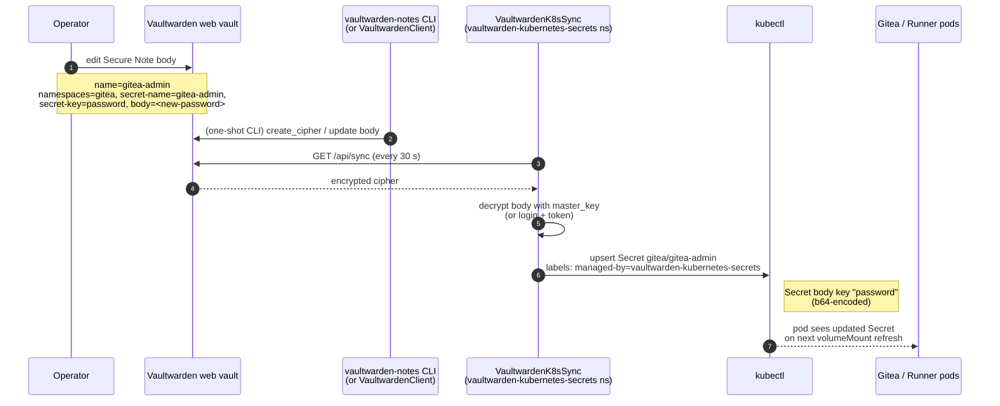

# Runbook: rotate the Gitea admin password + runner registration token

This runbook covers the two secrets the provisioner treats as
**operator-managed** (i.e. living in Vaultwarden and synced
into the cluster by VaultwardenK8sSync):

1. **The Gitea admin password** — created on first apply by
   the Gitea chart's `passwordMode: initialOnlyRequireReset`
   setting, then rotated by the operator on first login and
   re-stored in Vaultwarden.
2. **The Gitea runner registration token** — created in
   Gitea's web UI, then re-stored in Vaultwarden so the
   `gitea-runner` StatefulSet pod's mounted Secret
   refreshes.

Both flows use the same primitives:

- The `vaultwarden-notes` CLI (or the in-process
  `VaultwardenClient` library) for Vaultwarden CRUD.
- VaultwardenK8sSync (VKS) for the cluster-side Secret sync.
- `kubectl --context cicd` (or the per-cluster kubeconfig)
  for inspecting / bouncing pods.

There is **no `BitwardenSecret` CR** and **no `bw` CLI**
involved — those belonged to the previous chart
(`bitwarden-sm-operator`) and have been retired.

## Prerequisites

| Requirement | Notes |
| --- | --- |
| `vaultwarden-notes` CLI on `$PATH` | `uv tool install .` from the `proxmox-cicd/` repo root, or `uv run vaultwarden-notes …` from the repo. |
| Vaultwarden master password | Read from `--password-file` (recommended) or prompted. The password file must be `chmod 600`. |
| `kubectl` + cluster context | `kubectl --context cicd` (or `--kubeconfig ../proxmox-k3s/infra/clusters/cicd/kubeconfig.yaml`). |
| `gitea_admin` web login | Sign in once after first apply; the chart's `passwordMode: initialOnlyRequireReset` forces a reset on first login. |

## The VKS contract in one diagram



The same flow applies to the runner registration token;
only the Secret coordinates change
(`namespaces=gitea-runner`,
`secret-name=gitea-runner-gitea-runner-config`,
`secret-key=registrationToken`).

---

## Part 1 — Rotate the Gitea admin password

### What "rotate" means in this stack

- The Gitea chart's `passwordMode: initialOnlyRequireReset`
  bootstrap creates the `gitea_admin` user with a one-time
  password the first time `cicdctl apply cicd` runs. The
  bootstrap **prints** that password to the operator's
  stdout (it does NOT persist it to the helm values file
  or to Vaultwarden).
- The operator signs in once with that one-time password and
  Gitea forces a reset. After the reset, the new password is
  stored in Gitea's own database — and we mirror a copy into
  Vaultwarden so the team can find it later (or so a new
  admin can recover access without a database roundtrip).
- "Rotation" in this runbook = "store the new password in
  Vaultwarden" + "let the cluster's `gitea-admin` Secret
  refresh from VKS". The actual database change is just a
  normal password reset in the Gitea UI.

### The recipe

#### Step 1 — Sign in as `gitea_admin` and reset the password

1. Open `https://gitea.<base_domain>` (e.g. `gitea.bruj0.net`).
2. Sign in with the one-time bootstrap password (printed by
   `cicdctl apply cicd` on first run, **not** recoverable
   from Vaultwarden).
3. Gitea forces a password reset before showing the
   dashboard. Pick a strong password and submit.
4. You're now signed in with the new password.

#### Step 2 — Store the new password in Vaultwarden

Use the `vaultwarden-notes seed` subcommand. The destination
Secret is `gitea-admin` in the `gitea` namespace, with the
password under the `password` data key:

```sh
echo -n "$NEW_PASSWORD" > /tmp/gitea-admin.pw
chmod 600 /tmp/gitea-admin.pw

uv run vaultwarden-notes --password-file /tmp/vw.pw seed \
  --app gitea \
  --namespace gitea \
  --secret-name gitea-admin \
  --secret-key password \
  --body @/tmp/gitea-admin.pw
```

The CLI exits with `Secure Note created: id=<uuid> …` on
success. The note's decrypted body is the new password;
the note's custom fields carry the VKS coordinates so
VKS routes it to the right cluster Secret.

#### Step 3 — Watch VKS pick it up

```sh
KUBECONFIG=../proxmox-k3s/infra/clusters/cicd/kubeconfig.yaml \
  kubectl --context cicd \
  -n vaultwarden-kubernetes-secrets logs \
  -l app.kubernetes.io/name=vaultwarden-kubernetes-secrets -f
```

Look for:

```
Synced N items
default/... created
gitea/gitea-admin created     # or "updated"
```

Default sync interval is 30s (chart value
`env.config.SYNC__SYNCINTERVALSECONDS`).

#### Step 4 — Verify the cluster Secret

```sh
KUBECONFIG=../proxmox-k3s/infra/clusters/cicd/kubeconfig.yaml \
  kubectl --context cicd \
  -n gitea get secret gitea-admin -o yaml
```

The Secret should carry:

```yaml
metadata:
  labels:
    app.kubernetes.io/managed-by: vaultwarden-kubernetes-secrets
    app.kubernetes.io/created-by:  vaultwarden-k8s-sync
    app.kubernetes.io/instance:    gitea-admin
    app.kubernetes.io/name:        gitea-admin
    vaultwarden-kubernetes-secrets/managed-keys: '["password"]'
data:
  password: <base64 of new password>
```

The `managed-by` label proves VKS owns the Secret — helm no
longer races over labels (see
[`docs/cloudflared-helm-post-renderer.md`](../cloudflared-helm-post-renderer.md)
for the same pattern applied to the cloudflared chart).

#### Step 5 — Sanity check from a python REPL (optional)

```sh
uv run python - <<'PY'
from pathlib import Path
from provisioner.lib.vaultwarden import VaultwardenClient

client = VaultwardenClient.login(
    server_url="https://bitwarden.bruj0.net",
    email="secrets@bruj0.net",
    master_password=Path("/tmp/vw.pw").read_text().rstrip("\n"),
)
for cipher in client.list_ciphers():
    if client.decrypt_cipher_name(cipher) == "gitea-admin":
        for f in cipher.fields or []:
            if f.get("name") in {"namespaces", "secret-name", "secret-key"}:
                print(f.get("name"), "=", client.decrypt_cipher_field(name=f["name"], cipher=cipher))
        break
PY
```

You should see `namespaces = gitea`, `secret-name = gitea-admin`,
`secret-key = password`. (The encrypted body is intentionally
not printed here — it lands in stdout of the REPL only.)

### Where the admin password is stored

| Layer | What's there |
| --- | --- |
| Vaultwarden (user vault) | Secure Note `name=gitea-admin`, custom fields `namespaces=gitea`, `secret-name=gitea-admin`, `secret-key=password`, body = the current password |
| VKS auth Secret | `vaultwarden-kubernetes-secrets/vaultwarden-kubernetes-secrets` in cluster (BW_CLIENTID, BW_CLIENTSECRET, VAULTWARDEN__MASTERPASSWORD) |
| Cluster Secret | `gitea/gitea-admin` — `data.password` = b64 of current password; labels stamped by VKS |
| Gitea database | the actual user record (managed by Gitea itself; we don't touch it from outside the web UI) |

The cluster Secret's `password` data key is **the recovery
vector**. If Gitea is unavailable and a new admin needs
access, restore by signing in with the bootstrap password,
then resetting again to a known value, then re-running
step 2.

---

## Part 2 — Rotate the runner registration token

The Gitea Runner uses an ephemeral registration token
(`GITEA_RUNNER_REGISTRATION_TOKEN`) that's valid for as
long as the Gitea admin doesn't reset it. When the admin
resets it:

1. The previous k8s Secret
   `gitea-runner/gitea-runner-gitea-runner-config`
   (note: the chart uses the full helm-release name as
   a prefix, not the bare `gitea-runner-config`) carries
   the stale token.
2. VKS hasn't seen an update yet because the Vaultwarden
   note still holds the old value.
3. The runner pod keeps trying to register with the old
   token until the operator rotates the Vaultwarden note.

### The recipe

#### Step 1 — Reset the token in Gitea's web UI

1. Sign in to Gitea as `gitea_admin`.
2. Go to Site Administration → Actions → Runners.
3. Click on the existing runner (or "Create new runner" if
   it's gone). Click "Reset token".
4. Copy the new token from the modal.

#### Step 2 — Update the Vaultwarden Secure Note

```sh
echo -n "$NEW_REGISTRATION_TOKEN" > /tmp/runner-token
chmod 600 /tmp/runner-token

uv run vaultwarden-notes --password-file /tmp/vw.pw seed \
  --app gitea-runner \
  --namespace gitea-runner \
  --secret-name gitea-runner-gitea-runner-config \
  --secret-key registrationToken \
  --body @/tmp/runner-token
```

The note's name doesn't matter for VKS — VKS reads the
custom fields. Re-using the same `--app` / `--namespace` /
`--secret-name` / `--secret-key` is fine; VKS detects
the body change via `content-hash` and upserts the Secret.

#### Step 3 — Watch VKS pick up the change

```sh
KUBECONFIG=../proxmox-k3s/infra/clusters/cicd/kubeconfig.yaml \
  kubectl --context cicd \
  -n vaultwarden-kubernetes-secrets logs \
  -l app.kubernetes.io/name=vaultwarden-kubernetes-secrets -f
```

You should see
`gitea-runner/gitea-runner-gitea-runner-config updated`
within one sync interval.

#### Step 4 — Verify the cluster Secret

```sh
KUBECONFIG=../proxmox-k3s/infra/clusters/cicd/kubeconfig.yaml \
  kubectl --context cicd \
  -n gitea-runner get secret gitea-runner-gitea-runner-config \
  -o jsonpath='{.data.registrationToken}' | base64 -d ; echo
```

The decoded output should be the new token.

#### Step 5 — Bounce the runner pod

The runner pod mounts the Secret as a volume; the volume
refreshes within ~30s of the Secret update, so a manual
restart is usually not required. If the runner is stuck:

```sh
KUBECONFIG=../proxmox-k3s/infra/clusters/cicd/kubeconfig.yaml \
  kubectl --context cicd \
  -n gitea-runner rollout restart statefulset gitea-runner-gitea-runner
```

> Note: the StatefulSet name includes the helm release
> prefix (`gitea-runner-gitea-runner`), not just
> `gitea-runner`. The fullname is
> `<Release.Name>-<Chart.Name>` because the chart name
> is also `gitea-runner`. Use `kubectl get statefulset
> -n gitea-runner` if you're not sure.

The runner pod restarts, reads the new token from the
Secret (the `.runner` file in `/data` survives because
`/data` is a PVC backed by `proxmox-lvm-thin`), and
re-attaches to the same `action_runner` row in Gitea
instead of registering a new one.

> `ephemeral: false` in the chart means the runner is
> intended to be long-lived. Gitea OSS forces run-once
> mode regardless (see `poller: cannot register new
> runner as ephemeral upgrade Gitea to gain security,
> run-once will be used automatically` in the runner
> logs) but the `.runner` file re-attach still works
> when the token is unchanged. When you bump the token
> in Vaultwarden, VKS rewrites the Secret and the pod's
> volume mount picks up the new value on its next
> refresh; if the pod doesn't pick it up
> automatically, the `rollout restart statefulset`
> above forces a fresh start.

---

## What if Vaultwarden is down?

VKS's polling loop fails on `Failed to connect to
<server-url>`. The in-cluster Secrets it owns keep their
last-known values; the runner pod continues using the
stale-but-valid token until VKS can sync again. There's
no operator-side fix needed; the secrets self-heal on
the next successful sync.

To check VKS status:

```sh
KUBECONFIG=../proxmox-k3s/infra/clusters/cicd/kubeconfig.yaml \
  kubectl --context cicd \
  -n vaultwarden-kubernetes-secrets get pods \
  -l app.kubernetes.io/name=vaultwarden-kubernetes-secrets
```

If the pod is `Running` but logs show repeated sync
failures, the issue is upstream of the cluster (Vaultwarden
network or auth).

---

## What about the Gitea `INTERNAL_TOKEN`?

The chart generates a random `INTERNAL_TOKEN` on first
install and stores it in a k8s Secret (`gitea-internal-token`).
It's used for Gitea's internal API auth. If you need to
rotate it, delete the Secret and let the chart recreate
it:

```sh
KUBECONFIG=../proxmox-k3s/infra/clusters/cicd/kubeconfig.yaml \
  kubectl --context cicd -n gitea delete secret gitea-internal-token
KUBECONFIG=../proxmox-k3s/infra/clusters/cicd/kubeconfig.yaml \
  kubectl --context cicd -n gitea rollout restart statefulset/gitea-postgresql
# (the chart re-reads the secret on the next pod restart)
```

(This requires running `cicdctl apply` afterwards if the
chart re-creates the Secret with a new value, otherwise
the Gitea pods will fail to start.)

For production, it's better to either:
- Add `gitea.config.security.INTERNAL_TOKEN` to
  `values/gitea.yaml` and let helm manage it, or
- Wire a Vaultwarden note to source it from VKS via the
  same `namespaces / secret-name / secret-key` triple
  used in Parts 1-2.

Neither is in scope for v0.1.0.

## See also

- [`docs/vaultwarden-notes.md`](../vaultwarden-notes.md) —
  the `vaultwarden-notes` CLI + `VaultwardenClient` library
  this runbook uses.
- [`docs/vaultwarden-sync.md`](../vaultwarden-sync.md) —
  the VKS side: how ciphers become k8s Secrets, and which
  labels/annotations VKS stamps on the Secrets it owns.
- [`docs/runbooks/setup-vaultwarden-sync.md`](./setup-vaultwarden-sync.md) —
  the one-time setup recipe for the VKS account, plus a
  walk-through of the gitea-runner example from a Vaultwarden
  item's perspective.
- [`docs/cloudflared-helm-post-renderer.md`](../cloudflared-helm-post-renderer.md) —
  why chart-managed Secrets no longer fight VKS over labels
  (the same pattern protects `gitea-admin` from any future
  helm-vaultwarden race).