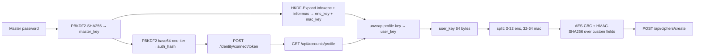

# `vaultwarden-notes` — Vaultwarden library + CLI for the provisioner

The `provisioner.lib.vaultwarden` package is a Python
implementation of the Bitwarden / Vaultwarden wire protocol
that the provisioner uses to **seed, list, decrypt, and
delete Secure Notes** in a Vaultwarden (or Bitwarden-compatible)
vault.

It powers two consumers:

- **The orchestrator** (in-process). The cloudflared app's
  `_seed_vaultwarden_note()` calls `VaultwardenClient.login()`
  + `client.create_cipher()` to land the Cloudflare tunnel
  token as a Secure Note so VaultwardenK8sSync (VKS) recreates
  the chart-managed Secret on destroy + apply. The
  orchestrator flow (mint, persist, seed, rotate, clean up
  duplicates) is documented end-to-end in
  [`docs/cloudflare-tunnel.md`](./cloudflare-tunnel.md).
- **The CLI** (`uv run vaultwarden-notes …`). The same
  library, exposed as a multi-subcommand tool for the
  operator. `seed` lands a new note; `delete` removes one
  (by id or by name match); `list` enumerates ciphers with
  decrypted names + VKS field summary; `decrypt` inspects
  one cipher.

## Why a library (not just a script)

A monolithic CLI script made three things hard:

1. The cloudflared app needs to seed a note **in-process**
   during `cicdctl apply cicd`. Spawning a subprocess and
   parsing its stdout is racy and slow.
2. Operators need to **inspect** what VKS sees (decrypted
   names, VKS custom-field summaries) without poking the
   Vaultwarden web UI.
3. Tests need to exercise the **same code path** the
   orchestrator uses, not a separate implementation.

The library + CLI split solves all three: the orchestrator
imports `VaultwardenClient` directly (no subprocess); the CLI
is a thin wrapper that exposes the same operations; the
tests cover the library, and the orchestrator tests mock the
library (not the CLI's subprocess exit codes).

## Layout

```
provisioner/lib/vaultwarden/
├── __init__.py
├── crypto.py    # PBKDF2 / HKDF / AES-CBC / HMAC primitives
├── http.py      # urllib wrappers with the right User-Agent
│                #   + Bitwarden-Client-Version headers
├── client.py    # VaultwardenClient — login + ciphers CRUD
├── note.py      # Secure-Note payload builders + VKS constants
└── kubeconfig.py # KUBECONFIG path resolution
provisioner/lib/cli/
└── vaultwarden_notes.py  # multi-subcommand CLI
```

The split matches the Bitwarden protocol's natural seams:

- `crypto.py` is the symmetric primitives (PBKDF2-SHA256
  master-key derivation, HKDF-Expand to split the master
  into enc/mac keys, AES-256-CBC + HMAC-SHA256 envelope
  encryption). 272 lines, ~21 unit tests.
- `http.py` is the wire format (the Bitwarden endpoints
  require `User-Agent`, `Bitwarden-Client-Version`,
  `device-type` headers; Cloudflare's WAF blocks the
  default `python-urllib` UA).
- `client.py` is the high-level API: `login()`, `list_ciphers()`,
  `get_cipher()`, `decrypt_cipher_*()`, `create_cipher()`,
  `delete_cipher()`. 300 lines.
- `note.py` is the Vaultwarden-Secure-Note schema: how to
  encode the `namespaces` / `secret-name` / `secret-key`
  custom fields VKS reads, plus the body builder for the
  VKS-style note.

## Quick start (CLI)

### Seed a Secure Note (the cloudflared use case)

```sh
echo -n "$MASTER_PASSWORD" > /tmp/vw.pw
chmod 600 /tmp/vw.pw

uv run vaultwarden-notes --password-file /tmp/vw.pw seed \
  --app cloudflared --namespace cloudflared \
  --secret-name cloudflare-tunnel-remote \
  --secret-key tunnelToken \
  --body @infra/secrets/cloudflared-tunnel.json
```

Equivalent to a one-off `vaultwarden-notes` invocation.
The CLI is installed as a console script (`pip install .` /
`uv tool install .` puts it on `PATH`).

### List every cipher in your vault

```sh
uv run vaultwarden-notes --password-file /tmp/vw.pw list
```

Output is one row per cipher, decrypted name + VKS custom
field summary:

```
id=bd915266-...  name=cloudflared  ns=cloudflared  name=cloudflare-tunnel-remote  key=tunnelToken
id=f47ac10b-...  name=gitea-runner-token  ns=gitea-runner  name=gitea-runner-config  key=registrationToken
…
```

### Decrypt one cipher

```sh
uv run vaultwarden-notes --password-file /tmp/vw.pw decrypt --id bd915266-...
```

Prints the cipher's decrypted `name`, `notes`, and every
custom field. Useful for sanity-checking what VKS will sync.

### Delete by id or by name match

```sh
# by id
uv run vaultwarden-notes --password-file /tmp/vw.pw delete --id bd915266-...

# by name (case-insensitive substring)
uv run vaultwarden-notes --password-file /tmp/vw.pw delete --match cloudflared
```

`--match` is a substring match against the **decrypted**
cipher name. If multiple match, the CLI prints them and
asks for confirmation (unless `--yes` is passed).

> **Flag ordering.** `--password-file` (along with
> `--email`, `--vaultwarden-url`, `--kubeconfig`,
> `--vks-namespace`, and `--vks-secret-name`) is a
> **parent-level** flag — it must appear before the
> subcommand. Putting it after the subcommand fails with
> `unrecognized arguments: --password-file /tmp/vw.pw`.

## Quick start (Python)

```python
from provisioner.lib.vaultwarden import (
    VaultwardenClient,
    build_secure_note_payload,
    vks_triple,
)

client = VaultwardenClient.login(
    server_url="https://bitwarden.bruj0.net",
    email="secrets@bruj0.net",
    master_password=open("/tmp/vw.pw").read().rstrip("\n"),
)

# Read everything VKS would see.
for cipher in client.list_ciphers():
    print(client.decrypt_cipher_name(cipher))

# Land a note the cloudflared app's orchestrator uses.
body = open("infra/secrets/cloudflared-tunnel.json").read()
ns, name, key = vks_triple(
    app="cloudflared",
    namespace="cloudflared",
    secret_name="cloudflare-tunnel-remote",
    secret_key="tunnelToken",
)
payload = build_secure_note_payload(
    note_name=ns,
    body_text=body,
    custom_fields={"namespaces": ns, "secret-name": name, "secret-key": key},
    user_key=client.user_key,
)
client.create_cipher(payload)
```

`VaultwardenClient.login()` returns a fully-authenticated
client with `user_key` already unwrapped (so you can
build note payloads directly without re-doing the
master-key derivation).

## CLI reference

```
usage: vaultwarden-notes [-h] [--password-file FILE]
                          [--email EMAIL] [--vaultwarden-url URL]
                          {seed,delete,list,decrypt} ...
```

| Flag | Default | Description |
| --- | --- | --- |
| `--password-file` | prompt | Read the master password from a file (recommended; bypasses the interactive prompt). |
| `--email` | `secrets@bruj0.net` (override via `VAULTWARDEN__EMAIL`) | The Vaultwarden account. |
| `--vaultwarden-url` | `https://bitwarden.bruj0.net` (override via `VAULTWARDEN__SERVERURL`) | Base URL of the Vaultwarden REST API. |

### `seed` subcommand

```
vaultwarden-notes [--password-file FILE …] seed
                  --app APP --namespace NAMESPACE
                  --secret-name SECRET_NAME
                  [--secret-key SECRET_KEY]
                  (--body BODY | --body @FILE)
                  [--dry-run]
```

The body is the **plaintext payload** that ends up under
the named Secret's data key. Use `--body @path/to/file`
to read from disk.

### `delete` subcommand

```
vaultwarden-notes [--password-file FILE …] delete
                  (--id ID | --match SUBSTRING) [--yes]
```

Exactly one of `--id` or `--match` is required. `--yes`
skips the confirmation prompt when multiple ciphers match.

### `list` subcommand

```
vaultwarden-notes [--password-file FILE …] list [--org ORG_ID] [--folder FOLDER_ID]
```

Prints one line per cipher: `id`, decrypted `name`, and
the VKS triple (`namespaces` / `secret-name` / `secret-key`)
when present in the cipher's custom fields.

### `decrypt` subcommand

```
vaultwarden-notes [--password-file FILE …] decrypt --id ID [--field FIELD]
```

`--field` is one of `name`, `notes`, `username`, `password`,
or a custom field name. Default is `notes`.

## The Bitwarden wire protocol (recap)

The docstrings in `crypto.py` / `client.py` / `http.py`
walk through each protocol step in detail. The short
version:



Two implementation details that often bite hand-rolled
clients and are correctly handled here:

1. **Trailing `=` matters in the auth_hash.** PBKDF2-SHA256
   with `iter=1` produces a 32-byte digest; base64-encoded
   it's **44 chars with a trailing `=`**. Strip the `=`
   and the resulting hash is for a *shorter* input, which
   Vaultwarden rejects with `Username or password is
   incorrect`. `make_server_auth_hash()` preserves the `=`.
2. **`device-type=25` (LinuxCLI)** is mandatory. The
   `/api/accounts/profile` endpoint requires a non-empty
   `device-type`; the Bitwarden reference clients use
   `8` (Firefox) for browser, `25` for the CLI, etc.
   `http.py` defaults to `25`.

## Design

| Concern | Library + CLI |
| --- | --- |
| Entry point | `uv run vaultwarden-notes seed …` (CLI) or `from provisioner.lib.vaultwarden import VaultwardenClient` (in-process) |
| Subprocess overhead | none for in-process; CLI spawns one Python per invocation |
| API surface | `VaultwardenClient` class + helpers; CLI is a thin wrapper |
| Tests | 21 crypto tests + 6 note-payload tests against the library; orchestrator tests mock the library |
| Library import | `from provisioner.lib.vaultwarden import VaultwardenClient` |

## Where the values live

| File | Role |
| --- | --- |
| `provisioner/lib/vaultwarden/` | the library (re-usable from any Python) |
| `provisioner/lib/cli/vaultwarden_notes.py` | the CLI |
| `provisioner/tests/test_vaultwarden_crypto.py` | 21 unit tests pinning the crypto |
| `provisioner/tests/test_vaultwarden_note.py` | 6 unit tests pinning the note payload shape |
| `provisioner/lib/apps/cloudflared.py` | the orchestrator consumer (`_seed_vaultwarden_note`) |

## See also

- [`docs/vaultwarden-sync.md`](./vaultwarden-sync.md) —
  how VKS consumes the ciphers this library / CLI creates.
- [`docs/runbooks/setup-vaultwarden-sync.md`](./runbooks/setup-vaultwarden-sync.md) —
  the operator runbook for one-time VKS setup.
- [`AGENTS.md § "Adding a third-party / chart-in-tree app"`](../AGENTS.md) —
  the canonical onboarding for `cloudflared`, with a
  worked-example walk-through of the seed → VKS → Secret loop.