# `vaultwarden-seed-note.py` — create a Vaultwarden Secure Note for VKS

> **Status (2026-07-14): legacy.** This script is kept on
> disk for backwards compatibility. New code should use
> [`provisioner.lib.vaultwarden`](./vaultwarden-notes.md)
> (the in-process library) or the `vaultwarden-notes` CLI
> (a multi-subcommand wrapper around the library). The
> underlying wire protocol is identical — see
> [`docs/vaultwarden-notes.md`](./vaultwarden-notes.md) §
> "Differences from the legacy script".

CLI that creates a Bitwarden-encrypted **Secure Note** in a
Vaultwarden (or Bitwarden-compatible) vault so the
[`vaultwarden-k8s-sync`][vks-doc] app picks it up on its next
polling cycle and materialises it as a Kubernetes Secret.

This is the operator-facing alternative to pasting secrets into
the Vaultwarden web UI by hand. The script talks to the
Bitwarden public REST API directly, performs the KDF + envelope
crypto itself (PBKDF2-SHA256, AES-256-CBC + HMAC-SHA256, with
HKDF-Expand on master/user keys), and POSTs the resulting
cipher to `/api/ciphers/create`.

[vks-doc]: ./vaultwarden-sync.md

## When to use this

- You need to land an opaque, base64-able payload (Cloudflare
  tunnel credentials, kubeconfig YAML, SSH private keys, age
  secrets, …) into a target namespace on the cluster without
  editing values files.
- The target app can't be onboarded through the
  `provisioner/lib/apps/<name>.py` chart lane (no upstream helm
  chart, or you don't want GitOps for a single secret).
- You'd rather seed Vaultwarden programmatically than navigate
  the web vault.

The script is **generic**: it doesn't care what the body is.
VKS reads the `namespaces` and `secret-name` custom fields, plus
every other custom field you set on the note. The cloudflared
tunnel credentials case in [AGENTS.md § "Adding a third-party /
chart-in-tree app"][ag-tpa] is the canonical example.

[ag-tpa]: ../AGENTS.md

## Prerequisites

| Requirement | Notes |
| --- | --- |
| Python ≥ 3.11 with `uv` | The repo is a uv project; `uv sync` once. |
| `cryptography` (45+) | Installed transitively via the project's `pyproject.toml`. |
| Network egress to Vaultwarden | Default `https://bitwarden.bruj0.net` (override with `--vaultwarden-url`). |
| A master password | Read from `--password-file` or prompted. Used to derive the Vaultwarden auth_hash + unwrap the user key. |
| Vaultwarden email | Defaults to `secrets@bruj0.net` (override with `--email` or `VAULTWARDEN__EMAIL`); the script **does not** read your Vaultwarden web login. |

The script does **not** require `bw` (the Bitwarden CLI) — it
talks the wire protocol directly so the same code path is
testable and reproducible without launching a Node.js subprocess.

## Quick start

```sh
# 1. File with the master password (mode 0600).
echo -n "$MASTER_PASSWORD" > ~/.cache/vw.pw
chmod 600 ~/.cache/vw.pw

# 2. Inline body, write to default Vaultwarden account.
uv run scripts/vaultwarden-seed-note.py \
  --app cloudflared --namespace cloudflared \
  --secret-name cloudflared-cloudflare-tunnel \
  --secret-key credentials.json \
  --body @infra/secrets/cloudflared-tunnel.json \
  --password-file ~/.cache/vw.pw

# 3. Watch VKS pick it up.
kubectl -n vaultwarden-kubernetes-secrets logs \
  -l app.kubernetes.io/name=vaultwarden-kubernetes-secrets -f
```

After the next ~30s sync cycle you'll see:

```
default/... created
cloudflared/cloudflared created
```

…where `cloudflared` contains a single key `credentials.json`
whose value is the body you supplied.

### Different Vaultwarden account

```sh
VAULTWARDEN__EMAIL=ops@acme.com \
  uv run scripts/vaultwarden-seed-note.py \
    --vaultwarden-url https://vault.acme.com \
    --body 'literal secret value' \
    --secret-name ops-license
```

The script picks up `VAULTWARDEN__EMAIL` and `VAULTWARDEN__SERVERURL`
from the environment so it composes with the same env vars
VKS uses (see [docs/vaultwarden-sync.md](./vaultwarden-sync.md)).

## CLI reference

```text
usage: vaultwarden-seed-note [-h] --app APP --namespace NAMESPACE
                              --secret-name SECRET_NAME [--secret-key KEY]
                              [--body BODY | --body @FILE]
                              [--email EMAIL] [--password-file FILE]
                              [--vaultwarden-url URL] [--kubeconfig PATH]
                              [--vks-namespace NAMESPACE]
                              [--vks-secret-name SECRET]
                              [--dry-run] [--debug-hash]
```

| Flag | Default | Description |
| --- | --- | --- |
| `--app`, `--namespace`, `--secret-name` | required | Custom fields VKS uses to name the destination Secret. `--namespace` may be repeated (or comma-separated) for multi-namespace output. |
| `--secret-key` | body sha256 prefix | Custom field name VKS uses as the Secret's data key. If omitted, the script derives a deterministic key from the body hash. |
| `--body`, `--body @FILE` | required | Plaintext payload. Prefix with `@` to read from a file (whitespace stripped). Use `--body 'value'` for a literal. |
| `--email` | `secrets@bruj0.net`, override via `VAULTWARDEN__EMAIL` | The Vaultwarden account this note lands in. |
| `--password-file` | prompt | Read the master password from a file (recommended; bypasses the interactive prompt). |
| `--vaultwarden-url` | `https://bitwarden.bruj0.net`, override via `VAULTWARDEN__SERVERURL` | Base URL of the Vaultwarden REST API. **Must** include scheme. |
| `--kubeconfig` | `$KUBECONFIG` or `~/.kube/config` | Only read by the dry-run / post-create hint that points at the destination cluster. |
| `--dry-run` | off | Decrypt nothing, do not POST. Prints the JSON body that **would** have been POSTed to `/api/ciphers/create`. |
| `--debug-hash` | off | Prints the derived PBKDF2 master key + auth_hash in addition to normal output. Useful when reproducing a `bw login` failure. |

### Exit codes

- `0` — note created (cipher returned an `id`).
- `2` — argument error or missing body.
- `3` — Vaultwarden rejected the request (network, auth, or
  envelope). The body of the error includes the HTTP status
  code and the first 200 bytes of the response body.

### Environment variables

| Var | Effect |
| --- | --- |
| `VAULTWARDEN__EMAIL` | Same as `--email`. |
| `VAULTWARDEN__SERVERURL` | Same as `--vaultwarden-url`. |
| `KUBECONFIG` | Same as `--kubeconfig`. |
| `VAULTWARDEN_SEED_NOTE_DEBUG=1` | Prints request/response line prefixes for each REST call, without the body. |

## What the script does (wire-level)

The script emulates a minimal Bitwarden client. Concretely:

```mermaid
flowchart LR
    subgraph VAULT[Vaultwarden server]
        PRE["POST /identity/accounts/prelogin&#10;returns kdfIterations, kdfType"]
        LOG["POST /identity/connect/token&#10;grant_type=password"]
        PROF["GET /api/accounts/profile&#10;returns profile.key envelope"]
        CR["POST /api/ciphers/create&#10;returns cipher id"]
    end

    PW["Master password&#10;(env or prompt)"]
    EM["Email&#10;secrets@bruj0.net"]
    USK["User key&#10;64 raw bytes"]

    PW --> MK["PBKDF2-SHA256&#10;email salt, 600k iters&#10;to master_key"]
    MK --> AH["PBKDF2 base64-one-iter&#10;to auth_hash"]
    MK --> ST["HKDF-Expand info=enc&#10;plus HKDF-Expand info=mac&#10;to enc_key and mac_key"]
    ST --> UW["unwrap profile.key&#10;verify MAC on mac_key&#10;to user_key"]
    USK --> K1["user_key split&#10;bytes 0 to 32 enc&#10;bytes 32 to 64 mac"]
    K1 --> E["AES-CBC plus HMAC-SHA256&#10;over custom field pairs&#10;type 2 iv then ct then mac"]
    E --> CR

    AH --> LOG
    PRE --> MK
    LOG --> PROF
    PROF --> UW
    UW --> USK
    EM --> MK

    classDef crypto fill:#1e3a8a,stroke:#3b82f6,color:#fff;
    class MK,AH,ST,UW,K1,E crypto;
```



For the full protocol walk-through — including the byte-exact
auth_hash derivation, the HKDF info-strings, and the
`<iv>|<ct>|<mac>` envelope shape — see the implementation
comments in `scripts/vaultwarden-seed-note.py` and
`scripts/tests/test_vaultwarden_seed_note.py`.

### Why a custom User-Agent (`curl/8.5.0`)?

The Cloudflare WAF in front of `bitwarden.bruj0.net` rate-limits
the default Python `user-agent` string. The script sends
`User-Agent: curl/8.5.0`, which is allowed through.

### Why does the script need `Bitwarden-Client-Version`?

Vaultwarden's `auth.rs::ClientVersion` extractor returns 401
`Unauthorized Error: No Bitwarden-Client-Version header
provided` for any request missing that header. The script sends
`Bitwarden-Client-Version: 2025.12.0` on every call.

## Operations

### Rotating the master password

If you change the Vaultwarden master password, the user key is
re-wrapped under the new master. Run any seed script again —
the user key unwrap succeeds (the new wrapping is served from
`/api/accounts/profile`), and subsequent POSTs sign under the
new keys.

### Multiple Vaultwarden accounts

The script is single-account; one invocation targets one
`--email` / `--vaultwarden-url`. To land the same payload in N
accounts, run the script N times with different `--email` /
`--vaultwarden-url` / `--password-file` triples.

### Re-running is safe

The script **does not** deduplicate. A second run creates a new
Secure Note each time, leaving the prior one in place. VKS
reads the most recent note per `secret-name` per `namespace`,
so the old ciphers linger until you delete them from the
Vaultwarden UI (Organize → Trash → Permanently Delete) or via
`DELETE /api/ciphers/{id}`.

### Auditing who created what

The script sends `deviceName=linux-seed-note` and a random
`deviceIdentifier` UUID per run. Vaultwarden logs these in the
account's device list (`Settings → Devices`). Rotate the
identifier by `rm /tmp/vw-device-id` between runs if you want
a clean device history.

## Limitations

- **One custom field per data key.** VKS reads multiple custom
  fields out of a single cipher, but `vaultwarden-seed-note.py`
  ships a `name=value` pair per `--secret-key`. To land a
  multi-key Secret, run the script multiple times against the
  same `--secret-name` with different `--secret-key` values.
- **No attachments.** Attachments live in a separate
  `/api/ciphers/{id}/attachment` endpoint; not supported by
  this script.
- **No org-mode / collection scoping.** The script targets the
  user's personal vault. For organisation items, use `bw`.
- **No refresh-token persistence.** The script derives a fresh
  bearer token per run (good for ≤2h TTL sessions); it does
  **not** write a token cache. Don't reuse this script for an
  unattended pipeline; use `bw` with a configured machine
  account.

## Troubleshooting

| Symptom | Cause | Fix |
| --- | --- | --- |
| `Vaultwarden HTTP 400 for /identity/connect/token: {"error":"invalid_grant"}` | The auth_hash doesn't match. Most often: trailing `=` stripped from base64, wrong email, or KDF iteration count mismatch. | Re-run with `--debug-hash` and compare the printed `master_key` against `bw login --check`; the `bw` source matches the script's derivation if the master password + email pair are correct. |
| `Vaultwarden HTTP 401 for /api/accounts/profile: Unauthorized Error: No Bitwarden-Client-Version header` | This shouldn't happen — the script sets the header by default. | Confirm you haven't set `CUSTOM_HEADERS=` style overrides; restore the script's defaults. |
| `VKS never picks up the new note` | VKS reads only items with the `namespaces` custom field. | Re-run the script with `--namespace cloudflared` and check the Vaultwarden UI for the resulting custom fields under the Secure Note. |
| `SSL: CERTIFICATE_VERIFY_FAILED` for a self-hosted Vaultwarden | The host's CA isn't in the system trust store. | Export the CA bundle and export `SSL_CERT_FILE=path/to/ca-bundle.crt`, or pass `--vaultwarden-url` to an HTTPS endpoint with a publicly trusted cert. |

### Reproducing the auth_hash

If you want to compare against `bw login --check`:

```sh
uv run python - <<'PY'
import importlib.util
import base64
from pathlib import Path

spec = importlib.util.spec_from_file_location(
    "vsn", Path("scripts/vaultwarden-seed-note.py").resolve()
)
vsn = importlib.util.module_from_spec(spec)
spec.loader.exec_module(vsn)

master_key = vsn.make_master_key("$MASTER_PASSWORD", "secrets@bruj0.net", 600_000)
print("master_key =", base64.b64encode(master_key).decode())
print("auth_hash  =", vsn.make_server_auth_hash(master_key, "$MASTER_PASSWORD"))  # str, trailing '=' preserved
PY
```

`bw config server https://bitwarden.bruj0.net && bw login
--check` should print the same `master_key` (b64) for the same
master password. If it doesn't, the script is correct and the
email or password mismatch is on the shell side.

## See also

- [docs/vaultwarden-notes.md](./vaultwarden-notes.md) — the
  in-process library + multi-subcommand CLI that **replaces**
  this script. New code should import `VaultwardenClient`
  directly or run `uv run vaultwarden-notes seed …`.
- [docs/vaultwarden-sync.md](./vaultwarden-sync.md) — how VKS
  consumes the ciphers this script creates.
- [AGENTS.md § "Adding a third-party / chart-in-tree app"][ag-tpa]
  — the canonical onboarding for `cloudflared`, with a
  worked-example walk-through.
- `scripts/vaultwarden-seed-note.py` — implementation comments
  anchor each protocol step to the matching source line.
- `scripts/tests/test_vaultwarden_seed_note.py` — 104 tests
  that pin every encoding decision (envelope shape, HKDF
  info-strings, base64-with-padding, `device-type=25`, etc.).
