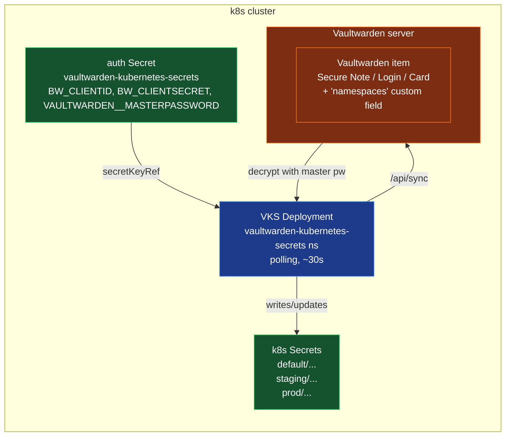

# Vaultwarden → Kubernetes secret sync

The `vaultwarden-k8s-sync` (VKS) app on the cicd
cluster periodically polls a Vaultwarden (or
Bitwarden-compatible) server and writes k8s
Secrets from items tagged with a `namespaces`
custom field.

## Why VKS, not Bitwarden Secrets Manager?

The previous chart (`bitwarden-sm-operator`) is
CRD-based: the operator watches a `BitwardenSecret`
CR and reconciles it into a k8s Secret by reading
from the Bitwarden Secrets Manager API. That model
has two operational footguns:

- It introduces a new CRD type and a new controller
  to debug.
- Bitwarden Secrets Manager is a paid tier on the
  official Bitwarden cloud and not available on
  self-hosted Vaultwarden.

VKS replaces both with a polling service that
talks to the standard Bitwarden public API. The
operator's contract is the same (items → k8s
Secrets), but the implementation is one
Deployment + a standard `Secret` + a `k8s Secret`
output, no CRDs.

## Architecture

### Data flow on each sync cycle (every 30s)

1. VKS POSTs to `/identity/connect/token` with the
   `client_id` / `client_secret` from the auth Secret
   (API key auth — no 2FA challenge).
2. VKS GETs `/api/sync?excludeDomains=true` with the
   bearer token. The response includes the user's
   encrypted profile + the encrypted item list.
3. VKS derives the symmetric key from the master
   password (PBKDF2-SHA256 600k iterations, or
   Argon2id if the account uses that KDF).
4. VKS decrypts each item's `notes` / `password` /
   `card` fields and reads the `namespaces` custom
   field.
5. For each (item, namespace) pair, VKS upserts a
   k8s `Opaque` Secret in the target namespace,
   stamping it with:
   - `app.kubernetes.io/managed-by: vaultwarden-kubernetes-secrets`
   - `vaultwarden-kubernetes-secrets/content-hash`
     (SHA-256 of the data — used to detect drift)
   - `vaultwarden-kubernetes-secrets/managed-keys`
     (JSON list of which data keys the secret owns)
6. VKS runs the orphan-cleanup phase
   (controlled by `SYNC__DELETEORPHANS`). Any
   `Opaque` Secret in the target namespaces that
   carries the `managed-by` label and isn't in the
   current item set is deleted.

### Why a separate no-2FA account?

VKS's `VaultwardenService.UnlockVaultAsync` doesn't
implement the `2fa_token` flow that Bitwarden
returns when 2FA is enabled on the user account.
The .NET client expects the master password alone
to derive the symmetric key. With 2FA, the API
key authenticates the user but the unlock step
fails with `Failed to decrypt symmetric key (got
0 bytes)`. A dedicated no-2FA service account is
the only way to run VKS without patching the
upstream. See
[`runbooks/setup-vaultwarden-sync.md`](runbooks/setup-vaultwarden-sync.md)
for the full setup recipe.

## What the provisioner does

The `vaultwarden_k8s_sync.AppSpec.apply()`
method in
[`provisioner/lib/apps/vaultwarden_k8s_sync.py`](../provisioner/lib/apps/vaultwarden_k8s_sync.py)
orchestrates the install:

1. `helm upgrade --install vaultwarden-kubernetes-secrets
   oci://ghcr.io/antoniolago/charts/vaultwarden-kubernetes-secrets
   --version 2.0.0 -n vaultwarden-kubernetes-secrets
   --create-namespace -f values/vaultwarden-kubernetes-secrets.yaml`
   with `--wait=false` (so a fresh chart install
   doesn't fail the readiness probe on the missing
   auth Secret).
2. Read `.env` from the operator's CWD
   (key aliases: `client_id` / `client_secret` /
   `master_password`, plus the canonical
   `BW_CLIENTID` / `BW_CLIENTSECRET` /
   `VAULTWARDEN__MASTERPASSWORD`).
3. `kubectl apply` an Opaque Secret named
   `vaultwarden-kubernetes-secrets` in the
   `vaultwarden-kubernetes-secrets` namespace,
   populated from `.env`.
4. `kubectl wait` for the sync Deployment to be
   Available (60s budget; logged as a warning
   if the wait times out so the apply doesn't
   fail on a slow first start).
5. Surface a next-step:
   - If `.env` had all three keys: "credentials
     auto-seeded; watch the first cycle".
   - Otherwise: a `kubectl create secret
     --from-literal=...` one-liner the operator
     can paste.

The apply is idempotent. Re-running
`cicdctl apply cicd` after a credential change
will:
- Re-helm the chart (no-op if the values match).
- Re-`kubectl apply` the Secret (overwriting the
  data block with the new values).
- Roll the Deployment so the new pod re-reads
  the updated env at start.

A `scripts/reseed-vks-creds.sh` shortcut wraps
this flow for credential rotations that don't
require a full chart re-install — it patches the
Secret + rolls the Deployment directly.

## Configuration

| Setting | File | Default | Notes |
| --- | --- | --- | --- |
| `env.config.SYNC__SYNCINTERVALSECONDS` | `values/vaultwarden-kubernetes-secrets.yaml` | `30` | 30s = ~2 min time-to-sync for new items |
| `env.config.SYNC__DELETEORPHANS` | `values/vaultwarden-kubernetes-secrets.yaml` | `true` | When true, VKS deletes k8s Secrets when their source item is removed |
| `env.config.SYNC__DRYRUN` | `values/vaultwarden-kubernetes-secrets.yaml` | `false` | Dry-run mode logs what would change but doesn't touch the cluster |
| `env.config.VAULTWARDEN__SERVERURL` | `values/vaultwarden-kubernetes-secrets.yaml` (overlaid at apply-time from `VAULTWARDEN__SERVERURL` in `.env` or `catalog.vaultwarden.server_url`) | `https://bitwarden.example.net` (placeholder) | Self-hosted Vaultwarden/Bitwarden server URL |
| `env.config.VAULTWARDEN__ORGANIZATIONID` | `values/vaultwarden-kubernetes-secrets.yaml` | empty | Filter items by org UUID (empty = all user-scoped items) |
| `env.config.VAULTWARDEN__COLLECTIONID` | `values/vaultwarden-kubernetes-secrets.yaml` | empty | Filter items by collection UUID |
| `env.secrets.BW_CLIENTID.secretName` | `values/vaultwarden-kubernetes-secrets.yaml` | `vaultwarden-kubernetes-secrets` | **Must match the Secret name the apply creates** |
| `image.repository` / `image.tag` | chart | `ghcr.io/antoniolago/...` | Pinned to chart 2.0.0 (which pins appVersion 2.0.0) |

The two non-obvious invariants are:

- The `env.secrets.*.secretName` value must match
  the name of the Secret the apply creates. We
  use `vaultwarden-kubernetes-secrets` (the same
  as the namespace + release). The chart's
  `auth-secret.yaml` template creates a *different*
  Secret (`...-auth`) which we don't use because
  it's only rendered when `api.enabled=true`.
- The `env.secrets.*.secretKey` values
  (`BW_CLIENTID`, `BW_CLIENTSECRET`,
  `VAULTWARDEN__MASTERPASSWORD`) must match the
  *key names* in the data block. The
  `valueFrom.secretKeyRef` lookup is exact-match
  on the key, so a typo silently produces an empty
  env var and a `Failed to decrypt symmetric key`
  error in the VKS pod logs.

## Common pitfalls

- **Pod `CrashLoopBackOff` after install** — the
  auth Secret wasn't seeded before the first
  rollout. Run `./scripts/reseed-vks-creds.sh` (or
  re-run `cicdctl apply cicd` with a populated
  `.env`) and the pod will go Ready on the next
  rollout.
- **`Failed to decrypt symmetric key (got 0 bytes)`**
  — the master password in `.env` is wrong for the
  user that owns the API key. Confirm by logging
  into the Vaultwarden web UI with the same
  email + master password; if you can sign in
  there, the password is correct and the issue is
  something else (e.g. the user changed their
  master password since the API key was issued).
- **Items with the right `namespaces` field aren't
  syncing** — check `kubectl logs` for
  `No items found in vault`. The most common cause
  is that the user account is scoped to an
  organization (org-scoped items don't show up
  under the personal `/api/sync` view). Move the
  item to the user's personal vault, or set
  `VAULTWARDEN__ORGANIZATIONID` to the org UUID.
- **`SYNC__DELETEORPHANS=true` deleted a Secret
  you wanted to keep** — VKS owns every Secret
  with the `app.kubernetes.io/managed-by:
  vaultwarden-kubernetes-secrets` label in the
  namespaces it watches. If you want a Secret to
  survive a Vaultwarden item deletion, give it a
  different label.

## Verifying it works

The smoke test in the runbook (creating a
`vks-smoke-test` Secure Note with
`namespaces=default`) takes about 30s end-to-end
and produces a k8s Secret in the `default`
namespace.
